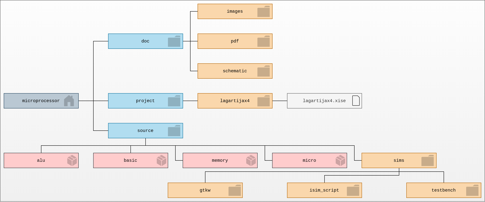

## Resumen

El siguiente repositorio corresponde al proyecto final del curso de Arquitectura de Computadoras de la [Escuela Superior de Cómputo](https://www.escom.ipn.mx/); este contiene material relacionado con el diseño e implementación mediante el lenguaje descripción VHDL de un microprocesador de 4 bits de arquitectura Von Neumann e instrucciones de longitud fija de 16 bits basadas en RISC. El nombre [LagartijaX4](https://github.com/Ivan1693/microprocessor) está inspirado en el procesador [Lagarto](https://www.proyectos.cic.ipn.mx/index.php/lagarto) desarrollado por el Centro de Investigación en Computación del IPN. 

**Reporte**
[LagartijaX4-ReporteFinal.pdf](https://github.com/Ivan1693/microprocessor/raw/micro_stage2/doc/pdf/LagartijaX4-ReporteFinal.pdf)

## Estructura del repositorio

El root del proyecto es el directorio **microprocessor**, el directorio **project** contiene el proyecto de **ISE** nombrado **lagartijax4**. El directorio **doc** contiene archivos de documentación, diagramas, etc. Finalmente el código VHD se organiza en el directorio **source**. Dentro de source existe un directorio llamado **sims** este contiene los archivos testbench (*_tb.vhd) para las simulaciones de los módulos  dentro del directorio **testbench**  para varias de las entidades que están declaradas en los paquetes y finalmente el directorio **gtkw** contiene los archivos de configuración de simulación de **GTKWave**.

## Equipo

| Abraham Zaid Aguilar Reyes | Brandon Iván Hernández Reséndiz |       Rámses Fuentes Perez       |
| :------------------------: | :-----------------------------: | :------------------------------: |
| https://github.com/Zaiks13 |   https://github.com/Ivan1693   | https://github.com/CobraUltimate |

