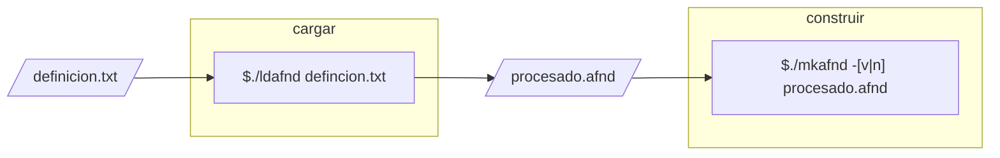
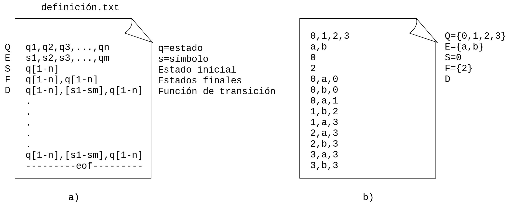
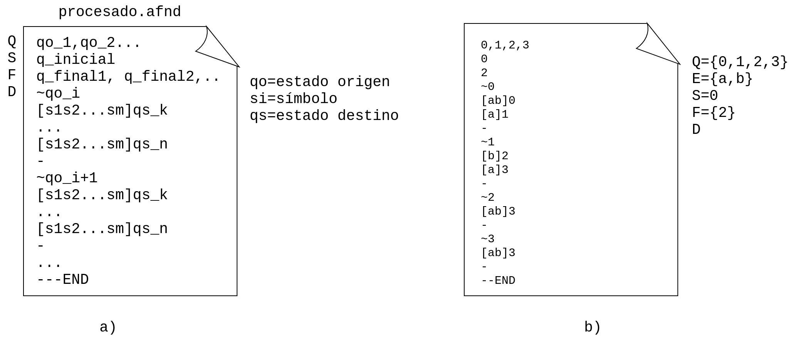
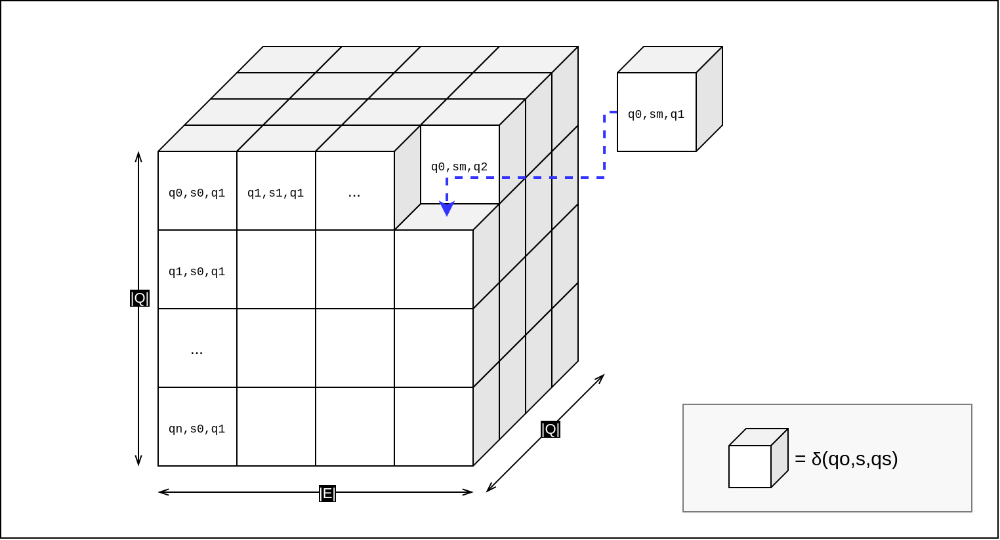
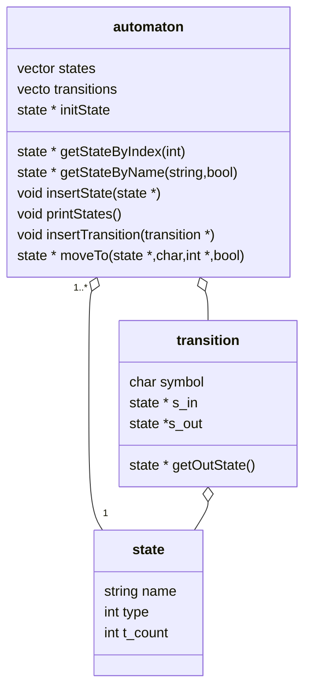

## AFND en C y C++

La implementación del AFND se hace, como ya se ha mencionado anteriormente, en el lenguaje C y C++ y obedece al diagrama mostrado en la <a href="fig21">Fig.2.1</a>; como se puede observar en dicho diagrama, se cuenta con dos módulos principales: el de **carga** y el de **construcción**. La función del módulo de carga es pasar la definición del autómata (dada en un formato que se discute mas adelante) a una representación equivalente, adecuada para implementarse bajo el paradigma orientado a objetos con el fin de facilitar su manipulación. Dicho módulo de construcción define las clases y métodos necesarios para realizar tanto la instanciación del autómata, como las validaciones y recorridos necesarios dentro de este.

<a name="fig21"></a>



> **Fig.2.1.** Proceso de carga y construcción del AFND a partir de un archivo de entrada TXT

El módulo de carga del autómata está implementado en un programa en C, mientras que el módulo de construcción se ha implementado en C++. El proceso implica la ejecución de 2 archivos binarios **ldafnd** con el nombre de archivo .txt correspondiente a la definición del autómata como argumento y **mkafnd** con el nombre de archivo .afnd con la representación equivalente como argumento. Adicionalmente se puede hacer la ejecución de los módulos con la bandera `-p` como último argumento para enviar a la salida estándar mensajes de la lectura de los archivos y demás información detallada mas adelante.

### Carga

##### Lectura de definición

En esta parte del proceso de lectura de la definición del autómata se tiene como entrada un archivo de texto plano que contiene un conjunto de líneas en las cuales, separados por comas, se encuentran los valores de Q, el alfabeto E, el estado inicial S, los estados finales F y la función de transición. La función de transición se define a partir de la quinta línea con el formato: 
$$
estado\ origen,\ simbolo,\ estado\ siguiente
$$
---



> **Fig.2.2.** a) Formato de archivo de entrada. b) Ejemplo de archivo de entrada

Una vez cargado el archivo en memoria, se leen los valores correspondientes a los conjuntos Q, E,F y S. Estos valores son considerados la cabecera del autómata  y se copian  a una estructura de tipo `afnd_header` que se conforma de 5 variables enteras (que guardan el conteo de los elementos de cada conjunto) y 5 de tipo `s_list` (lista de cadenas: estructura y funciones definidas en `strlist.h`). 

```C
typedef struct afnd_header{
	s_list Q,E,S,F;
	int q,e,s,f;
}afnd_header;
```

> Declaración de estructura para almacenar cabecera del autómata

Los valores de la función de transferencia se leen y se copian a una estructura de tipo `afnd_data` con la siguiente definición:

```C
typedef struct afnd_data{
	int d;
	s_list **** space;
}afnd_data;
```

La variable entera `d` almacena el conteo de transiciones leídas. El apuntador cuádruple  de tipo `s_list` se describe a continuación.

##### Conversión de la definición

Con la finalidad de transformar el formato de las transiciones de entrada a un formato de salida ([Fig.2.3.a](fig23)) que relacione un estado origen con un estado destino en función de todos los símbolos en las transiciones entre estos, se define un espacio de tres dimensiones, *espacio delta* (apuntador cuádruple de tipo `s_list`) como se muestra en la [Fig.2.4](fig24), de tamaño $|Q|\times |E|\times |Q|$, en el cual, si existe la transición que corresponde a las coordenadas $(qo_i,s_j,qs_k)$ se copian los valores correspondientes a la celda actual del espacio delta, o de forma contraria, si la transición no existe, se define como transición nula ($/$). Posteriormente se recorre el espacio delta de forma iterativa para escribir un nuevo archivo de salida con la representación del autómata en el siguiente formato:



> **Fig.2.3.** a) Formato de archivo procesado. b) Archivo procesado de la Fig.2.1.b.



> **Fig.2.4. Representación gráfica del espacio delta.** De manera conceptual el espacio delta se refiere a todas la combinaciones posibles entre dos estados y un símbolo en el dominio de los conjuntos que definen al autómata.

### Construcción

Como se ha mencionado, este módulo se desarrolla bajo el paradigma OO; el diagrama de clases correspondiente se muestra en la [Fig.2.5](fig25).



El proceso de lectura del archivo que se muestra en la Fig.2.3.b, se hace de forma diferente a como se hace en el módulo de carga, la siguiente serie de pasos describe este proceso:

1. Se lee el conjunto de estados de la primera línea y se crea la instancia de la clase `state ` correspondiente
2. Se lee la línea del archivo correspondiente al estado inicial del autómata. Con la cadena leída se busca dicho estado en las instancias creadas en el paso 1 y se hace la referencia a este. El valor del atributo `type` de la clase `state` se aumenta en 1, para que corresponda con el identificador del tipo de estado (Tabla.2.1).
3. Se lee la línea del archivo correspondiente a los estados finales del autómata.  El valor del atributo `type` de la clase `state` se aumenta en 2, para que corresponda con el identificador del tipo de estado (Tabla.2.1).
4. Se crean las instancias de transiciones. Para ello se lee el conjunto de líneas que describen de forma equivalente la transición. Se hace referencia al estado de origen, se guarda en símbolo de la transición en el atributo `symbol` de la transición y se hace referencia al estado de salida.

| Tipo      | Valor |
| --------- | ----- |
| ordinario | 0     |
| inicial   | 1     |
| terminal  | 2     |

> **Tabla.2.1.** Valores enteros asociados al tipo de estado.

Al finalizar la lectura e instanciación de clases, el autómata cargado en memoria, evalúa una cadena de entrada especificada como argumento, o recibe por la entrada estándar un flujo de caracteres a evaluar, esto dependiendo de la opción con la que se ejecute.