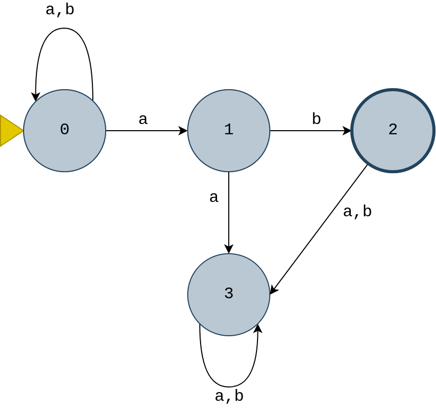
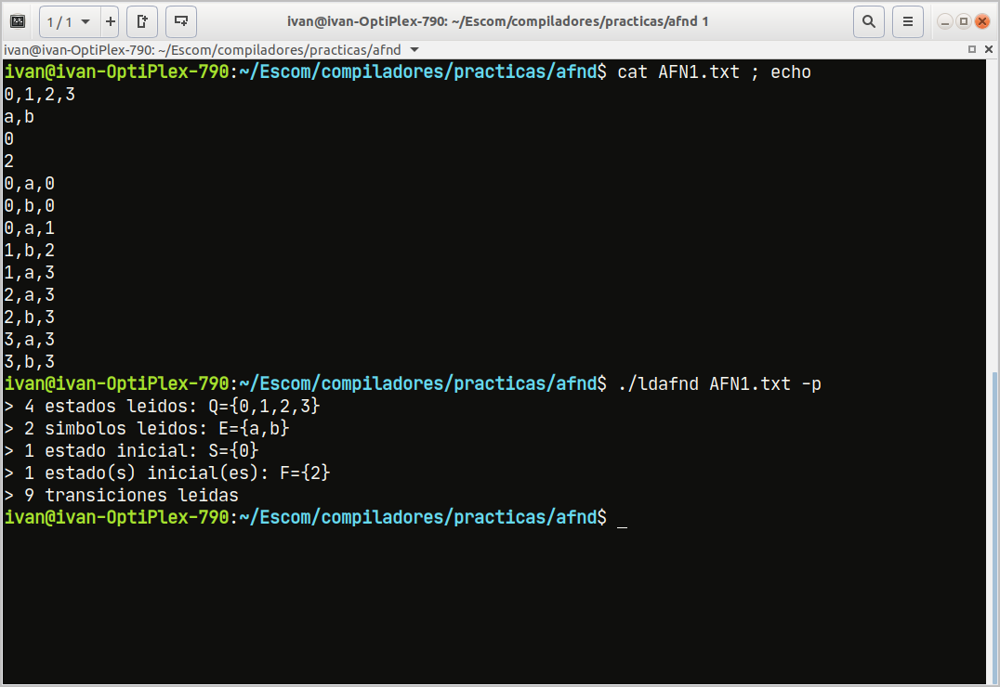
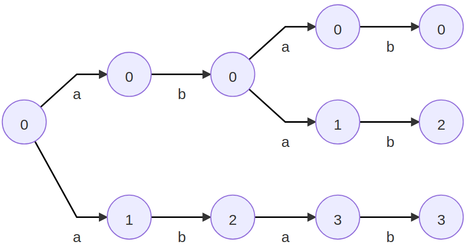
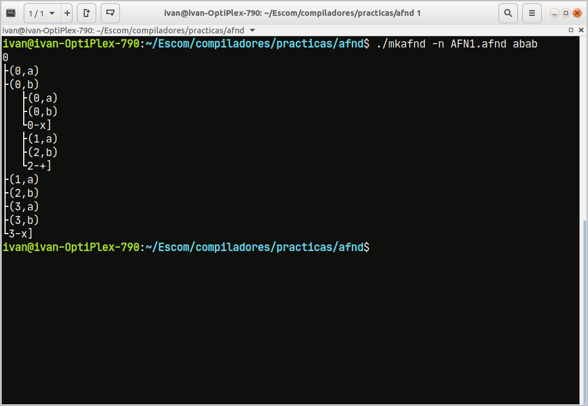
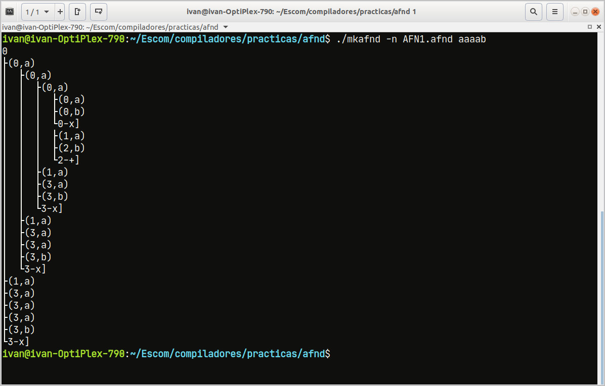
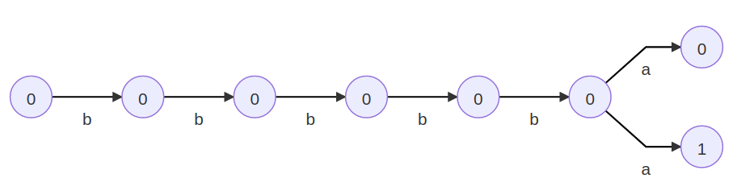
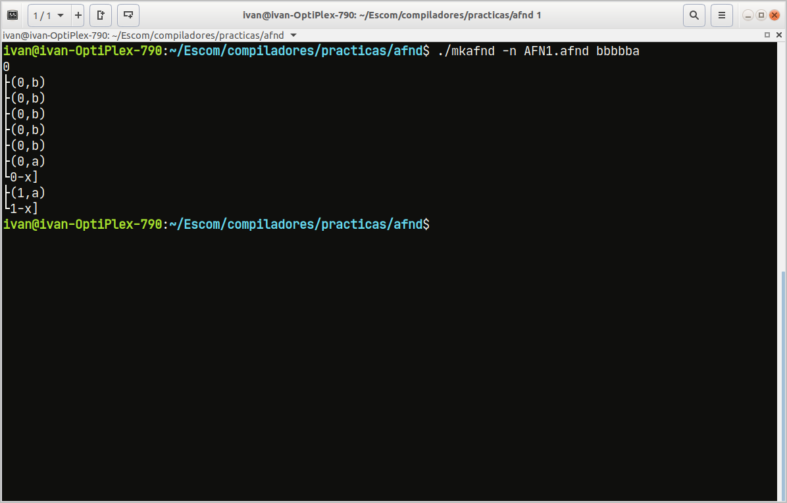

## Funcionamiento

Para mostrar el funcionamiento del programa, se utilizarán como entrada dos autómatas dados `AFN1.txt` y `AFN2.txt`, cuya definición, diagrama y condiciones de prueba se explican mas adelante respectivamente. Cabe mencionar que los programas se ejecutan en un entorno Linux a través de un emulador de terminal. La compilación del código en C y C++ se realizó con GCC 7.5.0 y G++ 7.5.0 respectivamente.

### Ejecución

El proceso implica la ejecución de 2 archivos binarios: 

1) **ldafnd** con el nombre de archivo .txt correspondiente a la definición del autómata como primer argumento.

```bash
$./ldafnd [ruta]/[archivo].txt [-p]?
```

2) **mkafnd** con la opción de ejecución como primer argumento, donde `n` permite mostrar los caminos posibles con la cadena de entrada y `v` permite recorrer el autómata con la cadena dada y elegir, en caso de existir mas de una transición con el mismo símbolo, el camino a recorrer; el segundo argumento corresponde al nombre de archivo .afnd generado por **ldafnd** con la representación equivalente. El tercer argumento corresponde a la cadena a evaluar.

```bash
$./mkafnd -[n|v] [ruta]/[archivo].afnd [cadena] [-p]?
```

La bandera `-p` como último argumento en ambos programas permite enviar a la salida estándar mensajes de la lectura de los archivos y en caso de ocurrir un error, una notificación de este.

Se contempla un conjunto de cadenas a evaluar en el autómata, y para ello se define a mano la posible ruta que la cadena puede tener considerando que pueden existir varios caminos para una sola cadena. Los diagramas y capturas siguientes muestran el cálculo a mano de los caminos y el resultado entregado por el programa, respectivamente. El programa muestra la ruta de la cadena en el autómata en forma de árbol con el siguiente formato:

```
estado inicial
├(estado, símbolo)
│  ├(estado, símbolo)
│  └estado-x|+]
├(estado,símbolo)
└estado-x|+]
```

Los caminos alternos se indican con el aumento de la sangría izquierda del par de estado y símbolo.  El estado en el que termina la cadena indica con el símbolo `+` si se trata de un estado terminal y con el símbolo `x` si se trata de un estado no terminal. 

### AFN1

La representación gráfica del autómata se muestra en la **Fig.7.a.** y el proceso de carga y salida de la representación equivalente se muestra en la **Fig.7.b**.

<table style="border:0px;text-align:center;">
    <tr style="border:0px">
        <td style="border:0px;padding:1em"></td>
        <td style="border:0px;padding:1em"></td>
    </tr>
    <tr>
        <td style="border:0px">a)</td>
        <td style="border:0px">b)</td>
    </tr>
</table>


> **Fig.7.** a) Representación gráfica del AFN1. b) Archivo de definición y ejecución de carga del AFND.

<style>
   thead tr {
        background-color:#CCC;
       text-align:center;
       font-weight:bold;
    }
</style>
<table class="entry">
    <thead>
    <tr>
        <td colspan="2" style="padding:.5em">Ruta</td>
        <td style="padding:.5em">Ejecución</td>
    </tr>
    </thead>
    <tbody>
    <tr>
        <td><span style="writing-mode: vertical-rl; transform: rotate(180deg);white-space: nowrap;font-size:1.3em">abab</span></td>
        <td class="entry-td" style="padding:1em"></td>
        <td class="entry-td" style="padding:1em"></td>
    </tr>
    <tr>
        <td><span style="writing-mode: vertical-rl; transform: rotate(180deg);white-space: nowrap;font-size:1.3em">aaaab</span></td>
        <td class="entry-td" style="padding:1em"></td>
        <td class="entry-td" style="padding:1em"></td>
    </tr>
    <tr>
        <td><span style="writing-mode: vertical-rl; transform: rotate(180deg);white-space: nowrap;font-size:1.3em">bbbbba</span></td>
        <td class="entry-td" style="padding:1em"></td>
        <td class="entry-td" style="padding:1em"></td>
    </tr>
	</tbody>	
</table>