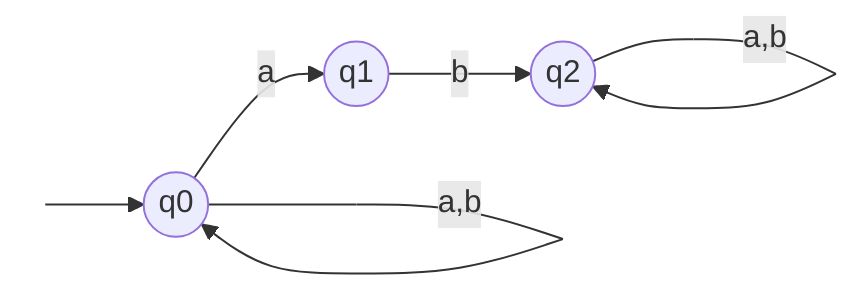
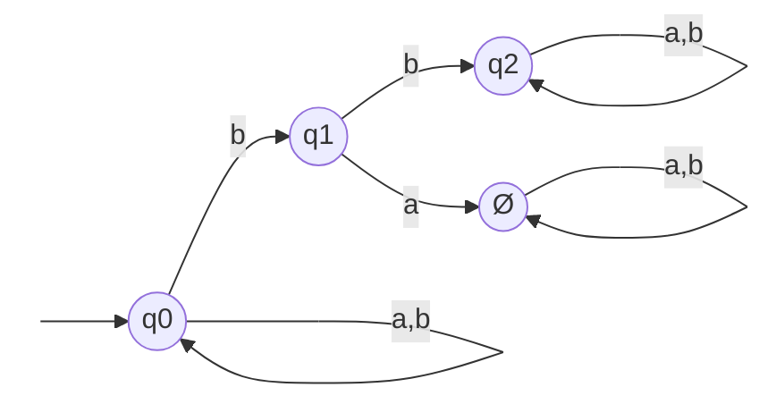
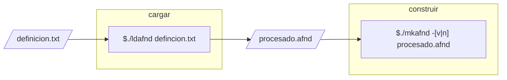
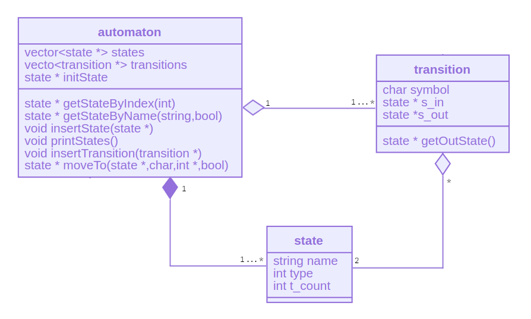

## Introducción

El presente trabajo describe el diseño e implementación en los lenguaje de programación `C` y `C++` de un *Autómata Finito No Determinista* adecuado para la implementación en el análisis léxico de un compilador. Se brinda además una un breve resumen teórico de temas fundamentales relacionados al trabajo. Los anexos a este presentan información técnica complementaria.

## Marco teórico

#### Análisis léxico 

Como se ha estudiado hasta el momento, la labor de los compiladores e interpretes, de los lenguajes de programación de alto nivel, implica llevar a cabo una serie de análisis sobre el código escrito por un programador. Estos análisis son identificados como **análisis léxico**, **análisis sintáctico** y **análisis semántico**, y si bien de manera conceptual son ejecutados de forma secuencial, en el orden que se han citado, en la práctica, este orden varía de compilador a compilador. Pese a lo anterior, las tareas que realiza cada tipo de análisis están bien definidas y difícilmente tienden a ser inconsistentes. 

Una de estas principales tareas es el análisis de las cadenas de caracteres que conforman el código fuente. Parte de estas cadenas son conocidas como *lexemas* y son consideradas la unidad mínima con significado dentro de un código. Las reglas que definen la estructura y forma de estos lexemas están dadas por un conjunto de *lenguajes regulares* para cada tipo de lexema (identificadores, expresiones matemáticas, palabras reservadas, por ejemplo), los cuales se pueden representar mediante *expresiones regulares*. Una expresión regular es definida, de manera general, como una secuencia de caracteres que encajan dentro de un patrón. De esta forma podemos establecer que un lexema pertenece a un lenguaje regular si encaja dentro de su expresión. Esta comprobación es posible hacerla implementando un modelo matemático que reconozca lenguajes regulares, por ejemplo un *Autómata Finito No Determinista*. Si dada una secuencia de caracteres como entrada al autómata finito no determinista se llega a un estado terminal al haber consumido la totalidad de los caracteres, concluimos que dicha cadena encaja en la expresión regular que representa el autómata y por ende es parte del lenguaje regular que conforma al lenguaje de programación.

#### Autómata finito

Definimos un autómata finito como un modelo matemático conformado por un conjunto de estados, un conjunto de símbolos (alfabeto) y transiciones, que tiene como finalidad reconocer lenguajes regulares. El reconocimiento de estos lenguajes se basa en una función de transición que define una trayectoria desde un estado inicial hasta un estado final en función de los símbolos que se le proporcionan como entrada. Esta función de transición es una función de dos variables: el estado origen (el estado en el que se encuentra dentro del autómata) y el símbolo y tiene como correspondencia un estado siguiente (al que desplaza dentro del autómata). Estrictamente, una función de transición de un *AFD* es una función **inyectiva**, ya que para un par de variables de entrada sólo se tiene un elemento de salida. Suele definirse a un autómata como una quintupla  de la forma:
$$
A=\{Q,\Sigma,q_i,\delta, F\}
$$
donde:	$Q = Conjunto\ de\ estados$ 

​				$\Sigma = Alfabeto\ (conjunto\ de\ símbolos)$

​				 $ q_i = estado\ inicial\ |\ q_i \in Q$

​				$\delta = función\ de\ transición$

​				$F = conjunto\ de\ estados\ finales\ |\ F\in Q $

> *Nota para mí: Consultar si la clasificación de la función de transición en las funciones inyectivas es correcta.* 

#### Autómata Finito No Determinista (AFND)

Un *Autómata Finito No Determinista*, es aquel en el que existe la posibilidad de tener (a diferencia del autómata finito determinista) transiciones de un estado a otros, posiblemente mas de uno, en función de un mismo símbolo de entrada perteneciente al alfabeto. Es decir, para los estados: $q_o$ (estado origen) y $qs_i$ (siguiente i-ésimo estado) y el símbolo de entrada $s$, existen las transiciones: $\delta(q_o,s)=qs_1$ y $\delta(q_o,s)=qs_2$ de tal forma que $qs_1 \ne qs_2$. Lo  anterior se puede interpretar como la posibilidad del autómata de estar en dos estados a la vez. 

---

**Ejemplo**

Sea el autómata definido por la quintupla: $A=\{Q,\Sigma,q0,\delta,q2\}$, donde $Q= \{q_0,q_1,q_2\}$, $\Sigma=\{a,b\}$, y $\delta $ se representa mediante la siguiente tabla:

| $\delta $             | a                | b        |
| --------------------- | ---------------- | -------- |
| $\triangleright\ q_0$ | $ \{q_0,q_1 \} $ | $q_o$    |
| $q_1 $                | -                | $q_2 $   |
| $\diamond\ q_2 $      | $q_2 $           | $q_2 \ $ |

( $\triangleright = estado\ inicial$, $\diamond = estado\ final$ ) 

El diagrama correspondiente al autómata anterior es el siguiente:



> **Fig.1. Autómata Finito No Determinista.** El autómata anterior reconoce las cadenas de letras a y b con mínimo dos ocurrencias de la letra b, por ejemplo, aabba, abba, abbb, etc. 

---

#### Analizador léxico

El analizador léxico de un compilador es autómata finito no determinista encargado realizar el análisis léxico de las cadenas de caracteres que conforman el código fuente de un programa, es decir, validan los lexemas del programa con base en los lenguajes regulares que conforman la totalidad del lenguaje de programación. Una característica que distingue al analizador léxico es su capacidad para llevar a cabo un manejo de errores. Este manejo de errores implica agregar un estado de error en la definición del autómata. La finalidad del estado es detectar determinados tipos de errores léxicos, señalar dicho error y permitir la continuidad del análisis.

Para el caso del autómata antes presentado, la implementación del estado de error tendría como resultado la siguiente definición, función de transición y diagrama:

$A=\{Q,\Sigma,q0,\delta,q2\}$, donde $Q= \{q_0,q_1,q_2, \O\}$, $\Sigma=\{a,b\}$.

| $\delta $             | a                | b        |
| --------------------- | ---------------- | -------- |
| $\triangleright\ q_0$ | $ \{q_0,q_1 \} $ | $q_o$    |
| $q_1 $                | $\O$             | $q_2 $   |
| $\diamond\ q_2 $      | $q_2 $           | $q_2 \ $ |
| $\O$                  | $\O$             | $\O$     |



> **Fig.2. AFND con estado de error**

Si el autómata anterior se encuentra en un estado en el que no existe transición, dado el actual símbolo de entrada, este pasa al estado de error y continua con la validación de la cadena.

## AFND en C y C++

La implementación del AFND se hace, como ya se ha mencionado anteriormente, en el lenguaje C y C++ y obedece al diagrama mostrado en la **Fig.3.**; como se puede observar en dicho diagrama, se cuenta con dos módulos principales: el de **carga** y el de **construcción**. La función del módulo de carga es pasar la definición del autómata (dada en un formato que se discute mas adelante) a una representación equivalente, adecuada para implementarse bajo el paradigma orientado a objetos con el fin de facilitar su manipulación. Dicho módulo de construcción define las clases y métodos necesarios para realizar tanto la instanciación del autómata, como las validaciones y recorridos necesarios dentro de este.



> **Fig.3.** Proceso de carga y construcción del AFND a partir de un archivo de entrada TXT

El módulo de carga del autómata está implementado en un programa en C, mientras que el módulo de construcción se ha implementado en C++. 

### Carga

##### Lectura de definición

En esta parte del proceso de lectura de la definición del autómata se tiene como entrada un archivo de texto plano que contiene un conjunto de líneas en las cuales, separados por comas, se encuentran los valores de Q, el alfabeto E, el estado inicial S, los estados finales F y la función de transición. La función de transición se define a partir de la quinta línea con el formato: 
$$
estado\ origen,\ simbolo,\ estado\ siguiente
$$
---


> **Fig.2.2.** a) Formato de archivo de entrada. b) Ejemplo de archivo de entrada

Una vez cargado el archivo en memoria, se leen los valores correspondientes a los conjuntos Q, E,F y S. Estos valores son considerados la cabecera del autómata  y se copian  a una estructura de tipo `afnd_header` que se conforma de 5 variables enteras (que guardan el conteo de los elementos de cada conjunto) y 5 de tipo `s_list` (lista de cadenas: estructura y funciones definidas en `strlist.h`). 

```C
typedef struct afnd_header{
	s_list Q,E,S,F;
	int q,e,s,f;
}afnd_header;
```

> Declaración de estructura para almacenar cabecera del autómata

Los valores de la función de transferencia se leen y se copian a una estructura de tipo `afnd_data` con la siguiente definición:

```C
typedef struct afnd_data{
	int d;
	s_list **** space;
}afnd_data;
```

La variable entera `d` almacena el conteo de transiciones leídas. El apuntador cuádruple  de tipo `s_list` se describe a continuación.

##### Conversión de la definición

Con la finalidad de transformar el formato de las transiciones de entrada a un formato de salida (**Fig.4.a**) que relacione un estado origen con un estado destino en función de todos los símbolos en las transiciones entre estos, se define un espacio de tres dimensiones, *espacio delta* (apuntador cuádruple de tipo `s_list`) como se muestra en la **Fig.5**, de tamaño $|Q|\times |E|\times |Q|$, en el cual, si existe la transición que corresponde a las coordenadas $(qo_i,s_j,qs_k)$ se copian los valores correspondientes a la celda actual del espacio delta, o de forma contraria, si la transición no existe, se define como transición nula ($/$). Posteriormente se recorre el espacio delta de forma iterativa para escribir un nuevo archivo de salida con la representación del autómata en el siguiente formato:


> **Fig.4.** a) Formato de archivo procesado. b) Archivo procesado de la Fig.2.1.b.


> **Fig.5. Representación gráfica del espacio delta.** De manera conceptual el espacio delta se refiere a todas la combinaciones posibles entre dos estados y un símbolo en el dominio de los conjuntos que definen al autómata.

### Construcción

Como se ha mencionado, este módulo se desarrolla bajo el paradigma OO; el diagrama de clases correspondiente se muestra en la **Fig.6**. Se utiliza la  Standard Template Library (STL) de C++ para manejar la estructura de datos **vector** como atributos de la clase.



> **Fig.6.** Diagrama de clases del módulo de construcción.

El proceso de lectura del archivo que se muestra en la Fig.4.b, se hace de forma diferente a como se hace en el módulo de carga, la siguiente serie de pasos describe este proceso:

1. Se lee el conjunto de estados de la primera línea y se crea la instancia de la clase `state ` correspondiente
2. Se lee la línea del archivo correspondiente al estado inicial del autómata. Con la cadena leída se busca dicho estado en las instancias creadas en el paso 1 y se hace la referencia a este. El valor del atributo `type` de la clase `state` se aumenta en 1, para que corresponda con el identificador del tipo de estado (Tabla.2.1).
3. Se lee la línea del archivo correspondiente a los estados finales del autómata.  El valor del atributo `type` de la clase `state` se aumenta en 2, para que corresponda con el identificador del tipo de estado (Tabla.2.1).
4. Se crean las instancias de transiciones. Para ello se lee el conjunto de líneas que describen de forma equivalente la transición. Se hace referencia al estado de origen, se guarda en símbolo de la transición en el atributo `symbol` de la transición y se hace referencia al estado de salida.

| Tipo      | Valor |
| --------- | ----- |
| ordinario | 0     |
| inicial   | 1     |
| terminal  | 2     |

> **Tabla.2.1.** Valores enteros asociados al tipo de estado.

Al finalizar la lectura e instanciación de clases, el autómata cargado en memoria, evalúa una cadena de entrada especificada como argumento, o recibe por la entrada estándar un flujo de caracteres a evaluar, esto dependiendo de la opción con la que se ejecute.

---

### Nota sobre los archivos de texto

<p style="background-color:rgba(200,0,0,0.1);border:1px solid rgba(200,0,0,0.5);padding:1em">Los archivos de texto de entrada al programa no deben contener saltos de línea de tipo <b>CRLF (CarriageReturn+LineFeed)</b>, ya que el programa de carga de la definición reconoce este par de caracteres como un símbolo mas, generando así una lectura y conversión de la definición errónea. Para solucionar este inconveniente se puede utilizar el comando en linux <b>dos2unix</b> para comvertir de un formato de salto de línea a otro. Regularmente los archivos de texto creados en Windows, son los que poseen este tipo de salto de línea.</p>

---

## Funcionamiento

Para mostrar el funcionamiento del programa, se utilizarán como entrada dos autómatas dados `AFN1.txt` y `AFN2.txt`, cuya definición, diagrama y condiciones de prueba se explican mas adelante respectivamente. Cabe mencionar que los programas se ejecutan en un entorno Linux a través de un emulador de terminal. La compilación del código en C y C++ se realizó con GCC 7.5.0 y G++ 7.5.0 respectivamente.

### Ejecución

El proceso implica la ejecución de 2 archivos binarios: 

1) **ldafnd** con el nombre de archivo .txt correspondiente a la definición del autómata como primer argumento.

```bash
$./ldafnd [ruta]/[archivo].txt [-p]?
```

2) **mkafnd** con la opción de ejecución como primer argumento, donde `n` permite mostrar los caminos posibles con la cadena de entrada y `v` permite recorrer el autómata con la cadena dada y elegir, en caso de existir mas de una transición con el mismo símbolo, el camino a recorrer; el segundo argumento corresponde al nombre de archivo .afnd generado por **ldafnd** con la representación equivalente. El tercer argumento corresponde a la cadena a evaluar.

```bash
$./mkafnd -[n|v] [ruta]/[archivo].afnd [cadena] [-p]?
```

La bandera `-p` como último argumento en ambos programas permite enviar a la salida estándar mensajes de la lectura de los archivos y en caso de ocurrir un error, una notificación de este.

Se contempla un conjunto de cadenas a evaluar en el autómata, y para ello se define a mano la posible ruta que la cadena puede tener considerando que pueden existir varios caminos para una sola cadena. Los diagramas y capturas siguientes muestran el cálculo a mano de los caminos y el resultado entregado por el programa, respectivamente. El programa muestra la ruta de la cadena en el autómata en forma de árbol con el siguiente formato:

```
estado inicial
├(estado, símbolo)
│  ├(estado, símbolo)
│  └estado-x|+]
├(estado,símbolo)
└estado-x|+]
```

Los caminos alternos se indican con el aumento de la sangría izquierda del par de estado y símbolo.  El estado en el que termina la cadena indica con el símbolo `+` si se trata de un estado terminal y con el símbolo `x` si se trata de un estado no terminal. 

### AFN1

La representación gráfica del autómata se muestra en la **Fig.7.a.** y el proceso de carga y salida de la representación equivalente se muestra en la **Fig.7.b**.

<table style="border:0px;text-align:center;">
    <tr style="border:0px">
        <td style="border:0px;padding:1em"></td>
        <td style="border:0px;padding:1em"></td>
    </tr>
    <tr>
        <td style="border:0px">a)</td>
        <td style="border:0px">b)</td>
    </tr>
</table>


> **Fig.7.** a) Representación gráfica del AFN1. b) Archivo de definición y ejecución de carga del AFND.

<style>
   thead tr {
        background-color:#CCC;
       text-align:center;
       font-weight:bold;
    }
</style>
<table class="entry">
    <thead>
    <tr>
        <td colspan="2" style="padding:.5em">Ruta</td>
        <td style="padding:.5em">Ejecución</td>
    </tr>
    </thead>
    <tbody>
    <tr>
        <td><span style="writing-mode: vertical-rl; transform: rotate(180deg);white-space: nowrap;font-size:1.3em">abab</span></td>
        <td class="entry-td" style="padding:1em"></td>
        <td class="entry-td" style="padding:1em"></td>
    </tr>
    <tr>
        <td><span style="writing-mode: vertical-rl; transform: rotate(180deg);white-space: nowrap;font-size:1.3em">aaaab</span></td>
        <td class="entry-td" style="padding:1em"></td>
        <td class="entry-td" style="padding:1em"></td>
    </tr>
    <tr>
        <td><span style="writing-mode: vertical-rl; transform: rotate(180deg);white-space: nowrap;font-size:1.3em">bbbbba</span></td>
        <td class="entry-td" style="padding:1em"></td>
        <td class="entry-td" style="padding:1em"></td>
    </tr>
	</tbody>	
</table>


