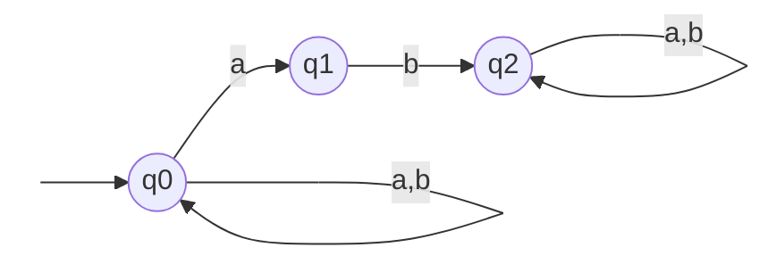
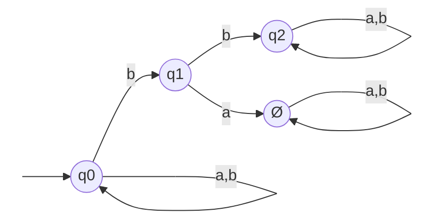

#### Autómata finito

Definimos un autómata finito como un modelo matemático conformado por un conjunto de estados, un conjunto de símbolos (alfabeto) y transiciones, que tiene como finalidad reconocer lenguajes regulares. El reconocimiento de estos lenguajes se basa en una función de transición que define una trayectoria desde un estado inicial hasta un estado final en función de los símbolos que se le proporcionan como entrada. Esta función de transición es una función de dos variables: el estado origen (el estado en el que se encuentra dentro del autómata) y el símbolo y tiene como correspondencia un estado siguiente (al que desplaza dentro del autómata). Estrictamente, una función de transición de un *AFD* es una función **inyectiva**, ya que para un par de variables de entrada sólo se tiene un elemento de salida. Suele definirse a un autómata como una quintupla  de la forma:
$$
A=\{Q,\Sigma,q_i,\delta, F\}
$$
donde:	$Q = Conjunto\ de\ estados$ 

​				$\Sigma = Alfabeto\ (conjunto\ de\ símbolos)$

​				 $ q_i = estado\ inicial\ |\ q_i \in Q$

​				$\delta = función\ de\ transición$

​				$F = conjunto\ de\ estados\ finales\ |\ F\in Q $

> *Nota para mí: Consultar si la clasificación de la función de transición en las funciones inyectivas es correcta.* 

#### Autómata Finito No Determinista (AFND)

Un *Autómata Finito No Determinista*, es aquel en el que existe la posibilidad de tener (a diferencia del autómata finito determinista) transiciones de un estado a otros, posiblemente mas de uno, en función de un mismo símbolo de entrada perteneciente al alfabeto. Es decir, para los estados: $q_o$ (estado origen) y $qs_i$ (siguiente i-ésimo estado) y el símbolo de entrada $s$, existen las transiciones: $\delta(q_o,s)=qs_1$ y $\delta(q_o,s)=qs_2$ de tal forma que $qs_1 \ne qs_2$. Lo  anterior se puede interpretar como la posibilidad del autómata de estar en dos estados a la vez. 

---

**Ejemplo**

Sea el autómata definido por la quintupla: $A=\{Q,\Sigma,q0,\delta,q2\}$, donde $Q= \{q_0,q_1,q_2\}$, $\Sigma=\{a,b\}$, y $\delta $ se representa mediante la siguiente tabla:

| $\delta $             | a                | b        |
| --------------------- | ---------------- | -------- |
| $\triangleright\ q_0$ | $ \{q_0,q_1 \} $ | $q_o$    |
| $q_1 $                | -                | $q_2 $   |
| $\diamond\ q_2 $      | $q_2 $           | $q_2 \ $ |

( $\triangleright = estado\ inicial$, $\diamond = estado\ final$ ) 

El diagrama correspondiente al autómata anterior es el siguiente:

> **Fig.1. Autómata Finito No Determinista.** El autómata anterior reconoce las cadenas de letras a y b con mínimo dos ocurrencias de la letra b, por ejemplo, aabba, abba, abbb, etc. 

---

#### Analizador léxico

El analizador léxico de un compilador es autómata finito no determinista encargado realizar el análisis léxico de las cadenas de caracteres que conforman el código fuente de un programa, es decir, validan los lexemas del programa con base en los lenguajes regulares que conforman la totalidad del lenguaje de programación. Una característica que distingue al analizador léxico es su capacidad para llevar a cabo un manejo de errores. Este manejo de errores implica agregar un estado de error en la definición del autómata. La finalidad del estado es detectar determinados tipos de errores léxicos, señalar dicho error y permitir la continuidad del análisis.

Para el caso del autómata antes presentado, la implementación del estado de error tendría como resultado la siguiente definición, función de transición y diagrama:

$A=\{Q,\Sigma,q0,\delta,q2\}$, donde $Q= \{q_0,q_1,q_2, \O\}$, $\Sigma=\{a,b\}$.

| $\delta $             | a                | b        |
| --------------------- | ---------------- | -------- |
| $\triangleright\ q_0$ | $ \{q_0,q_1 \} $ | $q_o$    |
| $q_1 $                | $\O$             | $q_2 $   |
| $\diamond\ q_2 $      | $q_2 $           | $q_2 \ $ |
| $\O$                  | $\O$             | $\O$     |

> **Fig.2. AFND con estado de error**

Si el autómata anterior se encuentra en un estado en el que no existe transición, dado el actual símbolo de entrada, este pasa al estado de error y continua con la validación de la cadena.