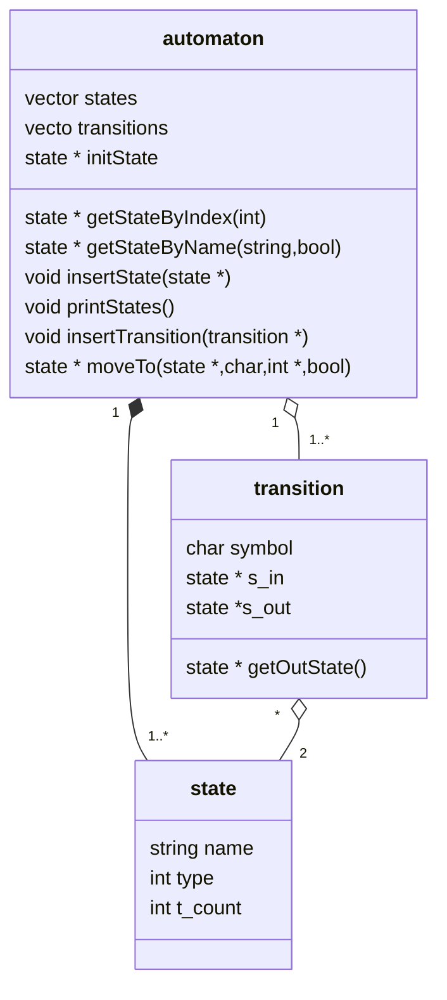
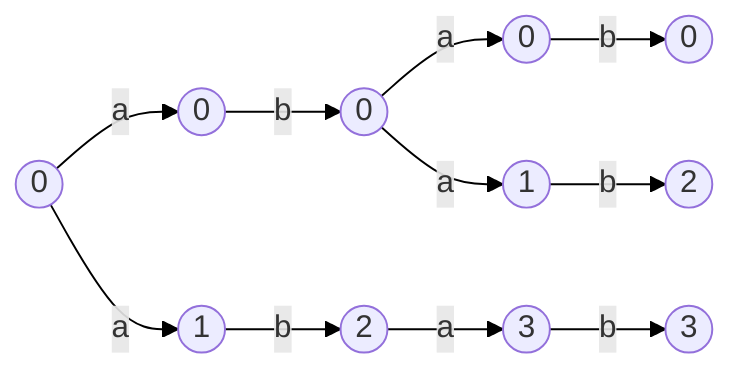
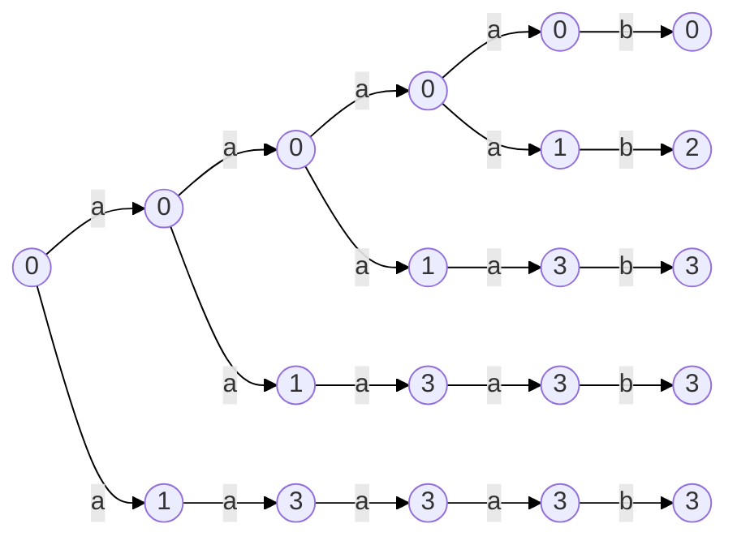
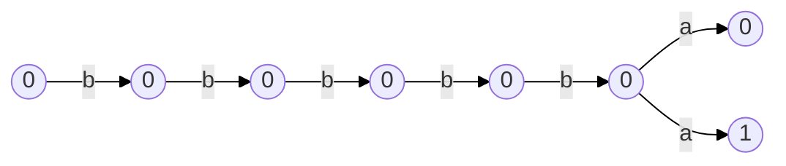

Lectura

Se leen los estados, el alfabeto, estado final y estado inicial. Se almacena en una estructura (cabecera). Se crea un espacio de caracteres de |Q²|x|E| donde se almacenará la relación de estados de entrada contra los símbolos del alfbeto contra los estados de salida de la forma: delta(qi,s,qo). De no existir relación de qí se marca como nulo "\". Se crea un nuevo archivo intermedio donde se escribe la cabecera del automata y posteriormente se vacia la información del espacio delta en el mismo con el siguiente formato:
Q
E
S
F

\>qi
cj,cj+1,..., q1
.
.
.

Carga de AFND

Se crea una instancia de la clase automaton, se le asigna los valores de Q,E,S y F. Se inicia la subrutina <<Crear estados>>. Se inicia la subrutina <<Crear transiciones>>.

Crear estados

Para cada elemento en Q, se crea una instancia de la clase state a la que se le asigna como nobre el valor de Q[i].

	for i in Q.size
		new state
		state.name <- Q.value

Crear transiciones

Se recorre el espacop delta y por cada elemento dentro de D[i][j][k]  (donde i = estado de entrada, j = símbolo y k=estado de salida) se crea una instancia de la clase transition a la cual se le asigna el símbolo actual, el estado de entrada y de salida actual. Por cada elemento de k se incrementa el número de transiciones asociadas al estado i.

## Uso

La implementación del AFND en C y C++, se hace en un entorno Linux. La ejecución de los programas se hace en terminal, por lo cual es posible definir un conjunto de opciones como argumentos para llevar a cabo diferentes tareas. Como se mencionó en la sección anterior la carga y conversión del archivo de definición del autómata la hace el programa **ldafnd** (ld=load, nombre de objeto sugerido) y la construcción y validación de este el programa **mkafnd** (mk=make).

moveTo Backup:

state * automaton::moveTo(state * s_in,char symbol, int * flag,bool vs){
	int i;
	vector<state*> aval_states;

	for(i=0;i<transitions.size();i++){
		if(s_in==transitions[i]->s_in&&symbol==transitions[i]->symbol){
			aval_states.push_back(transitions[i]->s_out);
		}
	}
	
	if(aval_states.size()==0){
		if(vs) cout << "> d(" << s_in->name << "," << symbol << ")=Sin transicion" <<endl;
		return s_in;
	}else{
		if(aval_states.size()==1){
			*flag=1;
			return aval_states[0];
		}
		else {
			int size = aval_states.size(), selected;
			if(vs) cout << "\n> Se tienen " << size << " transiciones con '" << symbol << "' desde " << s_in->name << endl;
			for(i=0;i<aval_states.size();i++){
				if(vs) cout <<"   "<< i+1 << ". d(" << s_in->name << "," << symbol << ")=" << aval_states[i]->name << endl;
			}
			if(vs) cout << "   Elige [1-" << size << "]: ";
			cin >> selected;
			*flag=1;
			return aval_states[selected-1];
		}
	}

}

**abab**

**aaaab**

**bbbbba**

