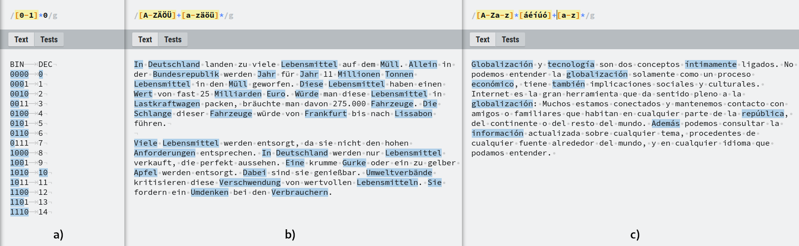
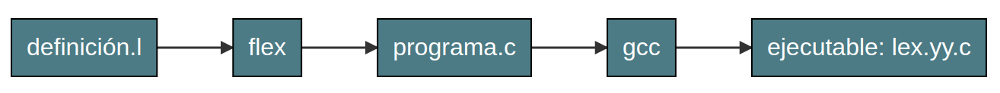
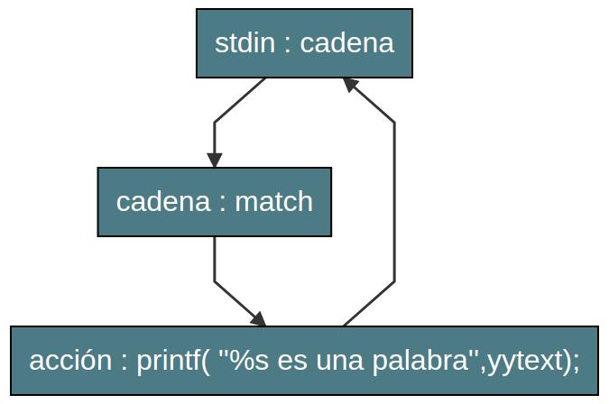

## Introducción

Siguiendo con la fase de análisis léxico de un compilador, observamos que hoy en día existe un gran conjunto de herramientas de software que permiten el desarrollo de analizadores léxicos de forma ágil y rápida. Flex es una de estas herramientas y el presente trabajo describe el proceso de generación de un analizador léxico con este. De forma introductoria se presenta una breve base teórica sobre expresiones regulares, las cuales son necesarias para implementar el analizador.

## Marco teórico

### Lenguajes y expresiones regulares

Como se ha mencionado Flex es una herramienta que permite implementar analizadores léxicos, esto, teniendo como entrada un conjunto de expresiones regulares. Decimos que una cadena de símbolos pertenece a un lenguaje cuando está encaja con un patrón definido en el propio lenguaje, por lo cual se hace de vital importancia tener una forma de expresar estos patrones de tal suerte que todas las cadenas que pertenecen al lenguaje sean identificadas con mayor facilidad; en el caso de los lenguajes regulares, las expresiones regulares cumplen la función antes mencionada, pues estas fungen como una abreviatura de la definición de un lenguaje regular.

Un lenguaje regular es el resultado de la aplicación de las operaciones de unión, concatenación y cerradura de Kleene sobre un alfabeto; en estos se incluye el conjunto vació $\emptyset$ y la cadena vacía $\epsilon$. La definición de un lenguaje regular sobre un alfabeto $\Sigma$ se hace de forma recursiva como sigue [1]:

**Lenguaje regular**

​		(a) $\emptyset$ es un lenguaje regular
​		(b) {$\epsilon$} es un lenguaje regular
​		(c) Para todo $a\in \Sigma$, $\{a\}$ es un lenguaje regular
​		(d) Si $A$ y $B$ son lenguajes regulares, entonces $A \cup B,\ A\cdot B\ y\ A^{*}$ son lenguajes regulares
​		(e) Ningún otro lenguaje sobre $\Sigma$ es regular

La Tabla.1. muestra un conjunto equivalencias de las que se hace uso en las expresiones regulares (**ER**) para representar un lenguaje regular (**LR**).

| ER        |        | LR                                        |
| --------- | :----: | ----------------------------------------- |
| $a$       | $\iff$ | $\{a\}={lenguaje\ unitario\ a}$           |
| $a\cup b$ | $\iff$ | $\{a,b\}=\{a\}\cup \{b\}$                 |
| ab        | $\iff$ | $\{ab\}=concatenación\ de\ a\ y\ b$       |
| $a^*$     | $\iff$ | $\{a^*\}=cerradura\ de\ Kleene\ sobre\ a$ |
| $a^+$     | $\iff$ | $\{a^+\}=cerradura\ positiva\ sobre\ a$   |

> **Tabla 1.** Equivalencias entre ER's y LR's.

El operador de cerradura Kleene tiene el primer lugar en la precedencia de operadores, la concatenación le sigue y finalmente la unión tiene el último lugar. Sentado lo anterior, la definición recursiva de una expresión regular [1] es la siguiente:

**Expresión regular**

​		(a) $\emptyset\ y\ \epsilon$ son lenguajes regulares
​		(b) $a$ es una expresión regular para todo $a\in \Sigma$
​		(c) Si $r$ y $s$ son expresiones regulares, entonces $r\cup s,\ r\cdot s,$ y $r^*$ también lo son
​		(d) Ninguna otra secuencia de símbolos es una expresión regular

Un ejemplo de esta relación se puede hacer con el lenguaje sobre el alfabeto de 1's y 0's que contiene todas las cadenas que representan números binarios pares.

**Ejemplo:** Sea el alfabeto $\Sigma=\{0,1\}$ se define el lenguaje $B={\{0\}\{1\}^*\{0\}}$ la expresión regular correspondiente a $B$ es $b=(01)^*0$.

### Expresiones regulares en computadora

La definición de expresión regular antes mencionada hace uso de símbolos matemáticos que carecen de una representación en una codificación digital, es por eso que en el ámbito computacional y de la programación podemos encontrar un conjunto de caracteres permiten definir una expresión regular de tal forma que esta pueda ser representada para su uso en una computadora. La aplicación de dicha forma de expresión se utiliza en distintas herramientas y lenguajes computacionales, ejemplo de estos son los motores de expresiones regulares de Unix/Linux **grep** y **sed** y los lenguajes **C++, Java, JavaScript, PERL, PHP, Python**, por mencionar algunos.

La Tabla.2. describe los principales caracteres utilizados para definir una expresión regular en una computadora.

| Caracter | Función                                                      |
| -------- | ------------------------------------------------------------ |
| .        | Representa cualquier caracter                                |
| \        | Caracter de escape. Omite el caracter siguiente de los criterios de búsqueda de un motor de ER. |
| []       | Agrupan en grupos o clases un conjunto de caracteres.        |
| [i-f]    | Denota un conjunto de caracteres que va de un inicio **i** a un final **f**. |
| \|       | Indica varias opciones a empatar en una ER. Se puede considerar el equivalente al símbolo matemático $\or$ en los conjuntos. |
| $        | Indica el final de una cadena de caracteres o de una línea   |
| ^        | Precedido de una ER indica el principio de una línea. Se se ubica seguido de la apertura de un corchete de agrupación, omite de la búsqueda el grupo al que se hace referencia. |
| ()       | Permiten agrupar un conjunto de caracteres.                  |
| ?        | Indica que la ER o caracter que lo precede puede ocurrir o no. |
| *        | Indica que una ER o un grupo de caracteres se puede repetir 0 o mas veces. Equivale al operador de la cerradura de Kleene. |
| +        | Indica que la ER o caracter que lo precede debe aparecer por lo menos una vez. |

> **Tabla.2. ** Principales signos utilizados en la representación de ER en una computadora.  Dependiendo del motor o lenguaje que se utilice estos pueden llegar a variar.

Tomando el ejemplo de expresión regular de la sección anterior la ER, $b=(01)^*0$  puede ser representada de forma equivalente como `[0-1]*0`.  La Fig.1. muestra un par de ejemplos de expresiones regulares y los empates de estas con un texto de ejemplo. Se utiliza el motor de expresiones regulares online [RegEx](https://regexr.com/).



> **Fig.1.** Expresiones regulares y sus empates. a) Números binarios pares. b) Sustantivos en idioma Alemán. c) Palabras acentuadas en un texto en español.

### Flex

Se trata de un software (de licencia GPL) que dada una especificación de patrones en forma de expresiones regulares en un archivo fuente (extensión .l), asocia ciertas acciones especificadas en función de los empates de una cadena de entrada con la ER correspondiente. El primer paso en la construcción del analizador léxico,  es definir en el fichero .l las expresiones para después analizarse con Flex. El resultado de este análisis es un archivo de código fuente en C listo para compilar y obtener un ejecutable del analizador.



> **Fig.2.** Proceso de generación de un analizador léxico con Flex.

**Formato de archivo .l**

El formato del archivo que contiene las definiciones y acciones junto con código en C especificado por el usuario, se divide en tres secciones correspondientes a lo antes mencionadas, las cuales se delimitan con el símbolo `%%`. 

```C
/* Definción de ER's */
	<nombre 1>	<definición 1>
	<nombre 2>	<definición 2>
        ...
%%
/* Reglas */
	<ER>{<nombre n>} {
		<acción = Código en C a ejecutar>
	}
	...
%%
/* Código de usuario en C */
int main(int argc, char * argv[]){
	...
	return 0;
}
```

**Compilación y ejecución**

Una vez que se obtiene el archivo de salida en C, este se puede compilar con GCC enlazando la librería `-lfl`. En ejecución, el programa espera en la entrada estándar una cadena de caracteres la cual analiza y en caso de encontrar un emparejamiento con alguna de las reglas especificas, se ejecuta el código en C asociado a dicho empate. 

> <small>**Nota:** Es posible cambiar la fuente de entrada del analizador a un archivo asignando a la variable global **yyin** el apuntador a un archivo cargado en memoria. Lo anterior se especifica en el código de usuario.</small>



> **Fig.3.** Ejemplo de ejecución de un analizador léxico hecho en Flex.
