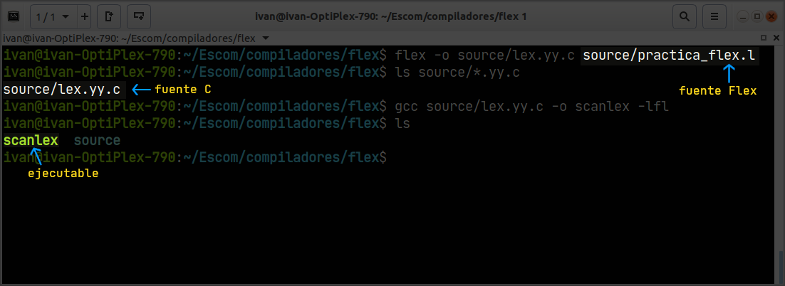
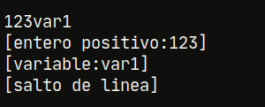
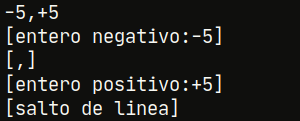
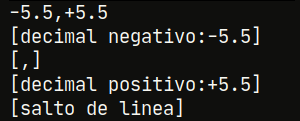
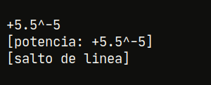
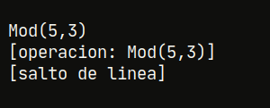
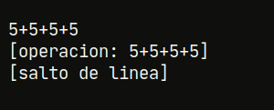

## Funcionamiento

### Análisis y compilación

Dado el archivo de entrada `practica_flex.l` con el contenido descrito anteriormente, se procede a analizar y obtener el código de salida en C en el archivo `lex.yy.c` con Flex . Posteriormente se compila dicho archivo con GCC 7.5 y se obtiene el ejecutable definido como `scanlex`. (Fig.4).

> **Fig.4.** Análisis y compilación del analizador léxico.

### Pruebas

Dado un conjunto de cadenas, se ingresan al analizador léxico mediante la entrada estándar de la terminal. El siguiente conjunto de figuras muestra el resultado entregado por el programa para cada cadena (primera línea en cada figura).

<table>
<tr>
<td width="30%" style="background-color:#0f0f0d"></td>
<td>Observamos que la cadena de entrada no cumple con las condiciones para ser un variable, es por eso que el analizador empata el la primera subcadena <b>123</b> como un número entero positivo y lo segunda subcadena <b>var1</b> como un variable.</td>
</tr>
<tr>
<td width="30%" style="background-color:#0f0f0d"></td>
<td>La primera subcadena <b>-5</b> empata en la definición de entero negativo, la coma "<b>,</b>" se separa y se identifica la subcadena <b>+5</b> como un entero positivo.</td>
</tr>
<tr>
<td width="30%" style="background-color:#0f0f0d"></td>
<td>De forma similar al caso anterior se empata la subcadena <b>+5.5</b> como un número decimal positivo, la coma se separa y la subcadena <b>-5.5</b> se empata con la definición de un decimal negativo.</td>
</tr>
<tr>
<td width="30%" style="background-color:#0f0f0d"></td>
<td>En este caso, dada la definición de la expresión regular correspondiente a la potencia, la primera subcadena <b>+5.5</b> se empata con la definición de decimal negativo, el acento circunflejo <b>^</b> se asocia a la operación de potencia y la subcadena <b>-5</b> se empata con la definición de entero negativo. Estas tres cadenas en conjunto corresponden al patrón que describe la regla de potencia, por lo cual la cadena en su totalidad es identificada como tal.</td>
</tr>
<tr>
<td width="30%" style="background-color:#0f0f0d"></td>
<td>La cadena corresponde a la definición de la operación módulo, esto ya que los paréntesis no forman parte de la expresión regular para las variables. La coma no es separada como en el los casos anteriores de los números, dado que está compone a la expresión regular de módulo que a su vez conforma a la expresión regular de la operación.</td>
</tr>
<tr>
<td width="30%" style="background-color:#0f0f0d"></td>
<td>La cadena de entrada es un conjunto de números enteros separados por el signo <b>+</b>, esta empata completamente con la expresión regular de la operación.</td>
</tr>
</table>

> **Fig.5.** Ejecución completa del programa.

## Conclusiones

La disponibilidad de herramientas como Flex para la generación de analizadores léxicos supone una gran ventaja en el proceso de compresión de la fase correspondiente; pues si bien, la base teórica se adquiere desde cursos anteriores, la aplicación de dicho conocimiento enfocado en la materia enriquece de manera sustancial el entendimiento del trabajo del compilador, entonces, la posibilidad de centrar la atención en la construcción de las expresiones regulares que definen al lenguaje y no en la construcción del analizador en sí, es la que propicia el aprovechamiento al que se refiere.

