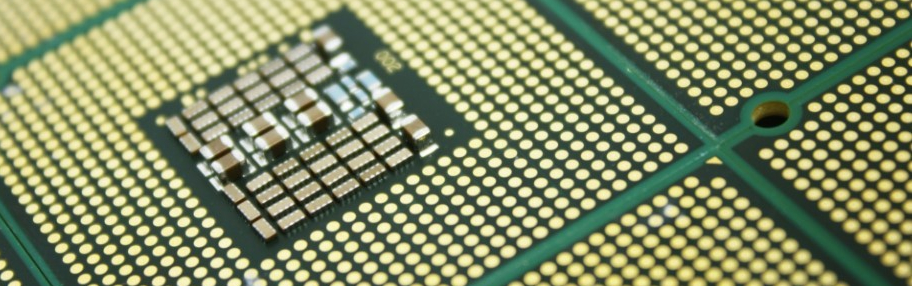

# I: Introducción

Los microprocesadores sustentan la mayoría de sistemas de cómputo en el mundo, conforman el cerebro y la columna vertebral de cualquier máquina que realiza cálculos. Actualmente los avances en la fabricación y diseño de microprocesadores, hace que los procesos de cómputo de cualquier dispositivo electrónico sean transparentes, extremadamente rápidos y accesibles desde casi cualquier lugar en el planeta. El desarrollo de un microprocesador requiere de consideraciones previas como lo es el formato de instrucción, tamaño de datos, la arquitectura, el número de operaciones, entre otras. El objetivo de este trabajo es dar seguimiento y documentar cada módulo del desarrollo de un procesador básico con funcionalidades limitadas, implementando una unidad aritmético lógica (ALU) con 16 operaciones, 8 aritméticas y 8 lógicas, permitiendo la entrada de dos operandos y la reutilización de la salida de la ALU, con un memoria ROM que permita almacenar y leer las instrucciones de programa.

La estructura del trabajo se divide en los siguientes capítulos: Diseño, Stage I, Stage II, GCM y LagartijaX4.

#### Microprocesador

El término **microprocesador** hace referencia a un circuito integrado digital encargado de ejecutar los programas de una computadora. Dicho circuito trabaja al nivel mas bajo de hardware, es decir la información que procesa se representa en forma binaria. El procesador lleva acabo una serie de instrucciones que principalmente se refiere a la carga/escritura de valores en alguno localidad de memoria o registro y a operaciones aritméticas y lógicas sobre uno o mas operandos. A pesar de que las funciones de un procesador son comunes entre los diferentes diseños y arquitecturas, estos presentan diferencias en cuanto los componentes que los conforman o la manera en que se procesa la información.



#### Arquitectura

Dentro del diseño de computadoras existen dos principales tipos de arquitecturas que describen a un muy alto nivel los componente básicos y relaciones entre estos de una computadora, la máquina Harvard y la de Von Neumann. Regularmente estas descripciones se suelen referir a la totalidad de una computadora digital, sin embargo son aplicables al concepto de microprocesador. La principal diferencia entre estas máquinas es la forma en que manejan la memoria, mientras la máquina Harvard cuenta con un par de unidades de memoria que manejan por separado los datos a procesar y las instrucciones, la máquina de Von Neuemann cuenta con un solo elemento de memoria del cual se leen tanto los datos como las instrucciones.


> **fig.1.0.** Descripción general de la máquina de Von Neumann y la máquina Harvard.


Si bien la diferencia entre ambas radica sólo en la forma de manejar la memoria, el desempeño total del sistema suele diferir en gran medida. En la actualidad se suele encontrar que las implementaciones basadas en la máquina Harvard son mas eficientes que las implementaciones basadas en la máquina de Von Neumann, sin embargo, en épocas pasadas sucedía lo contrario, la arquitectura Von Neumann solía  presentar un rendimiento mayor.

#### Instrucciones RISC

Reduced Instruction Set Computer, es el significado del acrónimo RISC, el cual se refiere a un tipo de procesador que implementa en su diseño un conjunto de instrucciones reducido y de longitud fija. Una de las ventajas de utilizar un conjunto de instrucciones RISC es la rapidez en su ejecución y su sencillez, como lo menciona la siguiente cita:


> [...] La principal virtud de RISC es tener un conjunto de instrucciones muy simples que se ejecutarán más rápidamente en el procesador. Existe un catálogo de pocas instrucciones y éstas son muy sencillas, lo cual implica también que para una cierta tarea compleja necesitaremos un mayor número de ellas, y por esto el programa final tendrá una longitud mayor y además accederá en un mayor número de ocasiones a los datos almacenados en la memoria. *[Pablo Espeso](https://www.xataka.com/autor/whiskito)*. *CISC frente a RISC, una batalla en blanco y negro*. [5] 


Establecido lo anterior se hace evidente que para el diseño de un microprocesador de 4 bits, el formato de instrucciones RISC, o como lo define Behrooz [1], la filosofía RISC supone la mejor opción para la implementación de este y ademas permite una mejor descripción con fines didácticos. Como se abordará mas adelante, el conjunto de instrucciones manejados por el procesador de 4 bits, se conforma de varios campos de diferente longitud teniendo en total 16 bits por instrucción. Como se abordará mas adelante, el significado de estos campos varía de acuerdo a la operación que se realiza.

<div style="text-align:center;page-break-after: always; break-after: page;"></div>

# Diseño

La implementación del microprocesador, parte de un diseño básico inicial conformado por cada uno de los componentes mínimos necesarios para el funcionamiento del microprocesador de 4 bits. Dicho diseño se segmenta en tres módulos: `Stage 1`, `Stage 2` y el Generador del ciclo de máquina `GCM`. Cada etapa en la que se subdivide la totalidad del microprocesador se considera como un módulo o componente independiente que se integraran en un componente final denominado **LagartijaX4**, esto como homenaje al procesador mexicano **Lagarto** desarrollado por el CIC.


> **fig.1.1.** Nombre del microprocesador inspirado en el  procesador Lagarto del CIC IPN

## LagartijaX4: micro_stage 1 y 2 + GCM

La fig.1.2 muestra el diagrama a bloques del procesador de 4 bits. En este, podemos notar que todo el proceso secuencial, es orquestado por el GCM y  por ende las señales, derivadas del oscilador, A-E.


> **fig.1.2.** Esquema general del microprocesador de 4 bits


Es por eso que los stages se dividen en función de las señales A-D y A,E para el **micro_stage1** y **micro_stage2** respectivamente. El siguiente diagrama muestra el diseño del procesador de manera compacta y la segmentación de este. Ambas etapas, stage 1 y 2, se agrupan a su vez en el denominado `micro_core` que funge como contenedor y bloque receptor de las señales provenientes del GCM.


> **fig.1.3.** Segmentación propuesta para el microprocesador. 


La segmentación y la modulación del microprocesador permite el control y organización mas eficiente del proyecto en general; ademas de esto, facilita las tareas de adaptación o integración de nuevas funcionalidades al microprocesador, ejemplo de ello se puede observar en el Stage 2 (abordado mas adelante), donde el manejo de valores con signo es implementado sustituyendo los registro de 4 bits por registros de 5 bits para habilitar el último bit del registro como signo de la magnitud. El diagrama a bloques de la fig.1.4 representa el diseño del microprocesador tomando en cuenta las consideraciones hechas anteriormente.


> **fig.1.4** Diseño del microprocesador LagartijaX4 según la segmentación propuesta y el diseño inicial dado.

<div style="text-align:center;page-break-after: always; break-after: page;"></div>

## Implementación del diseño

Para la implementación del proyecto se utilizó el software de análisis y síntesis de HDL, **ISE Design Suite** de **Xilinx** y el simulador del lenguaje VHDL  **GHDL**. El proyecto se desarrolla considerando programarse en la **FPGA Artix-7** montado en la tarjeta de desarrollo **Nexys 4** de Xilinx.

> **GHDL:** Es un simulador de lenguaje VHDL de código abierto. Este permite la "compilación" (*síntesis*)  y ejecución de código VHDL (*simulación*)  en un equipo de cómputo y en conjunto con **GTKWave** la visualización del comportamiento de los modelos de manera gráfica.

#### Organización del proyecto

El root del proyecto es el directorio **microprocessor**, el directorio **project** contiene el proyecto de **ISE** nombrado **lagartijax4**. El directorio **doc** contiene archivos de documentación, diagramas, etc. Finalmente el código VHD se organiza en el directorio **source**. Dentro de source existe un directorio llamado **sims** este contiene los archivos testbench (*_tb.vhd) para las simulaciones de los módulos  dentro del directorio **testbench**  para varias de las entidades que están declaradas en los paquetes y finalmente el directorio **gtkw** contiene los archivos de configuración de simulación de **GTKWave**.


> **fig.1.5.** Distribución del proyecto: raíz (gris), directorios (azul/naranja), directorios de paquetes (rojo).

### Paquetes

La organización de los archivos **VHD** del proyecto se hizo en forma de paquetes, clasificados en 4 categorías:  **alu**, **basic**, **memory** y **micro**, estos paquetes se integran a la librería por defecto **work**.  A cada archivo de paquete se le agrega el sufijo **_devs** y la extensión de estos es **.vhd**. Los archivos se ubican en el directorio **source**. Dentro del proyecto de **ISE** se agregan los archivos fuente en forma de referencia, es decir, no son copiados al directorio de este.

En el paquete **basic** se organizan dispositivos de lógica combinacional  tales como sumadores, multiplexores, comparadores, decodificadores, etc. El paquete **memory** contiene las descripciones de dispositivos de memoria, flip-flops, registros, memorias, etc. Dentro del paquete **alu** se definen los bloques que componen la ALU: la unidad lógica **logic_u**, la unidad aritmética **arith_u**,  y demás controles  El paquete **micro** contiene la descripción de los componentes de los módulos que integran la totalidad del microprocesador: **micro_stage1**, **micro_stage2** y el **GMC**.

#### Contenidos

La siguiente figura muestra los paquetes y los elementos declarados dentro de estos. Se considera a la librería **work** igual al directorio source del proyecto. La distribución de los directorios y carpetas en disco se hace como lo representa el árbol.


> **fig.1.6. **Archivos por paquetes utilizados en el proyecto. La descripción de la nomenclatura utilizada para nombrar ciertos dispositivos se encuentra en el **Anexo A**.

### Formato de archivos

El contenido de los archivos de paquetes es únicamente la declaración de componentes de cada dispositivo tal cual se declara la entidad. Un archivo de paquete tiene el siguiente formato:

```vhdl
library ieee;
use ieee.std_logic_1164.all;

package paquete is
    component dispositivo1 is
        port(
         puerto1: [in|out] std_logic...;
         puerto2: [in|out] std_logic...;
         ...
        );
    end component;
end package;
```

La instanciación de componentes se hace mediante mapeo de puertos por posición, es decir se asignan las señales al componente en el orden en que son declarados  dentro del paquete. El formato de estos archivos se asemeja al siguiente:

```vhdl
library ieee;
use ieee.std_logic_1164.all;
use work.paquete.dispositivo1;

entity bloque1 is
	port(
     puerto1_bloque: [in|out] std_logic...;
     puerto2_bloque: [in|out] std_logic...;
     ...
    );
end entity;

architecture behavioral of bloque1 is
	signal señal1_dispositivo: std_logic...;
	signal señal2_dispositivo: std_logic...;
    ...
begin
    -- Ejemplo de manipulación de señal
    señal2_dispositivo <= not(señal2_dispositivo1) after 2 ns;
    instancia1_dispositivo: dispositivo1 port map (señal1_dispositivo, señal2_dispositivo, ...); 
    -- Ejemplo de proceso
    process(puerto_bloque1)
        if(puerto_bloque1='1') then
        	...
        end if;
    end process;
end architecture;
```

## Niveles de diseño

La descripción de los circuitos que integran el proyecto se hace manera estructural, por ende es posible identificar una jerarquía de niveles de diseño y de manera conveniente establecer un punto de observación del funcionamiento del módulo a diferentes escalas. Es decir, la descripción estructural nos permite situarnos en algún dispositivo en particular y observar tanto su comportamiento como el de los dispositivos en niveles inferiores. 


> **fig.1.7.** Niveles del diseño para el microprocesador a escala de componentes; es decir, el árbol de conforma de dispositivos integrados por dispositivos básicos.


