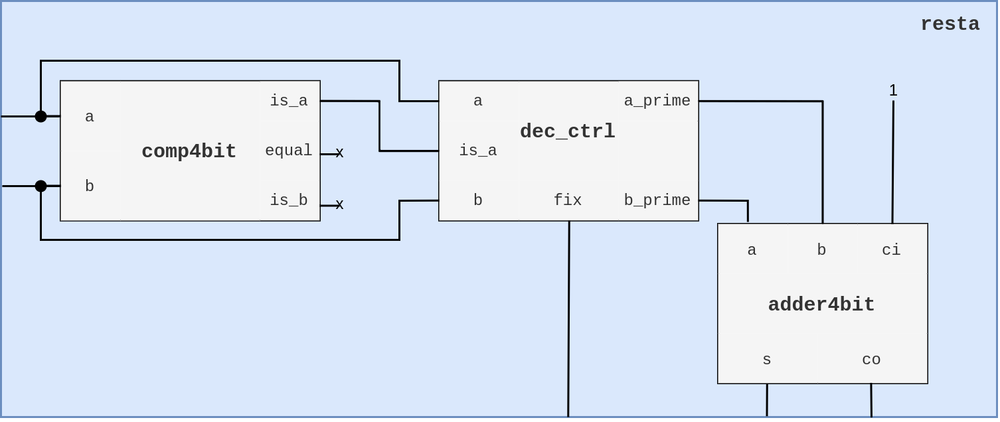
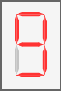

# II: Stage 1

## ALU + Registros ACM, ACC y RD

Esta primer etapa de desarrollo del microprocesador de 4 bits está compuesta por los siguientes elementos: un registro de datos RD, el registro temporal ACC, el registro acumulador ACM y  una ALU de 16 operaciones de 4 bits. El propósito de este módulo del microprocesador es realizar la carga de instrucción en la ALU, la carga de los datos desde memoria en el registro RD y finalmente la carga del resultado de la operación (salida de la ALU) tanto en el registro ACC como en el ACM. Siguiendo el esquema general del microprocesador (fig.1.2) observamos que las acciones antes mencionadas se realizan en sincronía con las 4 primeras señales del GCM del microprocesador.

Los registros utilizados consisten en un arreglo de flip flops (4 o 5 dependiendo el tamaño de la palabra a almacenar) tipo D. Dado que el registro RD debe almacenar dos datos leídos desde memoria, se utiliza un banco de registros de 2x4 (elementos x tamaño de elementos en bits). Una de las salidas de dicho banco va directamente a la ALU y la otro entra en un multiplexor de 2 a 1, en el cual se hace la selección del segundo dato a operar, entre el almacenado en el registro B del banco RD  y el almacenado en el registro ACM. Una vez en la ALU se realiza la operación entre los datos y el resultado, tanto magnitud (4 bits) como acarreo/signo (1 bit), se cargan en el registro ACC y  en el ACM, ambos, registros de 5 bits.

El despliegue de la información se hace en un arreglo de 5 displays de 7 segmentos los cuales muestran: dato a, dato b, instrucción actual, acarreo/signo y resultado (magnitud). Para ello se implementa un decodificador  de 4 bits para cada de display de 7 segmentos. Las primeras tres señales de los primeros tres displays, se toman directamente del bus de entrada al módulo, y tanto el acarreo como el valor de salida de la operación se toman desde las salidas del módulo. El diagrama a bloques correspondiente se muestra a continuación.


> **fig.2.1.** Diagrama Stage1: ALU + Registros ACM, ACC y RD


El diagrama es una representación del nivel mas alto del módulo, en este se denotan los bloques, señales y buses que lo conforman. Se debe tener en consideración que los elementos externos al micro_stage1 son los necesarios para montar un testbench, es decir, no son parte de la estructura final del módulo, su función es simplemente emular los demás dispositivos que dentro del microprocesador y proveer un medio de visualización del funcionamiento de esta primera etapa.

## ALU 16 Operaciones

Recordando la definición de microprocesador, se refiere a este como el "cerebro" de una computadora, pues es el encargado de ejecutar los programas del sistema operativo así como los programas de usuario; esta ejecución implica principalmente un conjunto de operaciones básicas en forma binaria, tarea de la cual la Unidad Aritmética Lógica (ALU) es la encargada.

> **Definición**
> Conjunto de circuitos electrónicos encargados de realizar tanto operaciones aritméticas como suma y resta, así como operaciones lógicas AND, OR, NAN, NOR, etc. sobre datos proporcionados por la unidad de control, registros, memoria o dispositivos de E/S en un microprocesador. El componente principal de una ALU es un sumador, pues la manipulación de los datos entrada de este, permiten realizar no solo la operación de suma, sino resta, incrementos, decrementos o transferencias.

### Diseño

La unidad de procesamiento se divide en dos sub-unidades: la lógica y la aritmética (**Fig.1**). Estas dos unidades se han considerado como dos bloques independientes `arith_u` y `logic_u`. Cada sub-unidad es capaz de realizar 8 operaciones cada una, sobre uno o los dos operandos que se especifiquen de entrada. La selección de la unidad y de la operación se hace en función de los valores de los campos recibidos en la instrucción. Esta instrucción es un conjunto de bits que se reciben desde el codificador de instrucción, elemento de una segunda etapa del microprocesador, por lo cual para pruebas y depuración de este módulo se sustituye dicho conjunto de bits provenientes del decodificador por un vector de 5 bits `instrcn` (Tabla 2.1).


> **fig.2.2** Diagrama de bloques de la ALU 16 operaciones. 

#### Instrucciones

El formato de las instrucciones de la ALU es una palabra de 5 bits la cual se divide en campos como se muestra a continuación:

```
bit		:	4				3			2-1			0
señal	:	[regmux_sel]	[unit_sel]	[op_sel]	[carry_in]
```

- ***regmux_sel***: El selector de registro del segundo operando se conecta al multiplexor y mediante este se elige el segundo operando que entra a la ALU, entre el dato de entrada B (rdb_bus) y el valor almacenado en el acumulador (acm_bus).

- ***unit_sel***: El selector de unidad determina si se realiza una operación aritmética (0) o lógica (1) sobre los operandos.

- ***op_sel & carry_in***: La instrucción de operación concatenada con el acarreo de entrada ci determina cual de las 8 operaciones en cada una de las unidades se va a realizar.

**Tabla de instrucciones**

| unit_sel | op_sel & ci | hex  |    operación    |
| :------: | :---------: | ---- | :-------------: |
|    0     |     000     | 0    |      suma       |
|    0     |     001     | 1    |      resta      |
|    0     |     010     | 2    | transferencia A |
|    0     |     011     | 3    |  incremento A   |
|    0     |     100     | 4    | transferencia B |
|    0     |     101     | 5    |  incremento B   |
|    0     |     110     | 6    |  decremento A   |
|    0     |     111     | 7    |  decremento B   |
|    1     |     000     | 8    |       AND       |
|    1     |     001     | 9    |      NAND       |
|    1     |     010     | A    |       OR        |
|    1     |     011     | B    |       NOR       |
|    1     |     100     | C    |       XOR       |
|    1     |     101     | D    |      XNOR       |
|    1     |     110     | E    |    BUFFER A     |
|    1     |     111     | F    |      NOT A      |

> **Tabla 2.1.** Código de instrucciones ALU 16 bits

#### Unidad lógica

La unidad lógica se compone de 4 bloques de operadores lógicos de 1 bit (como se observa en la fig.2.2), cada uno de estos operadores realiza la operación bit a bit de las entradas. El comportamiento de cada uno de estos 4 bloques está dado por las ecuaciones de la Tabla 2.2, la cuales en función del valor de op_sel (bits 2-1 de la instrucción) definen la salida del bloque dados los valores del bit correspondiente al operando A,B y el acarreo ci; el acarreo de salida en esta unidad se establece en 0. 

| op_sel | s                          |
| ------ | -------------------------- |
| 00     | $ci\ \oplus\ (ab)$         |
| 01     | $ci\ \oplus\ (a + b)$      |
| 10     | $ci\ \oplus\ (a \oplus b)$ |
| 11     | $ci\ \oplus\ a$            |

> **Tabla 2.2.** Ecuaciones de salida  por bloque lógico en función del campo op_sel.

#### Unidad Aritmética

La unidad aritmética de la ALU se compone de un bloque de control en el que en función de la operación recibida como instrucción se modifican los datos de entrada para posteriormente enviarse a un sumador completo de 4 bits. La tarea del bloque de control es modificar el valor de los operandos para obtener la operación especificada, como se muestra en la fig2.2. estos valores se ingresan en el sumador. Por ejemplo: Si se trata de una operación de incremento, el valor del segundo operando se establece a 0 y se suma el acarreo de entrada correspondiente al bit de control de la operación. La Tabla 2.3 muestra esta relación entre operando de salida con el código de operación, dónde **a** y **b** son los datos de entrada y **a_prime** y **b_prime** los datos de salida. Un caso particular se da con la operación de resta, esta se describe con mas de detalle posteriormente.

| op_sel | ci   | operación       | a_prime | b_prime | fix  |
| ------ | ---- | --------------- | ------- | ------- | ---- |
| 00     | 0    | suma            | a       | b       | 0    |
| 01     | 0    | transferencia A | a       | 0000    | 0    |
| 10     | 0    | transferencia B | 0000    | b       | 0    |
| 11     | 0    | decremento A    | a       | 1111    | 1    |
| 00     | 1    | resta           | b       | not a   | /    |
| 01     | 1    | incremento A    | a       | 0000    | 0    |
| 10     | 1    | incremento B    | 0000    | b       | 0    |
| 11     | 1    | decremento B    | 1110    | b       | 1    |

> **Tabla 2.3.** Relación entre código de operación y valor de salida de los operandos. El valor de fix en la fila 5 se especifica en la tabla 2.4.


El la última columna de la tabla 2.3 se observa el valor de la bandera **fix**. Está bandera indica si el valor del acarreo de salida debe ser negado para ser coherente con la operación realizada. El valor de fix entra junto con el acarreo de salida del sumador a una compuerta XNOR para obtener el valor correcto del acarreo de salida. Por ejemplo: Si el operando a=0011=3 y b=0111=7, el resultado esperado de la operación B-A es 4. Sin embargo, dado el algoritmo de resta como suma con complemento a dos, el valor de B-A es -4, para obtener a la salida de la ALU el valor correcto se debe encender la bandera fix. El siguiente diagrama muestra el ejemplo mencionado anteriormente.


> **fig.2.3.** Ejemplo de operación resta cuando fix=1.

##### Resta

Se considera el orden de los operandos como $B-A$, lo cual implica que:

1. Si $A>B$ se niega el operando B y la bandera fix permanece en bajo.

2. Si $A\leq B$ el operando B se iguala  al operando A negado y la bandera fix pasa a alto.

| Condición  | Signo |
| ---------- | ----- |
| $A > B$    | -     |
| $A \leq B$ | +     |

###### Bloque de control de operandos

Para llevar a cabo el control de la bandera fix y el orden de los operandos adecuado para efectuar la resta, se emplea un bloque del cual su comportamiento lo describe la siguiente tabla, donde el valor **is_a** indica con valor en alto que el operando A es mayor a B. La figura correspondiente a la resta, muestra una aproximación por bloques de la operación.

| is_a | A    | B    | A'   | B'             | fix  |
| ---- | ---- | ---- | ---- | -------------- | ---- |
| 0    | 0    | 0    | $B$  | $\overline{A}$ | 1    |
| 0    | 0    | 1    | $B$  | $\overline{A}$ | 1    |
| 0    | 1    | 0    | $B$  | $\overline{A}$ | 1    |
| 0    | 1    | 1    | $B$  | $\overline{A}$ | 1    |
| 1    | 0    | 0    | $A$  | $\overline{B}$ | 0    |
| 1    | 0    | 1    | $A$  | $\overline{B}$ | 0    |
| 1    | 1    | 0    | $A$  | $\overline{B}$ | 0    |
| 1    | 1    | 1    | $A$  | $\overline{B}$ | 0    |

> **Tabla 2.4.** Comportamiento de los operandos de salida del control de la unidad aritmética en función del valor del operando A.



> **fig.2.4.** Representación como diagrama de bloques de la operación resta.

## Simulación

Se monta un entorno de simulación para observar los resultados de la ALU según la operación. La simulación se lleva a cabo en el simulador ISim de ISE, dentro de la cual se definen (forzar constante) los valores tanto de los operandos A y B como de la instrucción.


> **fig.2.5.** Simulación en ISim del funcionamiento de la ALU con valores de A y B aleatorios.


Los valores forzados para la simulación (instrcn, A y B) y los resultados esperados a la salida de la ALU (co y s) se muestran en la Tabla 2.5. La fig.2.6. muestra los resultados de la simulación tanto para la unidad aritmética como para la unidad lógica.

| instrcn | A    | B    | co   | s    |
| ------- | ---- | ---- | ---- | ---- |
| 0000    | 0101 | 0110 | 0    | 1011 |
| 0001    | 1001 | 0011 | 1    | 0110 |
| 0010    | 1100 | 1110 | 0    | 1100 |
| 0011    | 1011 | 1010 | 0    | 1100 |
| 0100    | 1101 | 1111 | 0    | 1111 |
| 0101    | 0100 | 0111 | 0    | 1000 |
| 0110    | 0010 | 1011 | 0    | 0001 |
| 0111    | 1110 | 1000 | 0    | 0111 |
| 1000    | 1000 | 0100 | 0    | 0000 |
| 1001    | 0111 | 0000 | 0    | 1111 |
| 1010    | 0001 | 0010 | 0    | 0011 |
| 1011    | 0110 | 1101 | 0    | 0000 |
| 1100    | 1010 | 0001 | 0    | 1011 |
| 1101    | 0000 | 1100 | 0    | 0011 |
| 1110    | 1111 | 0101 | 0    | 1111 |
| 1111    | 0011 | 1001 | 0    | 1100 |

> **Tabla 2.5.** Entradas y salidas esperadas en la simulación.


<center>a)</center>


<center>b)</center>

> **fig.2.6.** Simulación de las operaciones aritméticas (a) y lógicas (b). De arriba hacía abajo: unit_sel, op_sel, ci,a,b,a_prime, b_prime,is_a,fix,co y  s (sumador), co y s (ALU).

## Registros

Cada uno de los registros utilizados en este módulo cuenta con un puerto de activación **enable**, un bus de entrada y otro de salida de 4 ó 5 bits. El banco de registros es un arreglo de n registros, y la activación de estos se hace mediante una señal de $2^n$ bits, donde el bit 0 corresponde a la señal enable del registro 0, el bit 1 corresponde a la señal enable del registro 1 y de manera sucesiva hasta el bit n-1.


> **fig.2.7** Diagrama de registros y banco de registros.

## Niveles de diseño

La descripción de los circuitos que integran el proyecto se hace manera estructural, por ende es posible identificar una jerarquía de niveles de diseño y de manera conveniente establecer un punto de observación del funcionamiento del módulo a diferentes escalas. Es decir, la descripción estructural nos permite situarnos en algún dispositivo en particular y observar tanto su comportamiento como el de los dispositivos en niveles inferiores.  Para efectos de esta etapa, se define el módulo **micro_stage1** como el nivel superior inicial y a partir de este se derivan los niveles subsecuentes haciendo uso de una estructura de árbol.

 #### Árbol de instancias

Representa de forma jerárquica los niveles de diseño y denota las instancias  que se hacen en cada componente que integra el módulo. Cada hoja se compone del nombre de la instancia seguido de su tipo.  Como se observa el dispositivo con el mayor número de instancias y niveles inferiores es la **alu**.


> **fig.2.8.** Árbol de instancias para el stage 1.

#### Propagación de ALU

Al ser el sumador de 4 bits el componente fundamental de la unidad aritmética, la propagación de la señal de salida y por ende el resultado de operación atraviesa diferentes dispositivos, la siguiente tabla muestra dicha ruta de abajo a arriba.

| Dispositivo | Instanciado en | Señal de acarreo   | Señal de salida   |
| ----------- | -------------- | ------------------ | ----------------- |
| full_adder  | adder4bit      | co                 | s                 |
| adder4bit   | arith_u        | co                 | s                 |
| arith_u     | alu_16op       | arith_unit_coutput | arith_unit_output |
| alu_16op    | micro_stage1   | carry_out          | alu_bus           |

> **Tabla 2.6.** Propagación de ALU

## Simulación

#### Níveles de simulación

Para llevar a cabo este proceso el proyecto se carga al software `ISE Design Suite` y se corren las respectivas simulaciones en `ISim`. Para observar a detalle el comportamiento del módulo se realiza la simulación en dos niveles:

1. **Testbench:** Definimos un nivel extra a los niveles mostrados en el árbol de instancias. Este nivel simula un componente de caja cerrada, es decir, un componente sin puertos de entrada ni de salida, en el cual se crea una instancia del siguiente nivel, `micro_stage1`, y las señales provenientes de los dispositivos con los que este interactúa dentro del microprocesador son emuladas en forma de valores constantes. Se implementa un contador de 0 a 3  conectado a un demultiplexor para emular el funcionamiento del GCM. Para el despliegue de los resultados se hacen las instancias de los 5 decodificadores de 4 bits a displays de 7 segmentos que se muestran en el diagrama del módulo. El testbench se describe en el archivo *vhd* `stage1_sim.vhd`.

2. **micro_stage1:** Dentro de la simulación a este nivel se presta especial atención a las 4 acciones principales de las que se encarga este módulo: lar carga de instrucción en la ALU, la carga de datos en el registro RD, la carga de la salida de la ALU en el registro ACC y el envío de este valor al ACM.

#### Convenciones para la simulación

**Frecuencia y periodo**

Se supone una frecuencia de reloj de 2.5 GHz, con lo cual determinamos el periodo correspondiente y el tiempo total necesario por el módulo para realizar una instrucción:
$$
T_{clk}=\frac1{f_{clk}}=\frac{1}{2.5\times 10^9Hz}=4\times 10^{-10}s=400ps
$$

$$
t_{stage1}=4T_{clk}=4\cdot400ps=1600ps=1.6ns
$$


> **fig.2.9.** Señales A-D para efectos de simulación, correspondientes a las generadas por el GCM.

**Display de 7 Segmentos**

Como se ha indicado anteriormente, la simulación del testbench obedece al diagrama del modulo mostrado en la fig.1 y por ende el despliegue de la información se da a través de displays de 7 segmentos. Para interpretar de forma mas ágil los resultados en la simulación se utiliza la siguiente tabla con la representación en binario, hexadecimal y gráfica de las posibles salidas del decodificador de 4 bits a 7 segmentos.

| binario | hexadecimal | gráfico                                        | binario | hexadecimal | gráfico                                      |
| ------- | ----------- | ---------------------------------------------- | ------- | ----------- | -------------------------------------------- |
| 111111  | 7F          |  | 0000000 | 00          |  |
| 0000001 | 01          |    | 0000100 | 04          |  |
| 1001111 | 4F          |    | 0001000 | 08          |  |
| 0010010 | 12          |    | 1100000 | 60          |  |
| 0000110 | 06          |    | 1110010 | 72          |  |
| 1001100 | 4C          |    | 1000010 | 42          |  |
| 0100100 | 24          |    | 0110000 | 30          |  |
| 0100000 | 20          |    | 0111000 | 38          |  |
| 0001111 | 0F          |    |         |             |                                              |

> **Tabla 2.7.** Display de 7 segmentos.

### Testbench

Las figuras (2.10-2.17) que se presentan a continuación corresponden a la simulación del testbench, en este se realiza la carga de cada una de las 16 operaciones que realiza la ALU con dos operandos constantes $A=1010$ y $B=0101$. Como se definió anteriormente, el tiempo necesario para realizar los 4 procesos habilitados por las señales A-D es de $1.6\ ns=1600\ ps$, periodo que se denota en la simulación mediante marcadores. La señal correspondiente al bus de entrada de instrucción a la ALU y al display 2 se resalta con color anaranjado y las señales correspondientes a los buses que conectan los displays 3 y 4, acarreo y salida respectivamente, se resaltan con color azul. La parte inferior muestra la representación gráfica de los displays 2,3 y 4 en función del valor de las señales antes mencionadas. Por encima de estos displays se indica la operación que se realiza en ese periodo de tiempo.

#### Operaciones [0-3]


> **fig.2.10.** Se denota con color rojo el retraso de $200\ ps$ que se obtiene debido a el inicio del reloj en 0. Para el caso de la primera operación el valor de los displays 3 y 4 en los primeros $600\ ps$ es igual a **4F** que representa el display apagado. Esto debido a la secuencia de operaciones que realiza el módulo en sincronía con las señales A-D. Como se observa en el diagrama del módulo, la señal de acarreo y la señal de salida de la ALU toman el valor del resultado de la operación hasta que se cargan los registros en la ALU con la señal B, por ende, valor de los displays se actualiza con cada pulso alto de la señal B.

#### Operaciones [4-7]


> **fig.2.11.**

#### Operaciones [8-11]


> **fig.2.12.**

#### Operaciones [C-F]


> **fig2.13.**

### micro_stage1

Es este nivel de simulación se forzan las contantes $A = 0011$ y $B=0111$  para los valores de los buses data_a y *data_b* respectivamente y la siguiente secuencia de instrucciones:

| Operación | Instrucción | Resultado            |
| --------- | ----------- | -------------------- |
| B-A       | 10001       | 0111-0011 = 0100     |
| ACM++     | 00101       | 0100+0001 = 0101     |
| A and ACM | 01000       | 0011 and 0101 = 0001 |
| ACM--     | 00111       | 0001-0001 = 0000     |

La señales de entrada de la **ALU** correspondientes a la instrucción `unit_sel`, `op_sel`, `ci`, el acarreo de salida `co` y el valor de salida 4 bits `s` se identifican con color amarillo. La señal de enable y el bus de salida del banco de registro **RD**, se identifican con color rosa. Las señales del registro **ACC** se identifica con color cyan y el registro **ACM** color fucsia. Las señales del multiplexor **regmux** se identifican con color gris y finalmente los valores de entrada al módulo con color verde.

#### B-A


> **fig.2.14.** En la ejecución de la primer instrucción durante el pulso A se carga la instrucción a la ALU y se hace la selección de B como segundo operando. Pasados $600\ ps$ durante el pulso B se activa el banco de registros RD y se obtiene la salida de la operación de la ALU en el bus correspondiente. Para el pulso C, $1000\ ps$ después, se carga el resultado de la operación en el registro ACC y finalmente pasados $1200\ ps$ se carga el valor de ACC en ACM. Este proceso se repite a partir de cada cambio de instrucción o pulso positivo de la señal A. El tiempo inactivo o de valor indefinido de cada dispositivo se denota con un sombreado rojo en la figura. Estos tiempos inactivos se deben a la secuencia de las señales A-C.

#### ACM++


> **fig.2.15.** Una vez ejecutada la primer instrucción los valores de los registro se actualizan cada pulso del GCM correspondiente.

#### A and ACM


> **fig.2.16.**

#### ACM--


> **fig.2.17.**