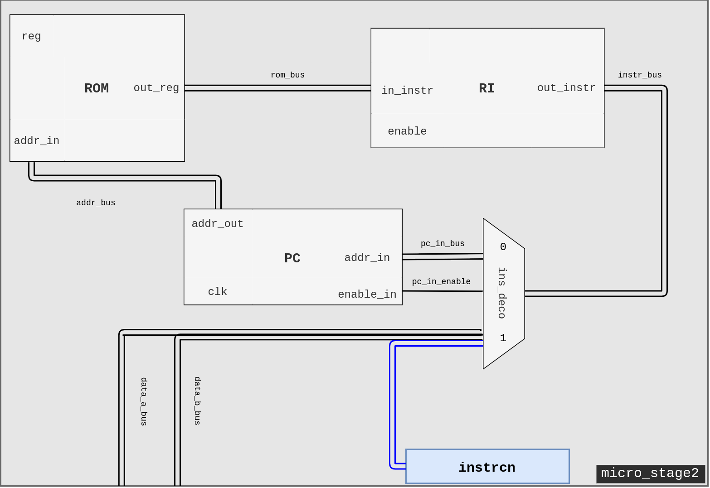
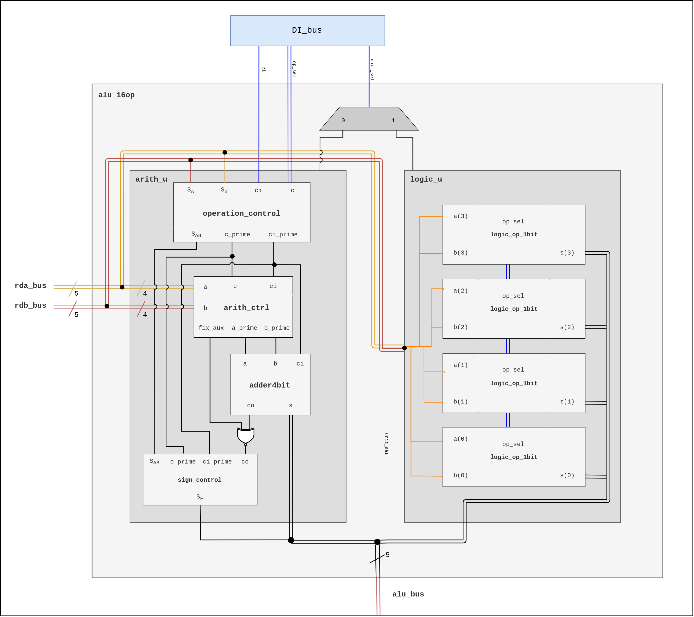
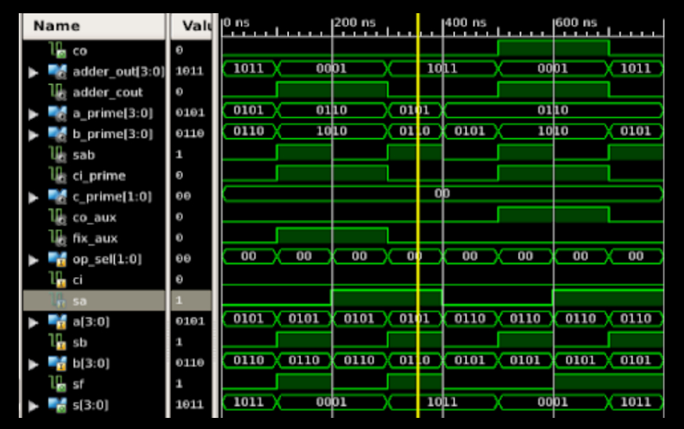
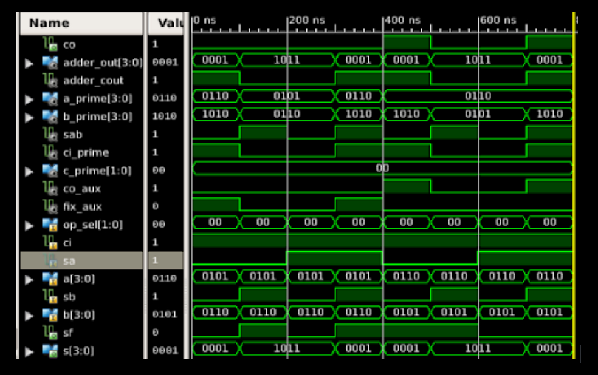
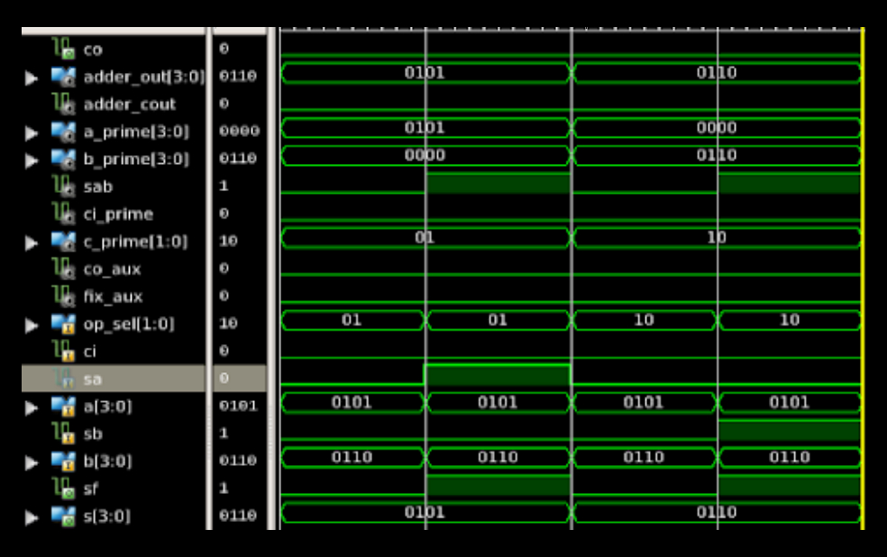
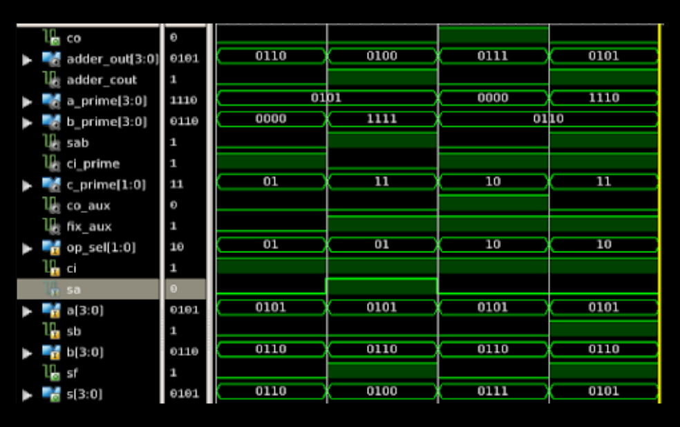
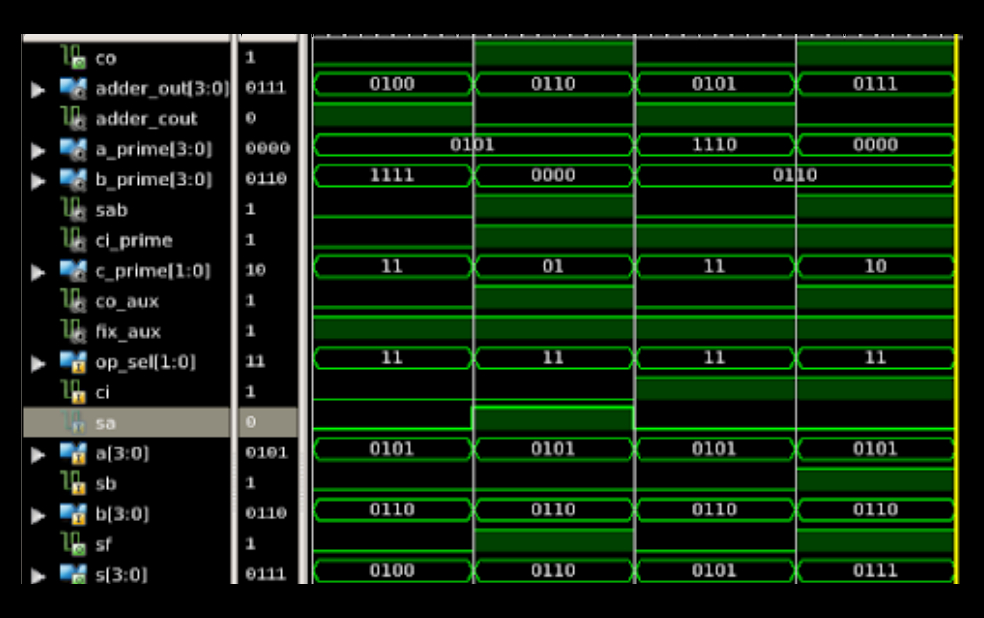
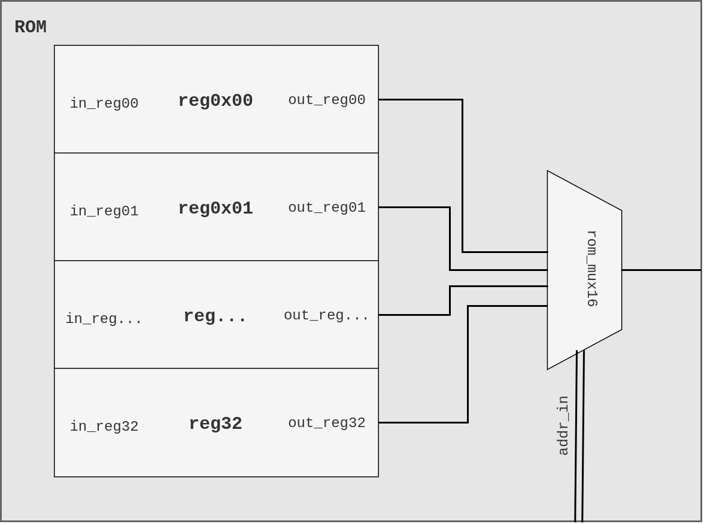
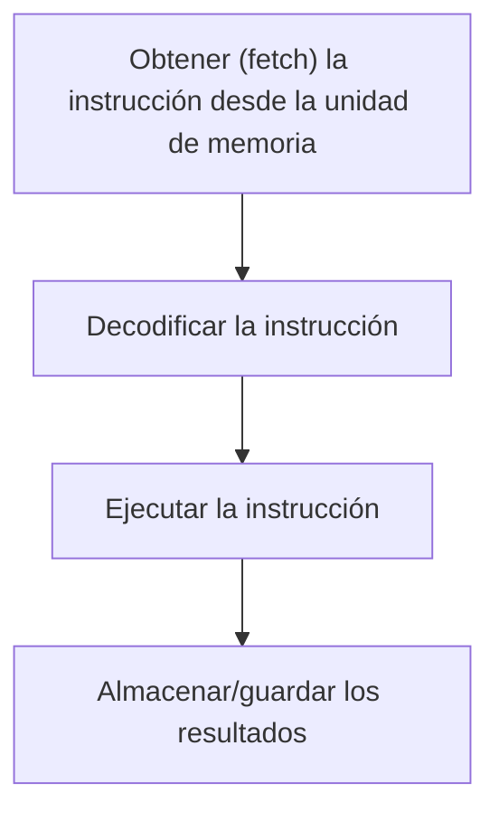

# III: Stage 2

## Manejo de signos + ROM + PC + RI + DI

En esta segunda etapa del microprocesador, ademas de realizar la extensión de los registros del Stage 1 a 5 bits, así como la integración de un conjunto de bloques adicionales a la ALU para permitir el manejo de valores de 4 bits con signo, se implementa el segundo módulo que corresponde a la unidad de control. La siguiente figura muestra el diagrama correspondiente a esta etapa.



> **fig.3.0.** Diagrama a bloques del Stage 2:  ROM + PC + RI + DI.

## Manejo de signos

Para implementar esta función se agregaron dos bloques a la unidad aritmética, de control de operación `operation_control` y control de signo `sign_control`, estos, como se describe mas adelante, permiten manipular los operandos, el signo del resultado y la operación en sí, para lleva a cabo la instrucción solicitada con operandos de 4 bits con signo.




> **fig.3.1.** Diagrama de la ALU de 16 Operaciones con signos


### Control de operación para suma/resta

Existe una equivalencia (Tabla 3.0) entre la suma con signos diferentes y la resta con signos iguales, es decir, según los signos de los operandos de entrada, la operación requerida se puede realizar considerando solamente la magnitud, la operación (suma o resta) equivalente correspondiente y finalmente realizando un ajuste en el signo del resultado de salida. La ventaja que esto supone se aprovecha para  modelar el comportamiento del bloque de control de operación  mostrado en la Tabla 3.1. 

| suma | $\iff$ | resta |
| :--: | :----: | :---: |
| $++$ | $\iff$ | $-+$  |
| $+-$ | $\iff$ | $--$  |
| $-+$ | $\iff$ | $++$  |
| $--$ | $\iff$ | $+-$  |

> **Tabla 3.0.** Equivalencia de operaciones de suma y resta entre valores de diferentes signos. La ventaja principal de esta equivalencia es la posibilidad de realizar una operación con operandos de signo diferente mediante una operación con operandos de signos iguales.


Recordando el formato de instrucción de 5 bits mencionado en la sección anterior, donde el valor de `op_sel & ci`,  con `op_sel`= `c` para este caso, es igual a `000` correspondiente a la operación de suma y el valor `001`correspondiente a la operación de resta; tenemos que en función de los signos de los operandos de entrada A y B ($S_A$ y $S_B$ respectivamente), se modifica el bit $ci$ para realizar la operación contraria; esto con la finalidad de ejecutar una operación equivalente como se muestra en la Tabla 3.0. 

La siguiente tabla, muestra como salidas el bit de la operación prima $ci\_prime$ y el signo equivalente $S_{AB}$ de los operandos. 

| $c\ \&\ ci$ | $S_A$ | $S_B$ | <u>$ci\_prime$</u> | <u>$S_{AB}$</u> |
| ----------- | ----- | ----- | ------------------ | --------------- |
| 000         | 0     | 0     | 0                  | 0               |
| 000         | 0     | 1     | 1                  | 1               |
| 000         | 1     | 0     | 1                  | 0               |
| 000         | 1     | 1     | 0                  | 1               |
| 001         | 0     | 0     | 1                  | 0               |
| 001         | 0     | 1     | 0                  | 0               |
| 001         | 1     | 0     | 0                  | 1               |
| 001         | 1     | 1     | 1                  | 1               |

|     <u>$ci\_prime$</u>     | <u>$S_{AB}$</u> |
| :------------------------: | :-------------: |
| $ci \oplus S_A \oplus S_B$ |      $S_B$      |
> **Tabla 3.1.** Tabla de verdad del control de operación para la suma y resta. Ecuaciones booleanas resultantes para las salidas $ci\_prime$ y $S_{AB}$.


#### Control de signo para suma/resta

Conociendo el signo de ambos ($S_{AB}$), la operación equivalente u operación prima y el acarreo de salida $co$ del sumador, definimos la tabla del bloque de control de signo donde  la salida $S_F$ indica si es necesario alterar el signo del resultado para mantener la coherencia de este. En la operación suma, por ejemplo,  los signos pasan igual y en la resta depende del signo  y del operando mayor. 

| $c\_prime$ | $S_{AB}$ | $co$ | <u>$S_F$</u> |
| ---------- | -------- | ---- | ------------ |
| 000        | 0        | 0    | 0            |
| 000        | 0        | 1    | 0            |
| 000        | 1        | 0    | 1            |
| 000        | 1        | 1    | 1            |
| 001        | 0        | 0    | 0            |
| 001        | 0        | 1    | 1            |
| 001        | 1        | 0    | 1            |
| 001        | 1        | 1    | 0            |

|                            $S_F$                             |
| :----------------------------------------------------------: |
| $[(not\ ci\_prime)\ and\ S_{AB}]\ or\ [ci\_prime\ and\ (S_{AB}\ \oplus co)]$ |

> **Tabla 3.2.** Tabla de verdad del control de signo para la suma y resta y ecuación booleana de salida para $S_F$.


### Control de operación para transferencia, incremento y decremento

Para estas operaciones aritméticas restantes, se usaron las equivalencias entre el incremento de signo positivo y el decremento de signo negativo y viceversa, con el fin de definir el comportamiento del control de operación y signo en estas operaciones; cabe mencionar que la operación transferencia no requiere de esta función.

| $S_{AB}$ | $c\ \&\ ci$ |                        | <u>$c\_prime$</u> | <u>$ci\_prime$</u> | <u>$S_F$</u> |
| -------- | ---------- | ---------------------- | ---------- | -------- | -------- |
| *0* | *010* | *transferencia A* | *01* | *0* | *0* |
| *1* | *010* | *transferencia A* | *01* | *0* | *1* |
| *0* | *100* | *transferencia B* | *10* | *0* | *0* |
| *1* | *100* | *transferencia B* | *10* | *0* | *1* |
| 0        | 011        | incremento A           | 01        | 1 | 0        |
| 0        | 101        | incremento B           | 10        | 1 | 0        |
| 0        | 110        | decremento A           | 11        | 0 | 0        |
| 0        | 111        | decremento B           | 11        | 1 | 0        |
| 1        | 011        | incremento A           | 11        | 0 | 1        |
| 1        | 101        | incremento B           | 11        | 1 | 1        |
| 1        | 110        | decremento A           | 01        | 1 | 1        |
| 1        | 111        | decremento B           | 10        | 1 | 1        |

|               | <small>transferencia/incremento A</small> | <small>transferencia/incremento B</small> |       <small>decremento A y B</small>       |
| :-----------: | :---------------------------------------: | :---------------------------------------: | :-----------------------------------------: |
| $c\_prime(0)$ |              $ci\ and\ S_A$               |                    $1$                    |   $[(not\ ci)\ and\ (not\ S_A)]\ or\ ci$    |
| $c\_prime(1)$ |                    $1$                    |              $ci\ and\ S_B$               |   $(not\ ci)\ or\ [ci\ and\ (not\ S_B)]$    |
|  $ci\_prime$  |           $ci\ and\ (not\ S_A)$           |                   $ci$                    |       $ci\ or\ [(not\ ci)\ and\ S_A]$       |
|   $S_{AB}$    |                   $S_A$                   |                   $S_B$                   | $[(not\ ci)\ and\ S_A]\ or\ (ci\ and\ S_B)$ |

> **Tabla 3.3. **Tabla de verdad del control de signo para el incremento, decremento y transferencia. Ecuaciones de salida para $c\_prime(0) ,\ c\_prime(1),\ ci\_prime$ y $S_{AB}$.


#### Control de signo para la transferencia, incremento y decremento

| $S_{AB}$ | $c\_prime$ | <u>$S_F$</u> |
| -------- | ---------- | ------------ |
| 0        | 010        | 0            |
| 1        | 010        | 1            |
| 0        | 100        | 0            |
| 1        | 100        | 1            |
| 0        | 011        | 0            |
| 0        | 101        | 0            |
| 0        | 110        | 0            |
| 0        | 111        | 0            |
| 1        | 110        | 1            |
| 1        | 111        | 1            |
| 1        | 011        | 1            |
| 1        | 101        | 1            |

|  $S_F$   |
| :------: |
| $S_{AB}$ |

> **Tabla 3.4.** Tabla de verdad del control de signo para el incremento, decremento y transferencia y ecuación de salida para $S_F$.

### Simulación

Se realizaron 5 simulaciones para cada operación aritmética (suma, resta, transferencia, incremento y decremento) para visualizar el comportamiento de la ALU con la implementación descrita anteriormente. Las siguiente figuras muestran los resultados obtenidos.



> **fig.3.2.** Suma: los primeros 4 ciclos son con B > A y los siguientes 4 ciclos son para A > B, ambos con cada  combinación de signos.




> **fig.3.3. ** Resta: los primeros 4 ciclos son con B > A y los siguientes 4 ciclos son para A > B, ambos con cada combinación de signos.




> **fig.3.4.**  Transferencia: los primeros 2 ciclos son la operación transferencia de A con signo positivo y negativo, los siguientes 2 son para la transferencia de B.




> **fig.3.5.** Incremento: los primeros 2 ciclos son la operación incremento de A con signo positivo y negativo, los siguientes 2 son para la incremento de B.




> **fig.3.6.** Decremento: los primeros 2 ciclos son la operación decremento de A con signo positivo y negativo, los siguientes 2 son para la decremento de B


## ROM

Una memoria ROM es un dispositivo digital que permite almacenar y acceder a la información aunque se apague el dispositivo, en un microcontrolador la memoria ROM se usa para almacenar las instrucciones y a veces variables que no cambian. Para que el microcontrolador pueda funcionar independientemente es necesario incorporarle un modulo de memoria que nos permitirá ejecutar las instrucciones secuencialmente al acceder a una dirección mediante el contador de programa.

Una memoria ROM consiste en $2^n$ registros de m bits, m multiplexores de n bits de selección que permite acceder a los m bits de un registro, a la linea de selección de la memoria ROM se le conoce como dirección de memoria, ya que cada registro corresponde con un valor de esta dirección de memoria, en la figura 3.7 se muestra el esquema de la memoria ROM utilizada.




> **fig.3.7.** Diagrama a bloques del módulo de memoria ROM.


En este caso se uso una memoria ROM con 32 registros de 16 bits y una linea de selección de 5 bits `addr_in`, se selecciono el tamaño de 32 registro ya que esta memoria es unicamente para pruebas, los registros son de 16 bits que corresponde con el formato de instrucción del microcontrolador. 

## Registro de instrucción RI + Decodificador de instrucción

El registro de instrucción almacena y entrega la instrucción que se obtiene de la memoria ROM al activarse el ciclo de reloj correspondiente al decodificador de instrucción, este se encarga de obtener los datos de la instrucción y preparar los registros necesarios para realizar la operación en el ciclo de la ALU, que puede ser activar la entrada del contador de programa e ingresar una nueva dirección o colocar las entradas en los registros de datos así como la operación a realizar en la ALU. Este modulo se puede representar como un demultiplexor que recibe la instrucción y la envía al contador de programa o a la ALU.

## Contador de programa PC <<<<<<<<<

## Instrucción de 16 bits

El funcionamiento en conjunto de las dos etapas del microprocesador, implica el manejo de instrucciones con longitud de 16 bits. Dicha instrucción se conforma de 7 campos de longitud fija, que ademas de contener la instrucción de 5 bits discutida anteriormente, integra el valor de los operandos A y B y en el último bit se define un control para el flujo de los los datos; este control (bit 15) en bajo indica que los campos de datos A y B se consideran operandos de 5 bits cada uno y son enviados a la ALU para su operación, en el caso contrario de tener un valor alto en este bit, ambos campos se consideran una dirección de 5 bits, la cual se envia al contador de programa para que ejecute un "salto" a dicha dirección dentro de los registros de la memoria ROM.

| 15   | 14         | 13       | 11-12  | 10       | 9-5    | 4-0    |
| ---- | ---------- | -------- | ------ | -------- | ------ | ------ |
| alu  | regmux_sel | unit_sel | op_sel | carry_in | dato B | dato A |

> **Tabla 3.5.** Formato de instrucción de 16 bits

| 15   | 14      | 13   | 12-10 | 9-5  | 4-0  |
| ---- | ------- | ---- | ----- | ---- | ---- |
| i/o  | ram/rom | w/t  | -     | dir  | dato |

```
15	14	13	12-10	9-5			4-0
0	0	0	
0	0	1
0	1	0
0	1	1
1	0	0	  X		 X  		dir			Escribir en PC
1	1	0	  X		dato		dir			Escribir en RAM
1	1	1	  X		dir_dst		dir_src		Transferir
```


# GCM

Como se ha mencionado anteriormente y como se ha observado en las simulaciones del **micro_stage1**, el GCM es el componente encargado de controlar el proceso secuencial en la ejecución de una instrucción en un programa. Podemos definir de forma elemental y resumida como el componente en el cual a partir de una señal de entrada de un oscilador, envía a la salida un conjunto de señales secuenciadas a los componentes del microprocesador. Estas señales de salida se pueden identificar dentro de  4 acciones principales: 



En el diseño del microprocesador establecimos que la segmentación de este se da en función del conjunto de señales provenientes del GCM A-E. La siguiente tabla muestra el identificador de la señal y la acción que se realiza durante su tiempo en alto.

| Señal | Acción                                                       |
| ----- | ------------------------------------------------------------ |
| A     | Cargar instrucción desde la memoria en el registro de instrucción RI |
| B     | Cargar los datos de entrada a la ALU en el registro RD       |
| C     | Almacenar el resultado de la operación procedente de la ALU en el registo ACC |
| D     | Cargar en el registro ACM el valor almacenado en el registro ACC |
| E     | Aumentar o modificar el contador del programa                |

## Descripción

La descripción del **Generador de Ciclo de Máquina** se puede hacer mediante un contador de anillo de 5 bits cuya comportamiento se describe en la Tabla 3.5. A la salida de este contador se conecta un codificador de 5 entradas a 5 salidas el cual se encarga de enviar el bit encendido del estado actual del contador al puerto de salida correspondiente a la salida A-E, según sea el caso.

| oscilator | gcm_count | gcm_count' | Salida |
| :-------: | :-------: | :--------: | :----: |
|     1     |   00001   |   00010    |   A    |
|     1     |   00010   |   00100    |   B    |
|     1     |   00100   |   01000    |   C    |
|     1     |   01000   |   10000    |   D    |
|     1     |   10000   |   00001    |   E    |

> **Tabla 3.6.** Tabla de estados del contador de anillo utilizado en el GCM.


> **fig.3.x.** Diagrama a bloques del GCM.

## Simulación 

La siguiente figura muestra la simulación correspondiente al GCM. Se muestran los ciclos  a diferentes escalas de tiempo con un periodo de $400 ps$.

