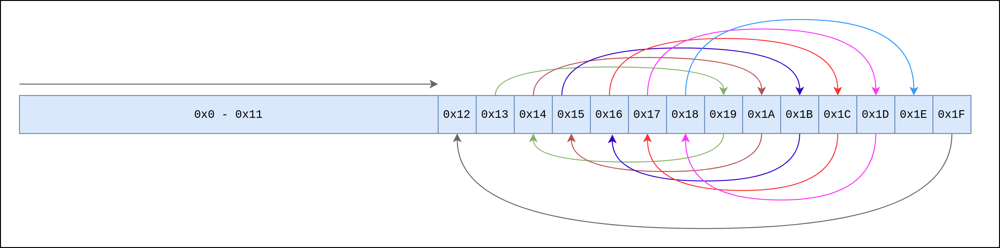
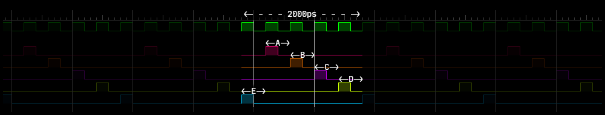
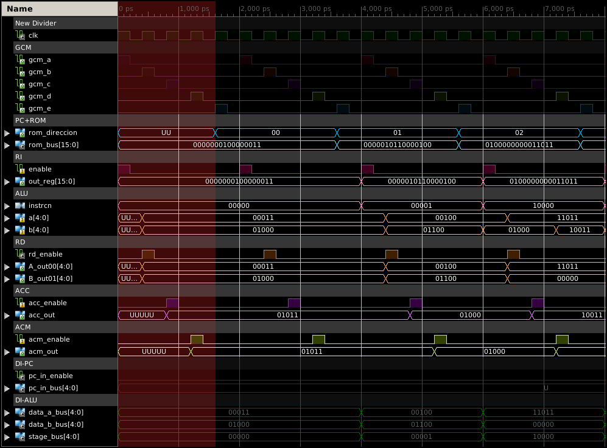
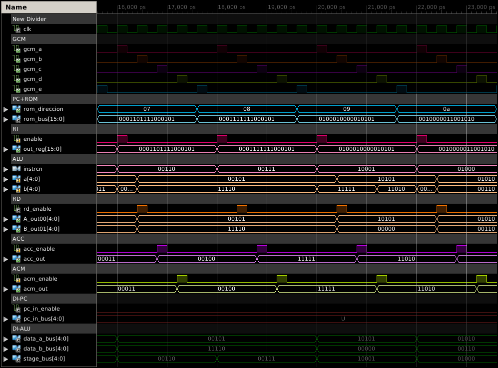
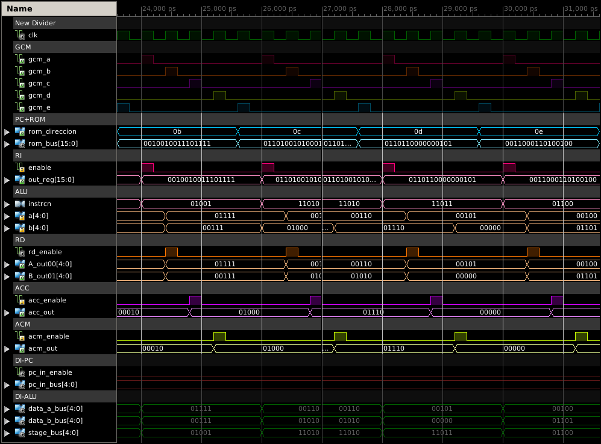
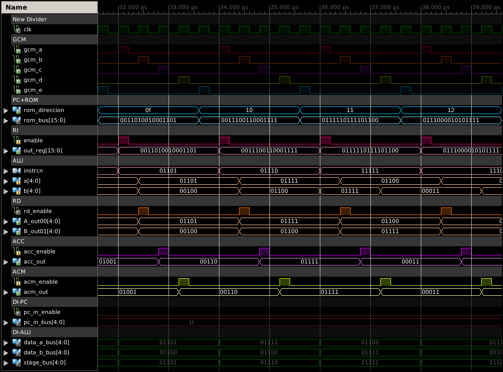
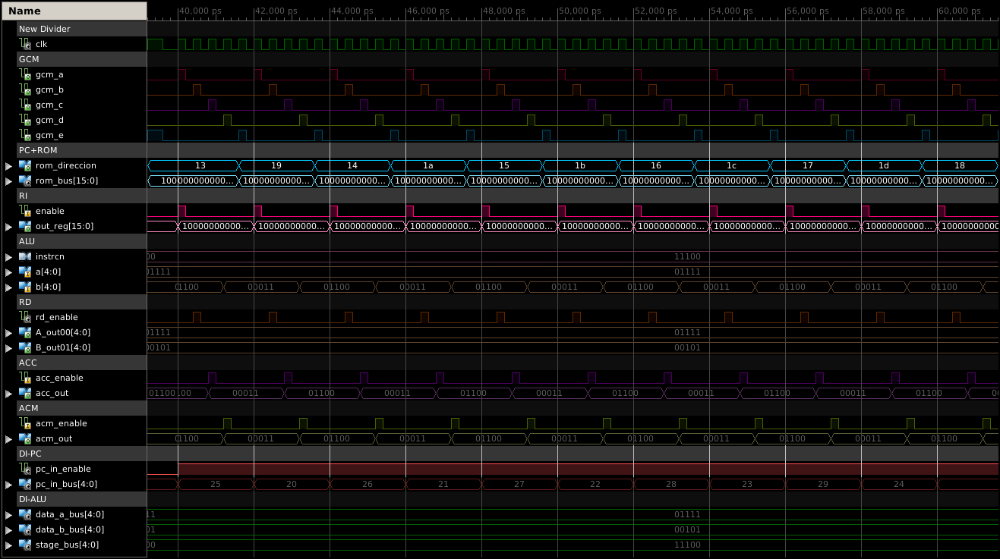
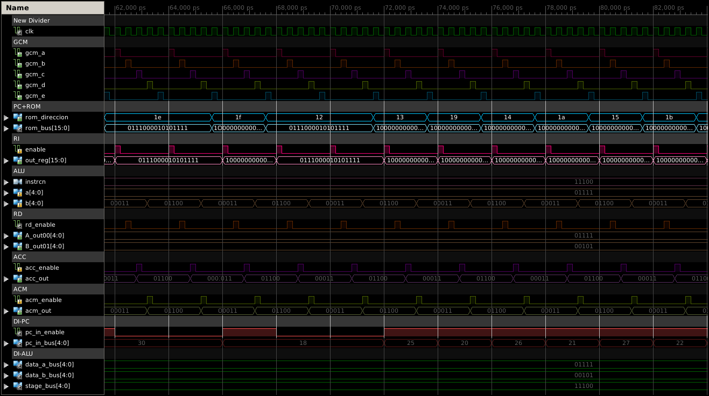

# IV: LagartijaX4

Para observar el funcionamiento del microprocesador se monta una simulación del componente `lagartijax4`; dicho componente está integrado por las dos etapas Stage 1 y Stage 2 conectadas dentro del `micro_core` el cual a su vez recibe las señales provenientes del `gcm`. El entorno de simulación muestra las señales, entradas y salidas de los componentes notables de cada uno de los módulos con el fin de mostrar el funcionamiento del microprocesador desde diferentes niveles de diseño. 

## Instrucciones de prueba

Se define en los registros de la memoria ROM  una secuencia de instrucciones para realizar las 16 operaciones tanto aritméticas como lógicas disponibles sobre diferentes operandos, para posteriormente realizar un salto entre instrucciones como se detallará en las siguientes tablas.

| registro | instrucción | registro | instrucción |
| :------: | :---------: | :------: | :--: |
|`0x0`|`0000000100000011`|`0x10`|`0011100110001111`|
|`0x1`|`0000010110000100`|`0x11`|`0111110111101100`|
|`0x2`|`0100000000011011`|`0x12`|`0111000010101111`|
|`0x3`|`0000100011101101`|`0x13`|`1000000000011001`|
|`0x4`|`0001000011101101`|`0x14`|`1000000000011010`|
|`0x5`|`0000110011000001`|`0x15`|`1000000000011011`|
|`0x6`|`0101010011000001`|`0x16`|`1000000000011100`|
|`0x7`|`0001101111000101`|`0x17`|`1000000000011101`|
|`0x8`|`0001111111000101`|`0x18`|`1000000000011110`|
|`0x9`|`0100010000010101`|`0x19`|`1000000000010100`|
|`0xA`|`0010000011001010`|`0x1A`|`1000000000010101`|
|`0xB`|`0010010011101111`|`0x1B`|`1000000000010110`|
|`0xC`|`0110100101000110`|`0x1C`|`1000000000010111`|
|`0xD`|`0110110000000101`|`0x1D`|`1000000000011000`|
|`0xE`|`0011000110100100`|`0x1E`|`0111000010101111`|
|`0xF`|`0011010010001101`|`0x1F`|`1000000000010010`|

a)

b)

> **Tabla 4.0.**  Ejemplo de un conjunto de 32 instrucciones. a) Instrucciones de 16 bits en binario. b) Instrucciones decodificadas.

Para el caso de la tabla anterior Tabla 4.0.b, la primer columna corresponde a la dirección de la instrucción dentro de la ROM. La siguiente columna indica si los datos son enviados a la ALU o al PC. De ser enviados a la ALU la columna *unidad* indica si se trata de una operación lógica o aritmética, la columna operando muestra el registro que se considera como segundo operando, ya sea el valor B leído en los bits 5-9 o el almacenado en el registro acumulador ACM. La columna operación muestra específicamente la operación a realizar. La columna B y A muestra el valor decimal de los operandos leídos en la instrucción, si los datos son enviados al PC, no se considera el operando B y en la columna A se muestra la dirección de memoria a la que se debe mover el PC. 

Como se ha observado en las tablas anteriores, el conjunto de instrucciones realiza cada una de la operaciones disponibles en la ALU, tanto aritméticas (`0x0`-`0x9`) como lógicas (`0xA`-`0x18`) y alternando valores positivos y negativos y a su vez especificando como segundo operando el valor almacenado en un momento dado en el acumulador (`0x2`, `0x6`, `0x9`, `0xC`, `0xD`, `0x11` y `0x12`); posteriormente se realiza una serie de "saltos" entre registros de la ROM para finalmente regresar a la instrucción `0x12` y repetir el ciclo (fig.4.0.).

> **fig.4.0.** Trayectoria del contador de programa en la memoria ROM.

## Simulación

Manteniendo la convención de la frecuencia de $2.5GHz$, y por ende una señal de reloj con un periodo de $400ps$, tenemos que por cada instrucción, al microprocesador le llevará
$$
t_{instrcn}=t_{A}+t_{B}+t_{C}+t_{D}+t_{E}=5\cdot T_{clk}=5\cdot 400ps=2000 ps
$$

como lo ilustra la siguiente figura:

> **fig.4.1.** Ejemplo de tiempo de ejecución de una instrucción y los respectivos pulsos del GMC. Observamos que la señal E se considera como la primera dentro del ciclo, esto debido a que es la señal que permite obtener una instrucción desde la ROM. 
>
> <small>**Nota:** Debido a que independientemente de que el ciclo de la instrucción comience con la señal E, la primer señal enviada por el GCM es la señal A, lo cual tendrá como consecuencia un tiempo "muerto" de $1600ps$ al realizar la ejecución de la primera instrucción.</small>

La siguiente serie de figuras muestra la simulación del programa descrito anteriormente, para las operaciones aritméticas y lógicas se destaca el valor de los operandos y el resultado cargado en los registros ACC  yACM. Para observar el salto entre instrucciones se destaca el valor del bus de dirección del PC.

> **fig.4.2. Instrucciones: `0x0 `- `0x2`** . La parte sombreada en rojo corresponde a los $1600 ps$ mencionados en la fig.4.1.

> **fig.4.3. Instrucciones: `0x3 `- `0x5`** .

> **fig.4.4. Instrucciones: `0x7 `- `0xA`** .

> **fig.4.5. Instrucciones: `0xB `- `0xE`** .

> **fig.4.6. Instrucciones: `0xF `- `0x12`** .

> **fig.4.7. Instrucciones: `0x13 `- `0x18`**. Se observa el "salto" entre instrucciones ilustrado en la fig. 4.0. La señal `pc_in_enable` se activa para indicar al PC un salto a la dirección indicada en el `pc_in_bus`.

> **fig.4.8. Instrucciones: `0x1e `-`0xb`**. Una vez que se alcanza la dirección `0x1e` se realiza la operación, el contador de programa pasa a la siguiente instrucción `0x1f` para después volver a `0x12`y repetir el ciclo iniciado en `0x13`.

## Conclusión

El objetivo del diseño e implementación del Microprocesador de 4 bits "**LagartijaX4**", se centra principalmente en analizar los componentes mínimos que integran un procesador así como las fases que implica la ejecución de una simple instrucción; esto se pretende lograr con los diagramas, tablas de verdad, descripciones, simulaciones y código que integran el presente proyecto de diseño. La segmentación del proyecto en fases se ha hecho con la finalidad de poder agregar funcionalidades, módulos o componentes de forma efectiva; tal es el caso de la `micro_stage3` en la que el equipo nos encontramos trabajando actualmente, la cual tiene como objetivo incluir un   componente de memoria RAM  en el microprocesador y de esta forma hacer la transición de la arquitectura Von Neuemann a arquitectura Harvard.

Finalmente, hablando como equipo, podemos decir que el proceso que ha supuesto llevar a cabo este diseño e implementación ha requerido de la compilación y estudio de una porción considerable de teoría, metodologías, técnicas, estructuras, dispositivos y demás conceptos relacionados con la arquitectura de computadoras y por ende el Diseño Digital, lo cual tiene como consecuencia una mayor compresión de lo que es la computación hoy en día. El familiarizarse con el trabajo de un microprocesador a diferentes escalas trae consigo una ventaja en todos los aspectos que conforman nuestra formación, pues con ello los criterios y consideraciones que se tomen a la hora de desenvolvernos profesionalmente en cualquier área de la carrera, estará influenciado por este conocimiento.

---

### 
Escuela Superior de Cómputo - Arquitectura de computadoras

---

