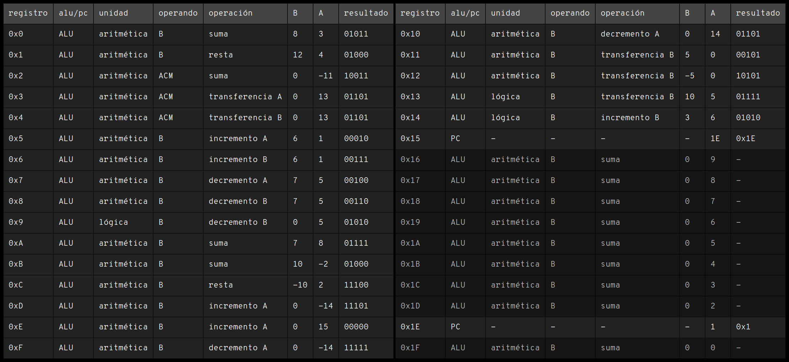

# IV: LagartijaX4

Para observar el funcionamiento final del microprocesador se monta una simulación del componente `lagartijax4`; dicho componente está integrado por las dos etapas Stage 1 y Stage 2 conectadas dentro del `micro_core` el cual a su vez recibe las señales provenientes del `gcm`. El entorno de simulación muestra las señales, entradas y salidas de los componentes notables de cada uno de los módulos con el fin de mostrar el funcionamiento del microprocesador desde diferentes niveles de diseño. 

## Instrucciones de prueba

Se define en los registros de la memoria ROM  una secuencia de instrucciones para realizar las 16 operaciones tanto aritméticas como lógicas disponibles sobre diferentes operandos, para posteriormente realizar un salto entre instrucciones como se detallará en las siguientes tablas.

| registro | instrucción | registro | instrucción |
| :------: | :---------: | :------: | :--: |
| `0x0`      | `0000000100000011` | `0x10`     | `0001100000001110` |
| `0x1`      | `0000010110000100` | `0x11`     | `0001000010100000` |
| `0x2`      | `0100000000011011` | `0x12`     | `0001001010100000` |
| `0x3`      | `0100100000001101` | `0x13`     | `0011000101000101` |
| `0x4`      | `0101000000001101` | `0x14`     | `0011010001100110` |
| `0x5`      | `0000110011000001` | `0x15`     | `1000000000011110` |
| `0x6`      | `0001010011000001` | `0x16`     | `0000000000001001` |
| `0x7`      | `0001100011100101` | `0x17`     | `0000000000001000` |
| `0x8`      | `0001110011100101` | `0x18`     | `0000000000000111` |
| `0x9`      | `0011110000000101` | `0x19`     | `0000000000000110` |
| `0xA`      | `0000000011101000` | `0x1A`     | `0000000000000101` |
| `0xB`      | `0000000101010010` | `0x1B`     | `0000000000000100` |
| `0xC`      | `0000011101000010` | `0x1C`     | `0000000000000011` |
| `0xD`      | `0000110000011110` | `0x1D`     | `0000000000000010` |
| `0xE`      | `0000110000001111` | `0x1E`     | `1000000000000001` |
| `0xF`      | `0001100000011110` | `0x1F`     | `0000000000000000` |

a)

b)

> **Tabla 4.0.**  Ejemplo de un conjunto de 32 instrucciones. a) Instrucciones de 16 bits en binario. b) Instrucciones decodificadas.

Para el caso de la segunda tabla anterior Tabla 4.0.b, la primer columna corresponde a la dirección de la instrucción dentro de la ROM. La siguiente columna indica si los datos son enviados a la ALU o al PC. De ser enviados a la ALU la columna unidad indica si se trata de una operación lógica o aritmética, la columna operando muestra el registro que se considera como segundo operando, ya sea el valor B leído en los bits 5-9 o el almacenado en el registro acumulador ACM. LA columna operación muestra específicamente la operación a realizar. La columna B y A muestra el valor decimal de los operandos leídos en la instrucción, si los datos son enviados al PC, no se considera el operando B y en la columna A se muestra la dirección de memoria a la que se debe mover el PC. 

## Simulación

Manteniendo la convención de la frecuencia de $2.5GHz$, y por ende una señal de reloj con un periodo de $400ps$, tenemos que por cada instrucción, al microprocesador le llevará
$$
t_{instrcn}=t_{A}+t_{B}+t_{C}+t_{D}+t_{E}=5\cdot T_{clk}=5\cdot 400ps=2000 ps
$$
