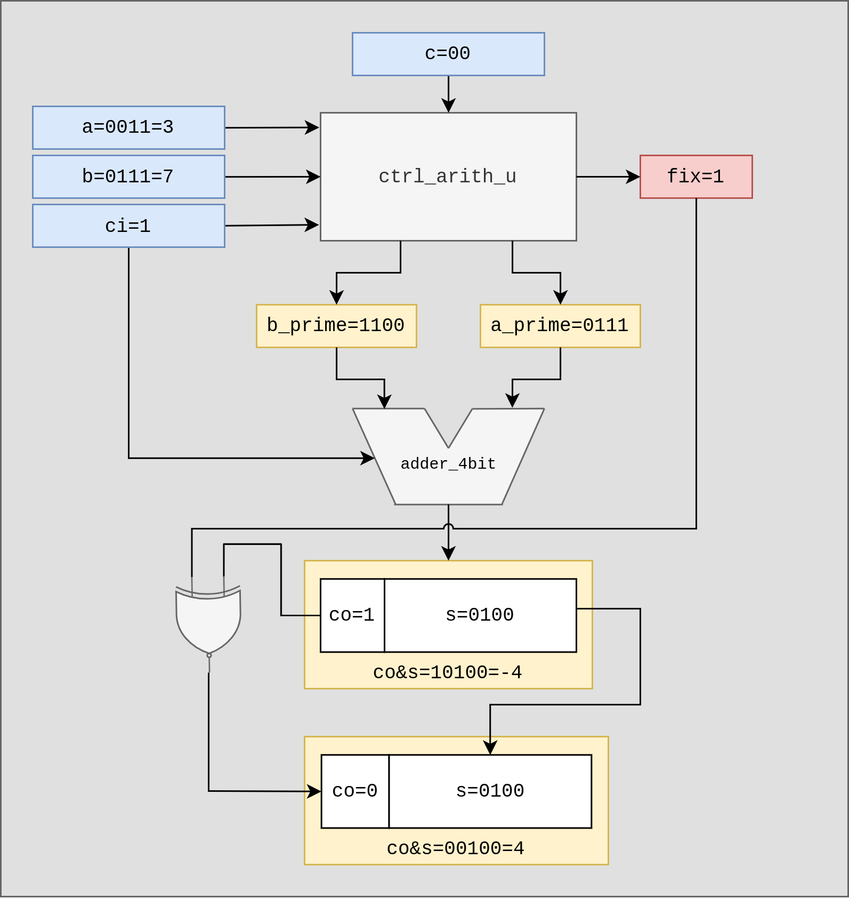
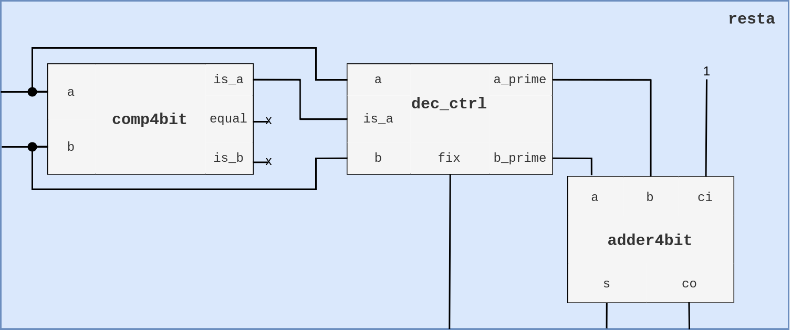
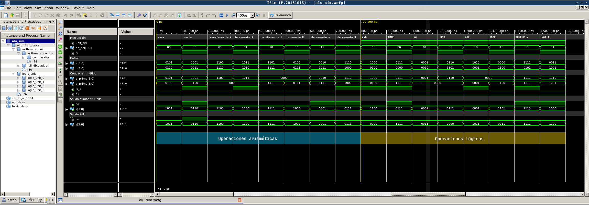
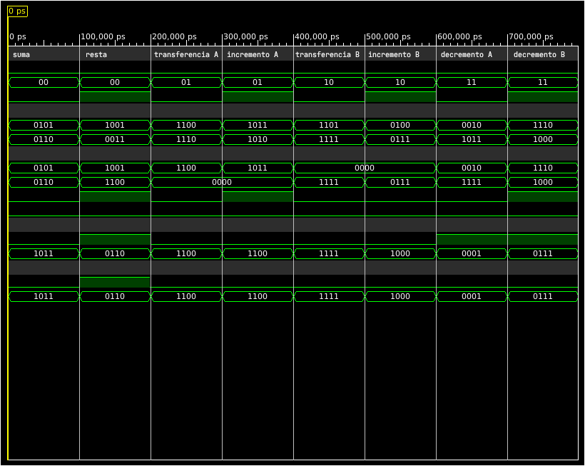
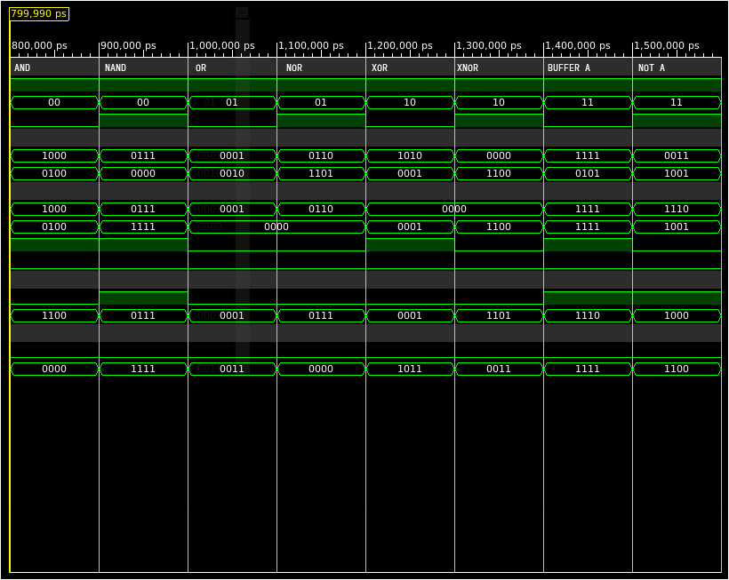

<table style="border:0px;"><tr>
	<td align="center" style="border:0px"></td>
	<td align="center" style="border:0px"><h2>Instituto Politécnico Nacional<br>Escuela Superior de Cómputo</h2></td>
	<td align="center" style="border:0px"></td>
</tr></table>


<center><h3>Arquitectura de Computadoras - 3CM4<br>Práctica: ALU 16 Operaciones</h3></center>


<center><h3>Prof. César Mujica Ascencio</h3></center>

<center><h4>Equipo: <br><br>Aguilar Reyes Abraham Zaid<br>Hernández Reséndiz Brandon Iván<br>Fuentes Perez Rámses<h4></center>

<center>Junio 2020</center>
<div style="page-break-after: always; break-after: page;"></div>

# ALU 16 Operaciones

Recordando la definición de microprocesador, se refiere a este como el "cerebro" de una computadora, pues es el encargado de ejecutar los programas del sistema operativo así como los programas de usuario; esta ejecución implica principalmente un conjunto de operaciones básicas en forma binaria, tarea de la cual la Unidad Aritmética Lógica (ALU) es la encargada.

> **Definición**
> Conjunto de circuitos electrónicos encargados de realizar tanto operaciones aritméticas como suma y resta, así como operaciones lógicas AND, OR, NAN, NOR, etc. sobre datos proporcionados por la unidad de control, registros, memoria o dispositivos de E/S en un microprocesador. El componente principal de una ALU es un sumador, pues la manipulación de los datos entrada de este, permiten realizar no solo la operación de suma, sino resta, incrementos, decrementos o transferencias.

## Diseño

La unidad de procesamiento se divide en dos sub-unidades: la lógica y la aritmética (**Fig.1**). Estas dos unidades se han considerado como dos bloques independientes `arith_u` y `logic_u`. Cada sub-unidad es capaz de realizar 8 operaciones cada una, sobre uno o los dos operandos que se especifiquen de entrada. La selección de la unidad y de la operación se hace en función de los valores de los campos recibidos en la instrucción. Esta instrucción es un conjunto de bits que se reciben desde el codificador de instrucción, elemento de una segunda etapa del microprocesador, por lo cual para pruebas y depuración de este módulo se sustituye dicho conjunto de bits provenientes del decodificador por un vector de 5 bits `instrcn` (Tabla.1).


> **Fig. 1.** Diagrama ALU 16 operaciones. 

<div style="page-break-after: always; break-after: page;"></div>

**Instrucciones**
El formato de las instrucciones de la ALU es una palabra de 5 bits la cual se divide en campos como se muestra a continuación:

```
bit		:	4				3			2-1			0
señal	:	[regmux_sel]	[unit_sel]	[op_sel]	[carry_in]
```

- ***regmux_sel***: El selector de registro del segundo operando se conecta al multiplexor y mediante este se elige el segundo operando que entra a la ALU, entre el dato de entrada B (rdb_bus) y el valor almacenado en el acumulador (acm_bus).

- ***unit_sel***: El selector de unidad determina si se realiza una operación aritmética (0) o lógica (1) sobre los operandos.

- ***op_sel & carry_in***: La instrucción de operación concatenada con el acarreo de entrada ci determina cual de las 8 operaciones en cada una de las unidades se va a realizar.

**Tabla de instrucciones**

| unit_sel | op_sel & ci | hex  |    operación    |
| :------: | :---------: | ---- | :-------------: |
|    0     |     000     | 0    |      suma       |
|    0     |     001     | 1    |      resta      |
|    0     |     010     | 2    | transferencia A |
|    0     |     011     | 3    |  incremento A   |
|    0     |     100     | 4    | transferencia B |
|    0     |     101     | 5    |  incremento B   |
|    0     |     110     | 6    |  decremento A   |
|    0     |     111     | 7    |  decremento B   |
|    1     |     000     | 8    |       AND       |
|    1     |     001     | 9    |      NAND       |
|    1     |     010     | A    |       OR        |
|    1     |     011     | B    |       NOR       |
|    1     |     100     | C    |       XOR       |
|    1     |     101     | D    |      XNOR       |
|    1     |     110     | E    |    BUFFER A     |
|    1     |     111     | F    |      NOT A      |
> **Tabla.1.** Código de instrucciones ALU 16 bits

#### Unidad lógica

La unidad lógica se compone de 4 bloques de operadores lógicos de 1 bit (como se observa en la Fig.1), cada uno de estos operadores realiza la operación bit a bit de las entradas. El comportamiento de cada uno de estos 4 bloques está dado por las ecuaciones de la Tabla.2, la cuales en función del valor de op_sel (bits 2-1 de la instrucción) definen la salida del bloque dados los valores del bit correspondiente al operando A,B y el acarreo ci; el acarreo de salida en esta unidad se establece en 0. 

| op_sel | s                      |
| ------ | ---------------------- |
| 00     | $ci\ \oplus\ (ab)$ |
| 01     | $ci\ \oplus\ (a + b)$  |
| 10     | $ci\ \oplus\ (a \oplus b)$ |
| 11     | $ci\ \oplus\ a$           |

> **Tabla 2.** Ecuaciones de salida  por bloque lógico en función del campo op_sel.

#### Unidad Aritmética

La unidad aritmética de la ALU se compone de un bloque de control en el que en función de la operación recibida como instrucción se modifican los datos de entrada para posteriormente enviarse a un sumador completo de 4 bits. La tarea del bloque de control es modificar el valor de los operandos para obtener la operación especificada, como se muestra en la Fig.1. estos valores se ingresan en el sumador. Por ejemplo: Si se trata de una operación de incremento, el valor del segundo operando se establece a 0 y se suma el acarreo de entrada correspondiente al bit de control de la operación. La Tabla.3 muestra esta relación entre operando de salida con el código de operación, dónde **a** y **b** son los datos de entrada y **a_prime** y **b_prime** los datos de salida. Un caso particular se da con la operación de resta, esta se describe con mas de detalle posteriormente.

| op_sel | ci   | operación       | a_prime | b_prime | fix  |
| ------ | ---- | --------------- | ------- | ------- | ---- |
| 00     | 0    | suma            | a       | b       | 0    |
| 01     | 0    | transferencia A | a       | 0000    | 0    |
| 10     | 0    | transferencia B | 0000    | b       | 0    |
| 11     | 0    | decremento A    | a       | 1111    | 1    |
| 00     | 1    | resta           | b       | not a   | /    |
| 01     | 1    | incremento A    | a       | 0000    | 0    |
| 10     | 1    | incremento B    | 0000    | b       | 0    |
| 11     | 1    | decremento B    | 1110    | b       | 1    |

> **Tabla.3.** Relación entre código de operación y valor de salida de los operandos. El valor de fix en la fila 5 se especifica en la tabla 4.

El la última columna de la tabla 3 se observa el valor de la bandera **fix**. Está bandera indica si el valor del acarreo de salida debe ser negado para ser coherente con la operación realizada. El valor de fix entra junto con el acarreo de salida del sumador a una compuerta XNOR para obtener el valor correcto del acarreo de salida. Por ejemplo: Si el operando a=0011=3 y b=0111=7, el resultado esperado de la operación B-A es 4. Sin embargo, dado el algoritmo de resta como suma con complemento a dos, el valor de B-A es -4, para obtener a la salida de la ALU el valor correcto se debe encender la bandera fix. El siguiente diagrama muestra el ejemplo mencionado anteriormente.



> **Fig.2.** Ejemplo de operación resta cuando fix=1.

##### Resta

Se considera el orden de los operandos como $B-A$, lo cual implica que:

1. Si $A>B$ se niega el operando B y la bandera fix permanece en bajo.

2. Si $A\leq B$ el operando B se iguala  al operando A negado y la bandera fix pasa a alto.

| Condición  | Signo |
| ---------- | ----- |
| $A > B$    | -     |
| $A \leq B$ | +     |

###### Bloque de control de operandos

Para llevar a cabo el control de la bandera fix y el orden de los operandos adecuado para efectuar la resta, se emplea un bloque del cual su comportamiento lo describe la siguiente tabla, donde el valor **is_a** indica con valor en alto que el operando A es mayor a B. La figura correspondiente a la resta, muestra una aproximación por bloques de la operación.

| is_a | A    | B    | A'   | B'             | fix  |
| ---- | ---- | ---- | ---- | -------------- | ---- |
| 0    | 0    | 0    | $B$  | $\overline{A}$ | 1    |
| 0    | 0    | 1    | $B$  | $\overline{A}$ | 1    |
| 0    | 1    | 0    | $B$  | $\overline{A}$ | 1    |
| 0    | 1    | 1    | $B$  | $\overline{A}$ | 1    |
| 1    | 0    | 0    | $A$  | $\overline{B}$ | 0    |
| 1    | 0    | 1    | $A$  | $\overline{B}$ | 0    |
| 1    | 1    | 0    | $A$  | $\overline{B}$ | 0    |
| 1    | 1    | 1    | $A$  | $\overline{B}$ | 0    |

> **Tabla.4.** Comportamiento de los operandos de salida del control de la unidad aritmética en función del valor del operando A.



> **Fig.3.** Representación como diagrama de bloques de la operación resta.

<div style="page-break-after: always; break-after: page;"></div>
## Simulación

Se monta un entorno de simulación para observar los resultados de la ALU según la operación. La simulación se lleva a cabo en el simulador ISim de SISE, dentro de la cual se forzan los valores tanto de los operandos A y B como de la instrucción.



> **Fig.4.** Simulación en ISim del funcionamiento de la ALU con valores de A y B aleatorios.

Los valores forzados para la simulación (instrcn, A y B) y los resultados esperados a la salida de la ALU (co y s) se muestran en la Tabla 6. La Fig.5. muestra los resultados de la simulación tanto para la unidad aritmética como para la unidad lógica.

| instrcn | A    | B    | co   | s    |
| ------- | ---- | ---- | ---- | ---- |
| 0000    | 0101 | 0110 | 0    | 1011 |
| 0001    | 1001 | 0011 | 1    | 0110 |
| 0010    | 1100 | 1110 | 0    | 1100 |
| 0011    | 1011 | 1010 | 0    | 1100 |
| 0100    | 1101 | 1111 | 0    | 1111 |
| 0101    | 0100 | 0111 | 0    | 1000 |
| 0110    | 0010 | 1011 | 0    | 0001 |
| 0111    | 1110 | 1000 | 0    | 0111 |
| 1000    | 1000 | 0100 | 0    | 0000 |
| 1001    | 0111 | 0000 | 0    | 1111 |
| 1010    | 0001 | 0010 | 0    | 0011 |
| 1011    | 0110 | 1101 | 0    | 0000 |
| 1100    | 1010 | 0001 | 0    | 1011 |
| 1101    | 0000 | 1100 | 0    | 0011 |
| 1110    | 1111 | 0101 | 0    | 1111 |
| 1111    | 0011 | 1001 | 0    | 1100 |
> **Tabla.5.** Entradas y salidas esperadas en la simulación.



<center>a)</center>


<center>b)</center>
> **Fig.5.** Simulación de las operaciones aritméticas (a) y lógicas (b). De arriba hacía abajo: unit_sel, op_sel, ci,a,b,a_prime, b_prime,is_a,fix,co y  s (sumador), co y s (ALU).


## Bibliografía y Referencias electrónicas

---

- **Parhami Behrooz**. Arquitectura de Computadoras, De los microprocesadores a las supercomputadoras, 1ra. Edición. McGraw Hill, México, 2007. 