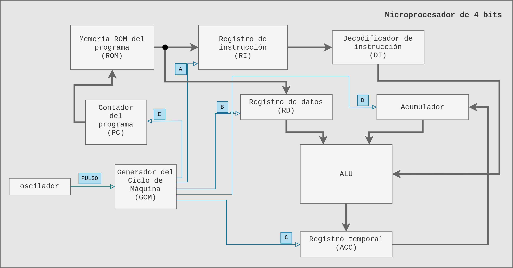
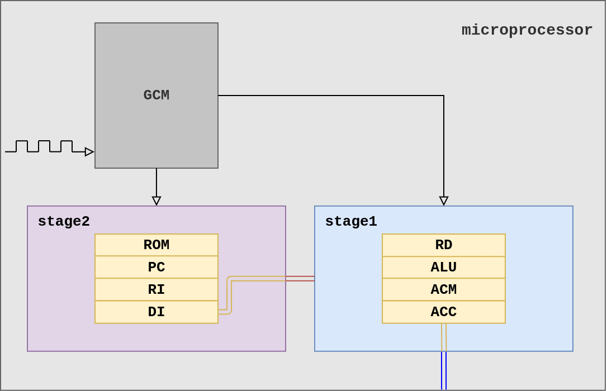
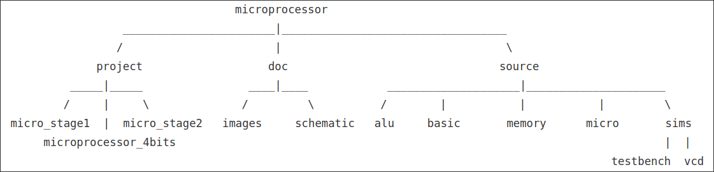
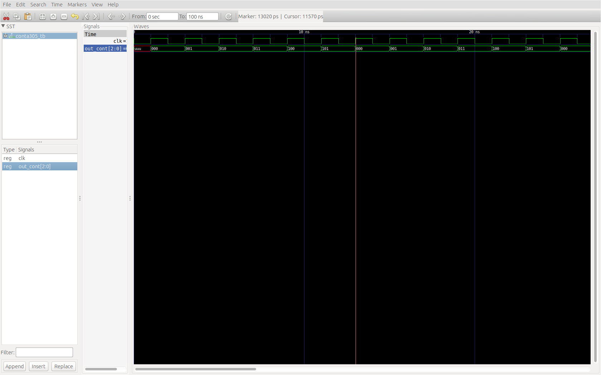

# Arquitectura de computadoras : Proyecto

## Generalidades

Mientras buscaba la falla dentro de la ALU en la operación de resta se me ocurrió esta idea de organizar el proyecto, ya que la gran cantidad de archivos que se generan y particularmente la forma de organizarlos del ISE me dificultaron de cierta forma resolver el problema. Comencé tratando de arreglar sólo los archivos y poco del código pero aún así seguía teniendo problemas. Después estudiando y tratando de entender un poco el diseño del microprocesador que el profesor nos dio, y también tratando de redactar un buen reporte, se me ocurrió la idea de dividirlo por módulos y nombrar a estos módulos **stage**. Otro factor que me orillo a seguir con la re-estructuración fue el entorno de ISE; si bien corriendo en Linux no es tan lento como en las XP del laboratorio, si es bastante engorroso "debuggear" y hacer pruebas, es por eso que ya habiendo conocido antes el GHDL, opté por escribir el código vhd con **Sublime Text** y  utilizar **GHDL+GTKWave** como compilador y simulador, mas adelante detallo un poco mas estas herramientas, las cuales me resultaron muy útiles y creo que agilizarón bastante todo el proceso. Las simulaciones están hechas en ISim, su línea de comando hace todo mas fácil.

> **stage** es una analogía a la modificación de autos, en la cual cada stage consiste en dotar al auto de piezas y modificaciones que valla mejorando las prestaciones de este.


## micro_stage 1 y 2 + GCM

Si observamos el diagrama de bloques y recordamos la clase que el profesor nos dio sobre el microprocesador, podemos notar que todo el proceso es secuencial, orquestado por el GCM y  por ende las señales, derivadas del oscilador, A-E.



> Diagrama original del microprocesador de 4 bits

Es por eso que los stages se dividen en función de las señales A-D y A,E para el `micro_stage1`y `micro_stage2` respectivamente. Si revisan el [reporte](Microprocesador - Stage 1.md) que anexo de ese primer módulo, trato de describir cada parte que lo compone y algunas consideraciones que hicimos para el diseño. El siguiente diagrama muestra el diseño del procesador de manera muy compacta y la segmentación propuesta.



> Segmentación propuesta para el microprocesador.


## Organización del proyecto

El root del proyecto es el directorio `miroprocessor`, el directorio `project`organiza por carpetas los proyectos de **ISE** de los módulos `micro_stage1`y `micro_stage2 ` y de la integración final como `microprocessor_4bits` (estos dos últimos por desarrollar). El directorio `doc`contiene archivos de documentación, diagramas, etc. Finalmente todo el código VHD se organiza en el directorio `source`(checar el árbol de paquetes en el [reporte](Microprocesador - Stage 1.md)). Dentro de source existe un directorio llamado `simulations`, este contiene los archivos testbench (*.vhd) para las simulaciones de los módulos y  dentro del directorio `testbench` para varias de las entidades que están declaradas en los paquetes; en el directorio `vcd`dentro de testbench se almacenan los archivos de simulación de GTKWave con extensión VCD.



<!--```
					    		   microprocessor
				  _______________________|__________________________________
                 /						 |	 		  						\
			  project	 				doc	   							   source
		  _____|_____				 ____|____		  	  ____________________|_____________________
		 /	   |     \				/		  \			 /		  |			  |			  |			\
 micro_stage1  |  micro_stage2	 images		schematic	alu		basic		memory		micro	    sims
	  microprocessor_4bits			 															    |  |
																				 		    testbench  vcd
​```-->


## GHDL + GTKWave: Comandos básicos y simulación

Para la organización y re-estructuración de los archivos del proyecto utilicé el simulador de VHDL, GHDL. El funcionamiento de este simulador es similar al compilador `GCC`, y bastante rápido. Ademas de analizar sintaxis permite la ejecución del código VHDL (simulación) implementando un testbench (entidad sin puertos, caja cerrada, en el cual se utilizan sólo señales), todo esto directamente en terminal. El resultado de dicha simulación se puede mandar como salida a un archivo `.vcd`y posteriormente visualizarlo con `GTKWave`, el cual es un software que permite observar el comportamiento de los puertos y señales instanciados en el testbench a diferentes niveles. La única que desventaja que tiene GTKWave, contra el simulador del ISE por ejemplo, es que no se pueden forzar constantes, para hacer un cambio en los valores de las señales es necesario cambar dicho valor directamente en el archivo VHD del testbench, compilar, analizar y recargar la simulación. Sin embargo, dado que esta compilación y análisis de los archivos se hace directamente en terminal, es posible implementar scripts de shell para hacerlo.

**Instalación de GHDL y GTKWave**

La gran ventaja de la terminal! Para la instalación del GHDL y GTKWave sólo es necesario el siguiente comando:

```bash
$ sudo apt-get install ghdl gtkwave
```

> **Link:** [Simulador VHDL gratuito. GHDL](https://vhdl.es/simulador-vhdl-gratuito/)

## Ejemplo del proceso de simulación con GHDL

Supongamos que queremos simular el comportamiento de un contador de 3 bits de 0 a 5 (pensaba implementarlo con el decodificador de 4 bits a 7 segmentos) declarado en el paquete `basic_devs`, el archivo de dicho contador `conta305.vhd` es el siguiente:


```vhdl
-- conta305 -> conta[tamaño en bits][inicio][fin]
library ieee;
use ieee.std_logic_1164.all;

entity conta305 is
	port (
	 clk: in std_logic;
	 count: out std_logic_vector(2 downto 0)
  );
end entity;

architecture behavioral of conta305 is
	signal delta: std_logic_vector(2 downto 0):="000";
begin
	process(clk)
	begin
		if(clk='1') then
			delta <=
			((not delta(2) and delta(1) and delta(0)) or (delta(2) and not delta(0) and not delta(1))) & 
			(not delta(2) and (delta(0) xor delta(1))) & 
			(not delta(0) and (not delta(1) or not delta(2)));
			count <= delta;
		end if;
	end process;
end architecture;
```

El archivo de testbench `conta305_tb.vhd` es el siguiente:

```vhdl
library ieee;
use ieee.std_logic_1164.all;
use work.basic_devs.conta305; -- Incluímos el componente desde basic_devs

entity conta305tb is -- Caja cerrada
end entity;

architecture conta305_test of conta305tb is
	signal clk: std_logic:='0'; -- Señal de reloj
	signal out_cont: std_logic_vector(2 downto 0); -- Señal a conectar a la salida del contador
begin
	clk <= not(clk) after 1 ns; -- Simulamos un ciclo de reloj de 2 ns
	conta305_block: conta305 port map(clk, out_cont); -- Instanciamos el contador
end architecture;
```
Con los dos archivos listos procedemos a analizar, en primer lugar el archivo del contador, seguido del archivo del testbench. Si se hacen cambios en el archivo de paquete, GHDL avisará que ha habido cambios y es necesario re-analizar, si se da el caso simplemente se analiza dicho archivo.  Una vez completados los análisis ejecutamos el código y finalmente corremos GTKWave con el archivo VCD como argumento. El procedimiento se muestra a continuación:

```bash
$ ghdl -a conta305.vhd
$ ghdl -a conta305_tb.vhd
$ ghdl -r conta305tb --vcd=simulacion.vcd --stop-time=12ns
$ gtkwave simulacion.vcd
ghdl:info: simulation stopped by --stop-time @12ns
```

> Notemos que para hacer la ejecución de la simulación se hace con el nombre de la entidad como argumento, no con el nombre del archivo. 

El resultado de la simulación debe ser el siguiente:



> Se observa que durante el primer nano segundo el valor de la señal `out_count` es indefinido dado que se comienza el pulso de reloj en bajo.

### Bash Scripts

Como he mencionado dicho proceso puede llegar a ser un poco tedioso sin el uso de un script. A continuación se muestra un ejemplo de script para analizar y ejecutar la simulación anterior con algunos mensajes de control.

```bash
#!/bin/bash

#Códigos de colores en UTF-para imprimir en términal
RED='\033[0;31m'
GRN='\033[0;32m'
LBL='\033[1;34m'
YLW='\033[1;33m'
NC='\033[0m'
SIMNAME=$1 #Se guarda la cadena del primer argumento como variable
NONAME="" #Cadena vacía para identificar la ausencia de argumentos

echo -e ">Analizar ${LBL}conta305.vhd${NC}" 
ghdl -a conta305.vhd
echo -e ">Analizar testbench ${LBL}stage1_sim.vhd${NC}"
ghdl -a conta305_tb.vhd
echo -e ">Correr testbench"

#Asignación de nombre de archivo de salida
if [ "$SIMNAME" = "$NONAME" ]; then
	echo -e " archivo de simulacion: ${YLW}simulation.vcd${NC}"
	SIMNAME="simulation.vcd"
else
	echo -e " archivo de simulacion: ${YLW}$SIMNAME${NC}"
fi

ghdl -r conta305tb --vcd=$SIMNAME --stop-time=12ns
COMPK=$? #Almacena el valor que devuelve GHDL al terminar su ejecución. En caso de éxito este valor es cero,
if [[ COMPK==0 ]]; then
	echo -e ">Simulacion [${GRN}OK${NC}]"
fi
```

> En el script evito correr GTKWave por si la simulación falla o surge algún inconveniente.

Existen dos maneras de ejecutar el script. La primera es directamente como argumento de `bash`:

```bash
$ bash makesim.sh simulacion_contador.vcd
>Analizar conta305.vhd
>Analizar testbench conta305_tb.vhd
>Correr testbench
 archivo de simulacion: simulacion_contador.vcd
ghdl:info: simulation stopped by --stop-time @12ns
>Simulacion [OK]
$ gtkwave simulacion_contador.vcd
```

La segunda es asignando el permiso de ejecución al script mediante `chmod`;

```bash
$ chmod +x makesim.sh
$ ./makesim.sh simulacion_contador.vcd
>Analizar conta305.vhd
>Analizar testbench conta305_tb.vhd
>Correr testbench
 archivo de simulacion: simulacion_contador.vcd
ghdl:info: simulation stopped by --stop-time @12ns
>Simulacion [OK]
$ gtkwave simulacion_contador.vcd
```

#### Script para analizar paquetes 

Como mencioné anteriormente, en ocasiones GHDL pide analizar el archivo de paquetes o el archivo donde se hace la descripción del componente que queremos simular; el problema surge conforme se van generando mas y mas archivos pues muchas veces es necesario re-analizar casi la totalidad el proyecto. Es por eso que decidí separar en carpetas los archivos pertenecientes a cada uno de los paquetes, para de esta forma implementar un script para hacer el análisis de todos los archivos del proyecto con sólo la ejecución del script. Nombré a este script `analize_tree.sh`haciendo referencia al árbol de paquetes que se describe en el reporte. 

> El archivo que genera GHDL, **work-obj93.cf**, contiene toda la información de la librería **work**, que es la que organiza por defecto todos los paquetes. Cada acción de análisis sobre cualquier archivo actualiza el archivo **work-obj93.cf**, sin embargo es recomendable eliminar y volver a generar dicho archivo cuando se analizan varios archivos a la vez, es por eso que se define la bandera *-r* como argumento del script, para eliminar y volver a generar.

```bash
#!/bin/bash
RED='\033[0;31m'
GRN='\033[0;32m'
LBL='\033[1;34m'
YLW='\033[1;33m'
NC='\033[0m'
VAR1=$1
VAR2="-r" #Bandera para eliminar y volver a generar el archivo work-obj93.cf
## Puro adorno
echo -e "${LBL}ESCOM${NC} Arquitectura de computadoras: Microcontrolador 4bits\nAnalisis de codigo fuente de paquetes y componentes con GHDL \n"


if [ "$VAR1" = "$VAR2" ]; then #Verifica si se ha activado la bandera de "reset" del archivo work-93.c
    echo -e "${RED}> Recompilar:${NC} work-obj93.cf"
    rm work-obj93.cf #En caso verdadero elimina dicho archivo
    				#GHDL lo vuelve a generar una vez que hace el primer análisis
else
    echo "> actualizar work-obj93.cf"
fi

echo -e "> analizar paquete de basicos"
ghdl -a basic_devs.vhd # Analiza paquete
compok=$?
	if [[ compok==0 ]]; then
		echo -e "  ${YLW}basic_devs.vhd${NC} [${GRN}OK${NC}]\n> analizar directorio basic/"
		files=$(ls basic/*.vhd) #Obtiene todos los archivos .vhd del directorio correspondiente
		for i in $files ; do
			ghdl -a $i #Analiza cada uno de los archivos almacenados en el vector files
			compok=$?
			if [[ compok==0 ]]; then
				echo -e "  ${LBL}$i${NC} [${GRN}OK${NC}]" #Comfirma el análisis
			else
				echo -e "${RED}Error${NC} al analizar ${LBL}$i${NC}" #Falló análisis de archivo
				exit 1
			fi
		done		
	else
		echo -e "${RED}Error${NC} al analizar basic_devs.vhd" #Falló análisis de paquete
		exit 1
	fi
#Y de manera análoga con los demás paquetes --->
echo -e "> analizar paquete de memoria"
ghdl -a memory_devs.vhd
compok=$?
	if [[ compok==0 ]]; then
		echo -e "  ${YLW}memory_devs.vhd${NC} [${GRN}OK${NC}]\n> analizar directorio memory/"
		files=$(ls memory/*.vhd)
		for i in $files ; do
			ghdl -a $i 
			compok=$?
			if [[ compok==0 ]]; then
				echo -e "  ${LBL}$i${NC} [${GRN}OK${NC}]"
			else
				echo -e "${RED}Error${NC} al analizar ${LBL}$i${NC}"
				exit 1
			fi
		done		
	else
		echo -e "${RED}Error${NC} al analizar memory_devs.vhd"
		exit 1
	fi

echo -e "> analizar paquete de alu"
ghdl -a alu_devs.vhd
compok=$?
	if [[ compok==0 ]]; then
		echo -e "  ${YLW}alu_devs.vhd${NC} [${GRN}OK${NC}]\n> analizar directorio alu/"
		files=$(ls alu/*.vhd)
		for i in $files ; do
			ghdl -a $i 
			compok=$?
			if [[ compok==0 ]]; then
				echo -e "  ${LBL}$i${NC} [${GRN}OK${NC}]"
			else
				echo -e "${RED}Error${NC} al analizar ${LBL}$i${NC}"
				exit 1
			fi
		done		
	else
		echo -e "${RED}Error${NC} al analizar alu_devs.vhd"
		exit 1
	fi

echo -e "> analizar paquete de micro"
ghdl -a micro_devs.vhd
	if [[ compok==0 ]]; then
		echo -e "  ${YLW}micro_devs.vhd${NC} [${GRN}OK${NC}]\n> analizar directorio micro/"
		files=$(ls micro/*.vhd)
		for i in $files ; do
			ghdl -a $i 
			compok=$?
			if [[ compok==0 ]]; then
				echo -e "  ${LBL}$i${NC} [${GRN}OK${NC}]"
			else
				echo -e "${RED}Error${NC} al analizar ${LBL}$i${NC}"
				exit 1
			fi
		done		
	else
		echo -e "${RED}Error${NC} al analizar micro_devs.vhd"
		exit 1
	fi
```

En caso de que exista algún error en algún archivo, GHDL lo reporta y se continua con el análisis. Regularmente estos errores implican otros errores en otros archivos, por lo cual lo ideal es corregir y volver a analizar. Este script se encuentra en la carpeta source junto con *makesim.sh* que funciona de forma similar al script anterior.

<div style="page-break-after: always; break-after: page;"></div>

## Notas:
> El propósito principal de esta redacción junto con el reporte es explicar como funciona esta parte del proyecto que se tiene y también proponer esta forma de trabajo para completar el microprocesador, prácticamente sólo falta el contador de programa y el decodificador de instrucciones. En el testbench `source/sims/top_sim.vhd` se crea un "mini GCM" de 4 señales con un contador de 0 a 3 y un demultiplexor de 1 a 4, para tener el GCM final sólo se deben extender un bit ambos componentes.

> El acarreo del dato de 5 bits almacenado en el registro ACM permanece desconectado hasta este momento. Una forma de especificar el uso de este puede ser mediante la misma instrucción. Creo que eso debe adecuarse una vez que se sepa el formato final de las instrucciones y la instrucciones en sí que estarán almacenadas en la memoria de programa.

#### Respecto a la documentación

> Para hacer estos documentos utilicé **markdown** y el software [**Typora**](https://www.typora.io/). Agilizan bastante el proceso de documentación. Anexo las versiones PDF que para mi gusto resultan un tanto desordenadas, por lo cual también anexo la versión [HTML](doc/html/microprocesador_stage_1.html) a la que le agregue uno que otro truco. Estoy trabajando en un tema personalizado de Typora para los PDF's.


> Para los diagramas de los circuitos utilicé [draw.io](https://www.draw.io/). Es un editor de gráficos vectoriales muy bueno y se utliza con drive. Les comparto el [link](https://drive.google.com/drive/folders/1BE7Lbbq0alqQRE5xtO7kfgk1HyXLJ6ZM?usp=sharing) a la carpeta del proyecto que tengo en drive y dónde almaceno los diagramas.

