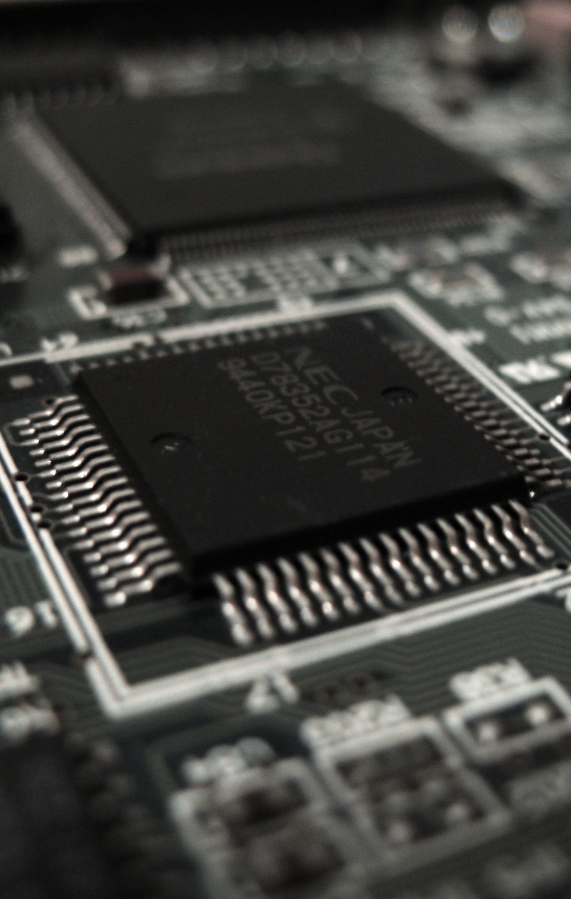
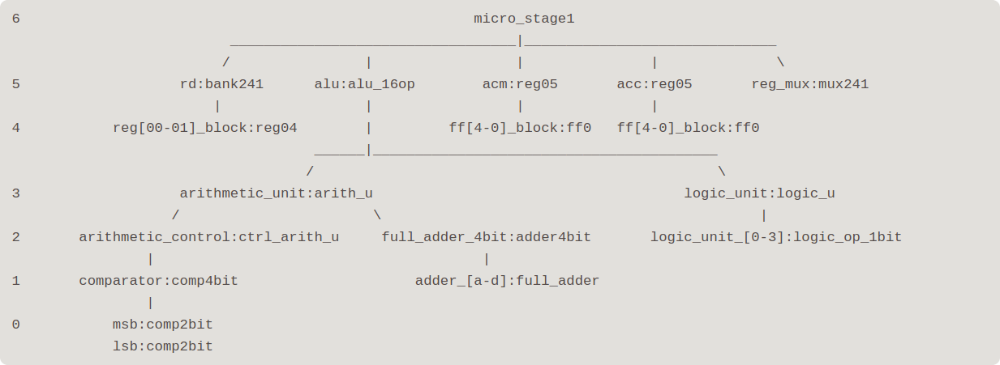
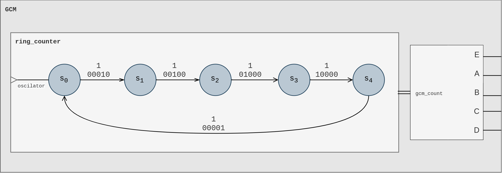
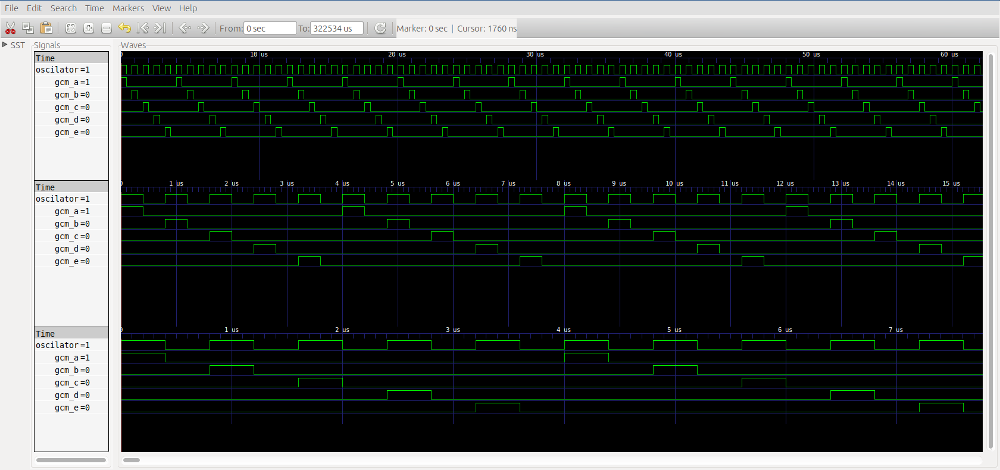

<table style="border:0px;"><tr>
	<td align="center" style="border:0px"></td>
	<td align="center" style="border:0px"><h2>Instituto Politécnico Nacional<br>Escuela Superior de Cómputo</h2></td>
	<td align="center" style="border:0px"></td>
</tr></table>


<center><h3>Arquitectura de Computadoras - 3CM4<br>Proyecto: Microprocesador de 4 bits</h3></center>




<center><h3>Prof. César Mujica Ascencio</h3></center>

<center><h4>Equipo: <br><br>Aguilar Reyes Abraham Zaid<br>Hernández Reséndiz Brandon Iván<br>Fuentes Perez Rámses<h4></center>

<div style="page-break-after: always; break-after: page;"></div>

----
[TOC]
---
<div style="page-break-after: always; break-after: page;"></div>

# Introducción

El presente trabajo describe el proceso de diseño y modelado en VHDL de un microprocesador de 4 bits basado en la arquitectura de computadora Von Neumann. Se define de manera breve un conjunto de conceptos a tener presentes y posteriormente se presenta la descripción del diseño, implementación y pruebas realizadas.

# Definiciones

#### Microprocesador

El término **microprocesador** hace referencia a un circuito integrado digital encargado de ejecutar los programas de una computadora. Dicho circuito trabaja al nivel mas bajo de hardware, es decir la información que procesa se representa en forma binaria. El procesador lleva acabo una serie de instrucciones que principalmente se refiere a la carga/escritura de valores en alguno localidad de memoria o registro y a operaciones aritméticas y lógicas sobre uno o mas operandos. A pesar de que las funciones de un procesador son comunes entre los diferentes diseños y arquitecturas, estos presentan diferencias en cuanto los componentes que los conforman o la manera en que se procesa la información.

#### Arquitectura

Dentro del diseño de computadoras existen dos principales tipos de arquitecturas que describen a un muy alto nivel los componente básicos y relaciones entre estos de una computadora, la máquina Harvard y la de Von Neumann. Regularmente estas descripciones se suelen referir a la totalidad de una computadora digital, sin embargo son aplicables al concepto de microprocesador. La principal diferencia entre estas máquinas es la forma en que manejan la memoria, mientras la máquina Harvard cuenta con un par de unidades de memoria que manejan por separado los datos a procesar y las instrucciones, la máquina de Von Neuemann cuenta con un solo elemento de memoria del cual se leen tanto los datos como las instrucciones.


> Descripción general de la máquina de Von Neumann y la máquina Harvard.

Si bien la diferencia entre ambas radica sólo en la forma de manejar la memoria, el desempeño total del sistema suele diferir en gran medida. En la actualidad se suele encontrar que las implementaciones basadas en la máquina Harvard son mas eficientes que las implementaciones basadas en la máquina de Von Neumann, sin embargo, en épocas pasadas sucedía lo contrario, la arquitectura Von Neumann solía  presentar un rendimiento mayor.

# Diseño

Para la implementación se parte de un diseño incial en el cual se denotan cada uno de los componentes involucrados en el funcionamiento del microprocesador de 4 bits. Dicho diseño se segmenta en tres módulos: micro_stage 1 y 2 y el Generador del ciclo de máquina GCM. 

## micro_stage 1 y 2 + GCM

La Fig.2.1 muestra el diagrama a bloques del procesador de 4 bits. En este, podemos notar que todo el proceso secuencial, es orquestado por el GCM y  por ende las señales, derivadas del oscilador, A-E.


> Diagrama original del microprocesador de 4 bits

Es por eso que los stages se dividen en función de las señales A-D y A,E para el **micro_stage1** y **micro_stage2** respectivamente. El siguiente diagrama muestra el diseño del procesador de manera muy compacta y la segmentación propuesta.


> Segmentación propuesta para el microprocesador.

<div style="page-break-after: always; break-after: page;"></div>

#### Organización del proyecto

El root del proyecto es el directorio **microprocessor**, el directorio **project** organiza por carpetas los proyectos de **ISE** de los módulos **micro_stage1** y **micro_stage2** y de la integración final como **microprocessor_4bits** (estos dos últimos por desarrollar). El directorio **doc** contiene archivos de documentación, diagramas, etc. Finalmente todo el código VHD se organiza en el directorio **source** (descrito mas adelante). Dentro de source existe un directorio llamado **simulations**, este contiene los archivos testbench (*.vhd) para las simulaciones de los módulos y  dentro del directorio **testbench**  para varias de las entidades que están declaradas en los paquetes.


<div style="page-break-after: always; break-after: page;"></div>

# Microprocesador - Stage 1

## ALU + Registros ACM, ACC y RD - Descripción general

Esta primer etapa de desarrollo del microprocesador de 4 bits está compuesta por los siguientes elementos: un registro de datos RD, el registro temporal ACC, el registro acumulador ACM y  una ALU de 16 operaciones de 4 bits. El propósito de este módulo del microprocesador es realizar la carga de instrucción en la ALU, la carga de los datos desde memoria en el registro RD y finalmente la carga del resultado de la operación (salida de la ALU) tanto en el registro ACC como en el ACM. Siguiendo el esquema general del microprocesador observamos que las acciones antes mencionadas se realizan en sincronía con las 4 primeras señales del GCM (Generador de ciclo) del microprocesador, lo cual se toma en consideración para el diseño de este primer módulo.

Los registros utilizados consisten en un arreglo de flip flops (4 o 5 dependiendo el tamaño de la palabra a almacenar) tipo D. Dado que el registro RD debe almacenar dos datos leídos desde memoria, se utiliza un banco de registros de 2x4 (elementos x tamaño de elementos en bits). Una de las salidas de dicho banco va directamente a la ALU y la otro entra en un multiplexor de 2 a 1, en el cual se hace la selección del segundo dato a operar, entre el almacenado en el registro B del banco RD  y el almacenado en el registro ACM. Una vez en la ALU se realiza la operación entre los datos y el resultado, tanto magnitud (4 bits) como acarreo/signo (1 bit), se cargan en el registro ACC y  en el ACM, ambos, registros de 5 bits.

El despliegue de la información se hace en un arreglo de 5 displays de 7 segmentos los cuales muestran: dato a, dato b, instrucción actual, acarreo/signo y resultado (magnitud). Para ello se implementa un decodificador  de 4 bits para cada de display de 7 segmentos. Las primeras tres señales de los primeros tres displays, se toman directamente del bus de entrada al módulo, y tanto el acarreo como el valor de salida de la operación se toman desde las salidas del módulo.

Se ha denominado a este primer módulo del microprocesador **micro_stage1** y el diagrama a bloques correspondiente se muestra a continuación.


> **Fig.1.** Diagrama micro_stage1: ALU + Registros ACM, ACC y RD

El diagrama es una representación del nivel mas alto del módulo, en este se denotan los bloques, señales y buses que lo conforman. Se debe tener en consideración que los elementos externos al micro_stage1 son los necesarios para montar un testbench, es decir, no son parte de la estructura final del módulo, su función es simplemente emular los demás dispositivos que dentro del microprocesador y proveer un medio de visualización del funcionamiento de esta primera etapa.

### ALU 16 operaciones

La unidad de procesamiento se divide en dos sub-unidades: la lógica y la aritmética. Estas dos unidades se han considerado como dos bloques independientes **arith_u** y **logic_u**. Cada sub-unidad es capaz de realizar 8 operaciones cada una, sobre uno o los dos operandos. La selección de la unidad y de la operación se hace en función de los valores de los campos recibidos en la instrucción. Esta instrucción es un conjunto de bits que se reciben desde el codificador de instrucción, elemento de una segunda etapa del microprocesador, por lo cual para pruebas y depuración de este módulo se sustituye dicho conjunto de bits provenientes del decodificador por un vector de 5 bits **instrcn**.


> **Fig. 2.** Diagrama ALU 16 operaciones. 

| logic_u                                                      | arith_u                                                      |
| ------------------------------------------------------------ | ------------------------------------------------------------ |
| La unidad lógica se compone de 4 bloques de operadores lógicos de 1 bit, cada uno de estos operadores realiza la operación bit a bit de las entradas. El acarreo de salida en esta unidad se establece en 0. | La unidad aritmética de la ALU se compone de un bloque de control en el que en función de la operación recibida como instrucción se modifican los datos de entrada para posteriormente enviarse a un sumador completo de 4 bits. |

#### Instrucciones

Se conviene de manera temporal un formato de instrucciones propio para la prueba del funcionamiento de esta primera etapa. El formato de las instrucciones de la ALU es una palabra de 5 bits la cual se divide en campos como se muestra a continuación:

```
bit		:	4				3			2-1			0
señal	:	[regmux_sel]	[unit_sel]	[op_sel]	[carry_in]
```

- *regmux_sel*: El selector de registro del segundo operando se conecta al multiplexor y mediante este se elige el segundo operando que entra a la ALU, entre el dato de entrada B (rdb_bus) y el valor almacenado en el acumulador (acm_bus).

- *unit_sel*: El selector de unidad determina si se realiza una operación aritmética (0) o lógica (1) sobre los operandos.

- *op_sel & carry_in*: La instrucción de operación concatenada con el acarreo de entrada ci determina cual de las 8 operaciones en cada una de las unidades se va a realizar.

#### Tabla de instrucciones

| unit_sel | op_sel & carry_in | hex  |    operación    |
| :------: | :---------------: | ---- | :-------------: |
|    0     |        000        | 0    |      suma       |
|    0     |        001        | 1    |      resta      |
|    0     |        010        | 2    | transferencia A |
|    0     |        011        | 3    |  incremento A   |
|    0     |        100        | 4    | transferencia B |
|    0     |        101        | 5    |  incremento B   |
|    0     |        110        | 6    |  decremento A   |
|    0     |        111        | 7    |  decremento B   |
|    1     |        000        | 8    |       AND       |
|    1     |        001        | 9    |      NAND       |
|    1     |        010        | A    |       OR        |
|    1     |        011        | B    |       NOR       |
|    1     |        100        | C    |       XOR       |
|    1     |        101        | D    |      XNOR       |
|    1     |        110        | E    |    BUFFER A     |
|    1     |        111        | F    |      NOT A      |

### Registros

Cada uno de los registros utilizados en este módulo cuenta con un puerto de activación **enable**, un bus de entrada y otro de salida de 4 ó 5 bits. El banco de registros es un arreglo de n registros, y la activación de estos se hace mediante una señal de $2^n$ bits, donde el bit 0 corresponde a la señal enable del registro 0, el bit 1 corresponde a la señal enable del registro 1 y de manera sucesiva hasta el bit n-1.


> **Fig.3.** Diagrama de registros y banco de registros.

<div style="page-break-after: always; break-after: page;"></div>

## Implementación del diseño

Para la implementación del proyecto se utilizó el software de análisis y síntesis de HDL **ISE Design Suite** de **Xilinx** y el simulador del lenguaje VHDL  **GHDL**.  

> **GHDL:** Es un simulador de lenguaje VHDL de código abierto. Este permite la "compilación" (*síntesis*)  y ejecución de código VHDL (*simulación*)  en un equipo de cómputo y en conjunto con **GTKWave** la visualización del comportamiento de los modelos de manera gráfica.

### Paquetes

La organización de los archivos **VHD** del proyecto se hizo en forma de paquetes, clasificados en 4 categorías:  **alu**, **basic**, **memory** y **micro**, estos paquetes se integran a la librería por defecto **work**.  A cada archivo de paquete se le agrega el sufijo **_devs** y la extensión de estos es **.vhd**. Los archivos se ubican en el directorio **source**. Dentro del proyecto de **ISE** se agregan los archivos fuente en forma de referencia, es decir, no son copiados al directorio de este.

En el paquete **basic** se organizan dispositivos de lógica combinacional  tales como sumadores, multiplexores, comparadores, decodificadores, etc. El paquete **memory** contiene las descripciones de dispositivos de memoria, flip-flops, registros, memorias, etc. Dentro del paquete **alu** se definen los bloques que componen la ALU: la unidad lógica **logic_u**, la unidad aritmética **arith_u**,  y el control de la unidad aritmética **ctrl_arith_u**.  El paquete **micro** contiene la declaración de componentes de los módulos/etapas que integran la totalidad del microprocesador: **micro_stage1**, **micro_stage2** y el **GMC**.

#### Árbol de paquetes

El siguiente árbol muestra los paquetes y algunos de los elementos declarados dentro de estos. Se considera a la librería **work**igual al directorito *source* del proyecto. La distribución de los directorios y carpetas en disco se hace como lo representa el árbol.


> **Nota:**  La descripción de la nomenclatura utilizada para nombrar ciertos dispositivos se encuentra en el **Anexo A**.

<div style="page-break-after: always; break-after: page;"></div>

### Formato de archivos

El contenido de los archivos de paquetes es únicamente la declaración de componentes de cada dispositivo tal cual se declara la entidad. Un archivo de paquete tiene el siguiente formato:

```vhdl
library ieee;
use ieee.std_logic_1164.all;

package paquete is
    component dispositivo1 is
        port(
         puerto1: [in|out] std_logic...;
         puerto2: [in|out] std_logic...;
         ...
        );
    end component;
end package;
```

La instanciación de componentes se hace mediante mapeo de puertos por posición, es decir se asignan las señales al componente en el orden en que son declarados  dentro del paquete. El formato de estos archivos se asemeja al siguiente:

```vhdl
library ieee;
use ieee.std_logic_1164.all;
use work.paquete.dispositivo1;

entity bloque1 is
	port(
     puerto1_bloque: [in|out] std_logic...;
     puerto2_bloque: [in|out] std_logic...;
     ...
    );
end entity;

architecture behavioral of bloque1 is
	signal señal1_dispositivo: std_logic...;
	signal señal2_dispositivo: std_logic...;
    ...
begin
    -- Ejemplo de manipulación de señal
    señal2_dispositivo <= not(señal2_dispositivo1) after 2 ns;
    instancia1_dispositivo: dispositivo1 port map (señal1_dispositivo, señal2_dispositivo, ...); 
    -- Ejemplo de proceso
    process(puerto_bloque1)
        if(puerto_bloque1='1') then
        	...
        end if;
    end process;
end architecture;
```

<div style="page-break-after: always; break-after: page;"></div>

### Niveles de diseño

La descripción de los circuitos que integran el proyecto se hace manera estructural, por ende es posible identificar una jerarquía de niveles de diseño y de manera conveniente establecer un punto de observación del funcionamiento del módulo a diferentes escalas. Es decir, la descripción estructural nos permite situarnos en algún dispositivo en particular y observar tanto su comportamiento como el de los dispositivos en niveles inferiores.  Para efectos de esta etapa, se define el módulo **micro_stage1**como el nivel superior inicial y a partir de este se derivan los niveles subsecuentes haciendo uso de una estructura de árbol.

 #### Árbol de instancias

Representa de forma jerárquica los niveles de diseño y denota las instancias  que se hacen en cada componente que integra el módulo. Cada hoja se compone del nombre de la instancia seguido de su tipo.  Como se observa el dispositivo con el mayor número de instancias y niveles inferiores es la **alu**.



#### Propagación de ALU

Al ser el sumador de 4 bits el componente fundamental de la unidad aritmética, la propagación de la señal de salida y por ende el resultado de operación atraviesa diferentes dispositivos, la siguiente tabla muestra dicha ruta de abajo a arriba.

| Dispositivo | Instanciado en | Señal de acarreo   | Señal de salida   |
| ----------- | -------------- | ------------------ | ----------------- |
| full_adder  | adder4bit      | co                 | s                 |
| adder4bit   | arith_u        | co                 | s                 |
| arith_u     | alu_16op       | arith_unit_coutput | arith_unit_output |
| alu_16op    | micro_stage1   | carry_out          | alu_bus           |

<div style="page-break-after: always; break-after: page;"></div>

## Simulación

#### Níveles de simulación

Para llevar a cabo este proceso el proyecto se carga al software `ISE Design Suite` y se corren las respectivas simulaciones en `ISim`. Para observar a detalle el comportamiento del módulo se realiza la simulación en dos niveles:

1. **Testbench:** Definimos un nivel extra a los niveles mostrados en el árbol de instancias. Este nivel simula un componente de caja cerrada, es decir, un componente sin puertos de entrada ni de salida, en el cual se crea una instancia del siguiente nivel, `micro_stage1`, y las señales provenientes de los dispositivos con los que este interactúa dentro del microprocesador son emuladas en forma de valores constantes. Se implementa un contador de 0 a 3  conectado a un demultiplexor para emular el funcionamiento del GCM. Para el despliegue de los resultados se hacen las instancias de los 5 decodificadores de 4 bits a displays de 7 segmentos que se muestran en el [diagrama del módulo](#diagrama). El testbench se describe en el archivo *vhd* `top_sim.vhd`.

2. **micro_stage1:** Dentro de la simulación a este nivel se presta especial atención a las 4 acciones principales de las que se encarga este módulo: lar carga de instrucción en la ALU, la carga de datos en el registro RD, la carga de la salida de la ALU en el registro ACC y el envío de este valor al ACM.

   

#### Convenciones para la simulación

**Frecuencia y periodo**

Se supone una frecuencia de reloj de 2.5 GHz, con lo cual determinamos el periodo correspondiente y el tiempo total necesario por el módulo para realizar una instrucción:
$$
T_{clk}=\frac1{f_{clk}}=\frac{1}{2.5\times 10^9Hz}=4\times 10^{-10}s=400ps
$$

$$
t_{stage1}=4T_{clk}=4\cdot400ps=1600ps=1.6ns
$$


<div style="page-break-after: always; break-after: page;"></div>

**Display de 7 Segmentos**

Como se ha indicado anteriormente, la simulación del testbench obedece al diagrama del modulo mostrado en la fig.1 y por ende el despliegue de la información se da a través de displays de 7 segmentos. Para interpretar de forma mas ágil los resultados en la simulación se utiliza la siguiente tabla con la representación en binario, hexadecimal y gráfica de las posibles salidas del decodificador de 4 bits a 7 segmentos.

| binario | hexadecimal | gráfico                                        | binario | hexadecimal | gráfico                                      |
| ------- | ----------- | ---------------------------------------------- | ------- | ----------- | -------------------------------------------- |
| 111111  | 7F          |  | 0000000 | 00          |  |
| 0000001 | 01          |    | 0000100 | 04          |  |
| 1001111 | 4F          |    | 0001000 | 08          |  |
| 0010010 | 12          |    | 1100000 | 60          |  |
| 0000110 | 06          |    | 1110010 | 72          |  |
| 1001100 | 4C          |    | 1000010 | 42          |  |
| 0100100 | 24          |    | 0110000 | 30          |  |
| 0100000 | 20          |    | 0111000 | 38          |  |
| 0001111 | 0F          |    |         |             |                                              |

### Testbench

Las figuras que se presentan a continuación corresponden a la simulación del testbench, en este se realiza la carga de cada una de las 16 operaciones que realiza la ALU con dos operandos constantes $A=1010$ y $B=0101$. Como se definió anteriormente, el tiempo necesario para realizar los 4 procesos habilitados por las señales A-D es de $1.6\ ns=1600\ ps$, periodo que se denota en la simulación mediante marcadores. La señal correspondiente al bus de entrada de instrucción a la ALU y al display 2 se resalta con color anaranjado y las señales correspondientes a los buses que conectan los displays 3 y 4, acarreo y salida respectivamente, se resaltan con color azul. La parte inferior muestra la representación gráfica de los displays 2,3 y 4 en función del valor de las señales antes mencionadas. Por encima de estos displays se indica la operación que se realiza en ese periodo de tiempo.

<div style="page-break-after: always; break-after: page;"></div>

#### Operaciones [0-3]


> Se denota con color rojo el retraso de $200\ ps$ que se obtiene debido a el inicio del reloj en 0. Para el caso de la primera operación el valor de los displays 3 y 4 en los primeros $600\ ps$ es igual a **4F** que representa el display apagado. Esto debido a la secuencia de operaciones que realiza el módulo en sincronía con las señales A-D. Como se observa en el diagrama del módulo, la señal de acarreo y la señal de salida de la ALU toman el valor del resultado de la operación hasta que se cargan los registros en la ALU con la señal B, por ende, valor de los displays se actualiza con cada pulso alto de la señal B.

#### Operaciones [4-7]


#### Operaciones [8-11]


#### Operaciones [C-F]


<div style="page-break-after: always; break-after: page;"></div>

### micro_stage1

Es este nivel de simulación se forzan las contantes $A = 0011$ y $B=0111$  para los valores de los buses data_a y *data_b* respectivamente y la siguiente secuencia de instrucciones:

| Operación | Instrucción | Resultado            |
| --------- | ----------- | -------------------- |
| B-A       | 10001       | 0111-0011 = 0100     |
| ACM++     | 00101       | 0100+0001 = 0101     |
| A and ACM | 01000       | 0011 and 0101 = 0001 |
| ACM--     | 00111       | 0001-0001 = 0000     |

La señales de entrada de la **ALU** correspondientes a la instrucción `unit_sel`,`op_sel`,`ci`, el acarreo de salida `co`y el valor de salida 4 bits `s` se identifican con color amarillo. La señal de enable y el bus de salida del banco de registro **RD**, se identifican con color rosa. Las señales del registro **ACC** se identifica con color cyan y el registro **ACM** color fucsia. Las señales del multiplexor **regmux** se identifican con color gris y finalmente los valores de entrada al módulo con color verde.


#### B-A


> En la ejecución de la primer instrucción durante el pulso A se carga la instrucción a la ALU y se hace la selección de B como segundo operando. Pasados $600\ ps$ durante el pulso B se activa el banco de registros RD y se obtiene la salida de la operación de la ALU en el bus correspondiente. Para el pulso C, $1000\ ps$ después, se carga el resultado de la operación en el registro ACC y finalmente pasados $1200\ ps$ se carga el valor de ACC en ACM. Este proceso se repite a partir de cada cambio de instrucción o pulso positivo de la señal A. El tiempo inactivo o de valor indefinido de cada dispositivo se denota con un sombreado rojo en la figura. Estos tiempos inactivos se deben a la secuencia de las señales A-C.


<div style="page-break-after: always; break-after: page;"></div>

#### ACM++


> Una vez ejecutada la primer instrucción los valores de los registro se actualizan cada pulso del GCM correspondiente.


#### A and ACM


<div style="page-break-after: always; break-after: page;"></div>

#### ACM--


<div style="page-break-after: always; break-after: page;"></div>

# GCM


Como se ha mencionado anteriormente y como se ha observado en las simulaciones del **micro_stage1**, el GCM es el componente encargado de controlar el proceso secuencial en la ejecución de una instrucción en un programa. Podemos definir de forma elemental y resumida como el componente en el cual a partir de una señal de entrada de un oscilador, envia a la salida un conjunto de señales secuenciadas a los componentes del microprocesador. Estas señales de salida se pueden identificar dentro de  4 acciones principales: 


En el diseño del micropocesador establecimos que la segmetación de este se da en función del conjunto de señales provenientes del GCM A-E. La siguiente tabla muestra el identificador de la señal y la acción que se realiza durante su tiempo en alto.

| Señal | Acción                                                       |
| ----- | ------------------------------------------------------------ |
| A     | Cargar instrucción desde la memoria en el registro de instrucción RI |
| B     | Cargar los datos de entrada a la ALU en el registro RD       |
| C     | Almacenar el resultado de la operación procedente de la ALU en el registo ACC |
| D     | Cargar en el registro ACM el valor almacenado en el registro ACC |
| E     | Aumentar o modificar el contador del programa                |

## Descripción y simulación

Para realizar la descripción del GCM en VHDL se utilizó un contador de 3 bits de cero a cuatro conectado a un demultiplexor de 3 entradas a una salida. El siguiente diagrama a bloques describe lo anterior.



<div style="page-break-after: always; break-after: page;"></div>

La siguiente figura muestra la simulación correspondiente al GCM. Se muestran los ciclos  a diferentes escalas de tiempo con un periodo de $400 ps$.



<div style="page-break-after: always; break-after: page;"></div>

# Bibliografía y Referencias electrónicas

---

- **Parhami Behrooz**. Arquitectura de Computadoras, De los microprocesadores a las supercomputadoras, 1ra. Edición. McGraw Hill, México, 2007. 
- **Luc Boulesteix**.Respuesta a: What is the fastest von Neumann architecture or Harvard architecture? en Quora.com.
  (https://www.quora.com/What-is-the-fastest-von-Neumann-architecture-or-Harvard-architecture ).
- [FALTAN REFERENCIAS Y BIBLIOGRAFÍA] !