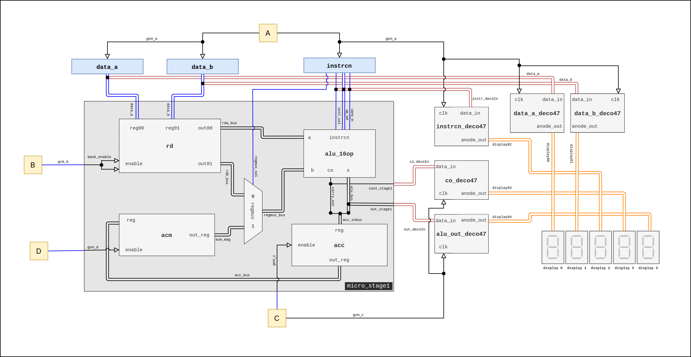
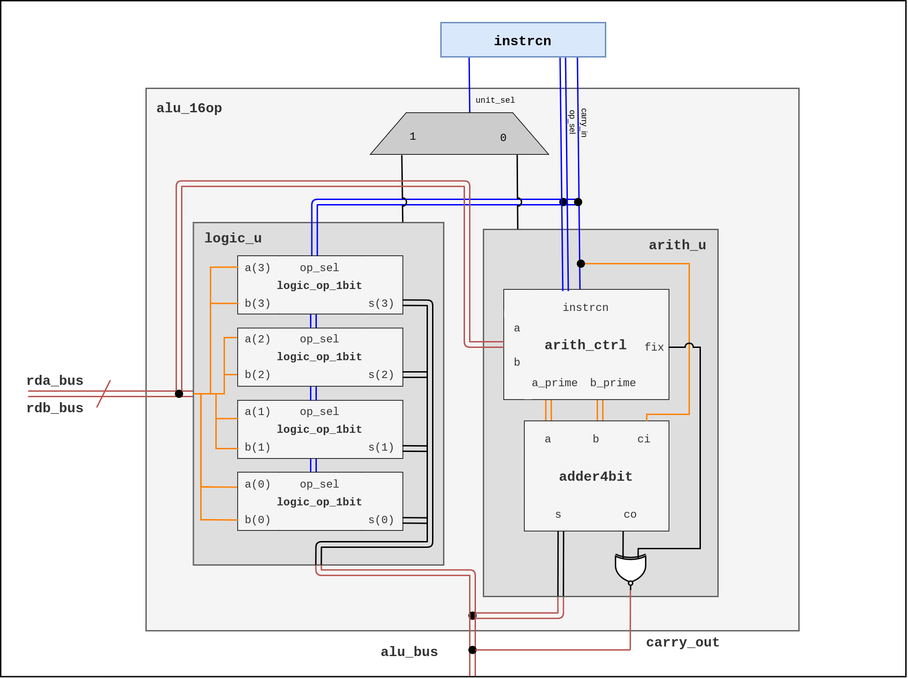
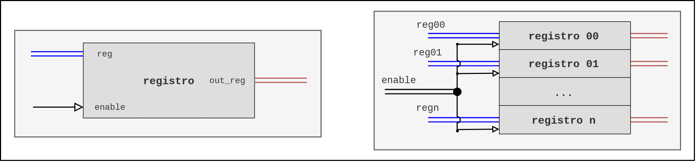

# Microprocesador - Stage 1

## ALU + Registros ACM, ACC y RD - Descripción general

Esta primer etapa de desarrollo del microprocesador de 4 bits está compuesta por los siguientes elementos: un registro de datos RD, el registro temporal ACC, el registro acumulador ACM y  una ALU de 16 operaciones de 4 bits. El propósito de este módulo del microprocesador es realizar la carga de instrucción en la ALU, la carga de los datos desde memoria en el registro RD y finalmente la carga del resultado de la operación (salida de la ALU) tanto en el registro ACC como en el ACM. Siguiendo el esquema general del microprocesador observamos que las acciones antes mencionadas se realizan en sincronía con las 4 primeras señales del GCM (Generador de ciclo) del microprocesador, lo cual se toma en consideración para el diseño de este primer módulo.

Los registros utilizados consisten en un arreglo de flip flops (4 o 5 dependiendo el tamaño de la palabra a almacenar) tipo D. Dado que el registro RD debe almacenar dos datos leídos desde memoria, se utiliza un banco de registros de 2x4 (elementos x tamaño de elementos en bits). Una de las salidas de dicho banco va directamente a la ALU y la otro entra en un multiplexor de 2 a 1, en el cual se hace la selección del segundo dato a operar, entre el almacenado en el registro B del banco RD  y el almacenado en el registro ACM. Una vez en la ALU se realiza la operación entre los datos y el resultado, tanto magnitud (4 bits) como acarreo/signo (1 bit), se cargan en el registro ACC y  en el ACM, ambos, registros de 5 bits.

El despliegue de la información se hace en un arreglo de 5 displays de 7 segmentos los cuales muestran: dato a, dato b, instrucción actual, acarreo/signo y resultado (magnitud). Para ello se implementa un decodificador  de 4 bits para cada de display de 7 segmentos. Las primeras tres señales de los primeros tres displays, se toman directamente del bus de entrada al módulo, y tanto el acarreo como el valor de salida de la operación se toman desde las salidas del módulo.

Se ha denominado a este primer módulo del microprocesador `micro_stage1` y el diagrama a bloques correspondiente se muestra a continuación.



> **Fig.1.** Diagrama micro_stage1: ALU + Registros ACM, ACC y RD

El diagrama es una representación del nivel mas alto del módulo, en este se denotan los bloques, señales y buses que lo conforman. Se debe tener en consideración que los elementos externos al micro_stage1 son los necesarios para montar un testbench, es decir, no son parte de la estructura final del módulo, su función es simplemente emular los demás dispositivos que dentro del microprocesador y proveer un medio de visualización del funcionamiento de esta primera etapa.

### ALU 16 operaciones

La unidad de procesamiento se divide en dos sub-unidades: la lógica y la aritmética. Estas dos unidades se han considerado como dos bloques independientes `arith_u` y `logic_u`. Cada sub-unidad es capaz de realizar 8 operaciones cada una, sobre uno o los dos operandos. La selección de la unidad y de la operación se hace en función de los valores de los campos recibidos en la instrucción. Esta instrucción es un conjunto de bits que se reciben desde el codificador de instrucción, elemento de una segunda etapa del microprocesador, por lo cual para pruebas y depuración de este módulo se sustituye dicho conjunto de bits provenientes del decodificador por un vector de 5 bits `instrcn`.



> **Fig. 2.** Diagrama ALU 16 operaciones. 

| logic_u                                                      | arith_u                                                      |
| ------------------------------------------------------------ | ------------------------------------------------------------ |
| La unidad lógica se compone de 4 bloques de operadores lógicos de 1 bit, cada uno de estos operadores realiza la operación bit a bit de las entradas. El acarreo de salida en esta unidad se establece en 0. | La unidad aritmética de la ALU se compone de un bloque de control en el que en función de la operación recibida como instrucción se modifican los datos de entrada para posteriormente enviarse a un sumador completo de 4 bits. |

#### Instrucciones

El formato de las instrucciones de la ALU es una palabra de 5 bits la cual se divide en campos como se muestra a continuación:

```
bit		:	4				3			2-1			0
señal	:	[regmux_sel]	[unit_sel]	[op_sel]	[carry_in]
```

- *regmux_sel*: El selector de registro del segundo operando se conecta al multiplexor y mediante este se elige el segundo operando que entra a la ALU, entre el dato de entrada B (rdb_bus) y el valor almacenado en el acumulador (acm_bus).

- *unit_sel*: El selector de unidad determina si se realiza una operación aritmética (0) o lógica (1) sobre los operandos.

- *op_sel & carry_in*: La instrucción de operación concatenada con el acarreo de entrada ci determina cual de las 8 operaciones en cada una de las unidades se va a realizar.

#### Tabla de instrucciones

| unit_sel | op_sel & carry_in | hex  |    operación    |
| :------: | :---------------: | ---- | :-------------: |
|    0     |        000        | 0    |      suma       |
|    0     |        001        | 1    |      resta      |
|    0     |        010        | 2    | transferencia A |
|    0     |        011        | 3    |  incremento A   |
|    0     |        100        | 4    | transferencia B |
|    0     |        101        | 5    |  incremento B   |
|    0     |        110        | 6    |  decremento A   |
|    0     |        111        | 7    |  decremento B   |
|    1     |        000        | 8    |       AND       |
|    1     |        001        | 9    |      NAND       |
|    1     |        010        | A    |       OR        |
|    1     |        011        | B    |       NOR       |
|    1     |        100        | C    |       XOR       |
|    1     |        101        | D    |      XNOR       |
|    1     |        110        | E    |    BUFFER A     |
|    1     |        111        | F    |      NOT A      |

### Registros

Cada uno de los registros utilizados en este módulo cuenta con un puerto de activación `enable`, un bus de entrada y otro de salida de 4 ó 5 bits. El banco de registros es un arreglo de n registros, y la activación de estos se hace mediante una señal de $2^n$ bits, donde el bit 0 corresponde a la señal enable del registro 0, el bit 1 corresponde a la señal enable del registro 1 y de manera sucesiva hasta el bit n-1.



> **Fig.3.** Diagrama de registros y banco de registros.

## Implementación del diseño

Para la implementación del proyecto se utilizó el software de análisis y síntesis de HDL `ISE Design Suite` de `Xilinx` y el simulador del lenguaje VHDL  `GHDL`.  

> **GHDL:** Es un simulador de lenguaje VHDL de código abierto. Este permite la "compilación" (*síntesis*)  y ejecución de código VHDL (*simulación*)  en un equipo de cómputo y en conjunto con `GTKWave` la visualización del comportamiento de los modelos de manera gráfica.

### Paquetes

La organización de los archivos `VHD` del proyecto se hizo en forma de paquetes, clasificados en 4 categorías:  **alu**, **basic**, **memory** y **micro**, estos paquetes se integran a la librería por defecto `work`.  A cada archivo de paquete se le agrega el sufijo `_devs` y la extensión de estos es `.vhd`. Los archivos se ubican en el directorio `source`. Dentro del proyecto de **ISE** se agregan los archivos fuente en forma de referencia, es decir, no son copiados al directorio de este.

En el paquete **basic** se organizan dispositivos de lógica combinacional  tales como sumadores, multiplexores, comparadores, decodificadores, etc. El paquete **memory** contiene las descripciones de dispositivos de memoria, flip-flops, registros, memorias, etc. Dentro del paquete **alu** se definen los bloques que componen la ALU: la unidad lógica `logic_u`, la unidad aritmética `arith_u`,  y el control de la unidad aritmética `ctrl_arith_u`.  El paquete **micro** contiene la declaración de componentes de los módulos/etapas que integran la totalidad del microprocesador: `micro_stage1`, `micro_stage2`y el `GMC`.

#### Árbol de paquetes

El siguiente árbol muestra los paquetes y los elementos declarados dentro de estos. Se considera a la librería `work`igual al directorito *source* del proyecto. La distribución de los directorios y carpetas en disco se hace como lo representa el árbol.

	                                                     work
	                                   ___________________|_____________________
	                                  /		     	 |			 	|			\
	                                alu			   basic		  memory	    micro
	                                /				 |				|  			  |
	                          alu_16op			adder4bit	       bank241 	   	micro_stage1
	                          arith_u 			full_adder		   reg04		micro_stage2
	                          ctrl_arith_u		comp4bit		   reg05 		GMC
	                          logic_u			comp2bit		   ff0
												logic_op_1bit
												mux241
												deco47seg
												conta203
	                                            conta305
	                                            conta40F
	                                            mux643
	                                            dmux673
	                                            dmux412

> **Nota:** Las entidades de todos los dispositivos utilizados en el diseño y pruebas del microprocesador se pueden encontrar en el [Anexo A](Anexo A.md). La descripción de la nomenclatura utilizada para nombrar ciertos dispositivos se encuentra en el [Anexo B](Anexo B.md).

### Formato de archivos

El contenido de los archivos de paquetes es únicamente la declaración de componentes de cada dispositivo tal cual se declara la entidad. Un archivo de paquete tiene el siguiente formato:

```vhdl
library ieee;
use ieee.std_logic_1164.all;

package paquete is
    component dispositivo1 is
        port(
         puerto1: [in|out] std_logic...;
         puerto2: [in|out] std_logic...;
         ...
        );
    end component;
end package;
```

La instanciación de componentes se hace mediante mapeo de puertos por posición, es decir se asignan las señales al componente en el orden en que son declarados  dentro del paquete. El formato de estos archivos se asemeja al siguiente:

```vhdl
library ieee;
use ieee.std_logic_1164.all;
use work.paquete.dispositivo1;

entity bloque1 is
	port(
     puerto1_bloque: [in|out] std_logic...;
     puerto2_bloque: [in|out] std_logic...;
     ...
    );
end entity;

architecture behavioral of bloque1 is
	signal señal1_dispositivo: std_logic...;
	signal señal2_dispositivo: std_logic...;
    ...
begin
    -- Ejemplo de manipulación de señal
    señal2_dispositivo <= not(señal2_dispositivo1) after 2 ns;
    instancia1_dispositivo: dispositivo1 port map (señal1_dispositivo, señal2_dispositivo, ...); 
    -- Ejemplo de proceso
    process(puerto_bloque1)
        if(puerto_bloque1='1') then
        	...
        end if;
    end process;
end architecture;
```
### Niveles de diseño

La descripción de los circuitos que integran el proyecto se hace manera estructural, por ende es posible identificar una jerarquía de niveles de diseño y de manera conveniente establecer un punto de observación del funcionamiento del módulo a diferentes escalas. Es decir, la descripción estructural nos permite situarnos en algún dispositivo en particular y observar tanto su comportamiento como el de los dispositivos en niveles inferiores.  Para efectos de esta etapa, se define el módulo `micro_stage1`como el nivel superior inicial y a partir de este se derivan los niveles subsecuentes haciendo uso de una estructura de árbol.

 #### Árbol de instancias

Representa de forma jerárquica los niveles de diseño y denota las instancias  que se hacen en cada componente que integra el módulo. Cada hoja se compone del nombre de la instancia seguido de su tipo.  Como se observa el dispositivo con el mayor número de instancias y niveles inferiores es la `alu`.

	6                                                      micro_stage1
	                          __________________________________|______________________________
	                         /				  |			     	|			 	|			   \
	5                   rd:bank241		alu:alu_16op		acm:reg05		acc:reg05		reg_mux:mux241
	                        |				  |					|				|
	4           reg[00-01]_block:reg04		  |			ff[4-0]_block:ff0	ff[4-0]_block:ff0
	                                    ______|_________________________________________
	                                   /									   			\				
	3                   arithmetic_unit:arith_u										logic_unit:logic_u
	                   /					   \											 |
	2       arithmetic_control:ctrl_arith_u		full_adder_4bit:adder4bit 		logic_unit_[0-3]:logic_op_1bit
	                |										|
	1       comparator:comp4bit						adder_[a-d]:full_adder
	                |
	0           msb:comp2bit
	            lsb:comp2bit

#### Propagación de ALU

Al ser el sumador de 4 bits el componente fundamental de la unidad aritmética, la propagación de la señal de salida y por ende el resultado de operación atraviesa diferentes dispositivos, la siguiente tabla muestra dicha ruta de abajo a arriba.

| Dispositivo | Instanciado en | Señal de acarreo   | Señal de salida   |
| ----------- | -------------- | ------------------ | ----------------- |
| full_adder  | adder4bit      | co                 | s                 |
| adder4bit   | arith_u        | co                 | s                 |
| arith_u     | alu_16op       | arith_unit_coutput | arith_unit_output |
| alu_16op    | micro_stage1   | carry_out          | alu_bus           |

