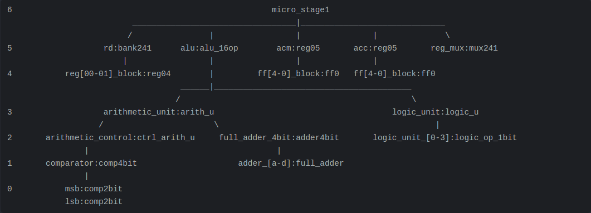
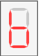
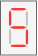
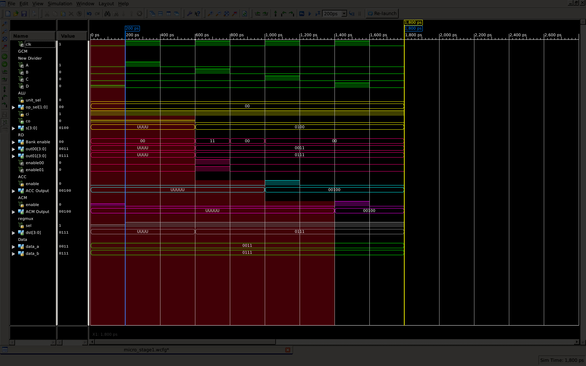
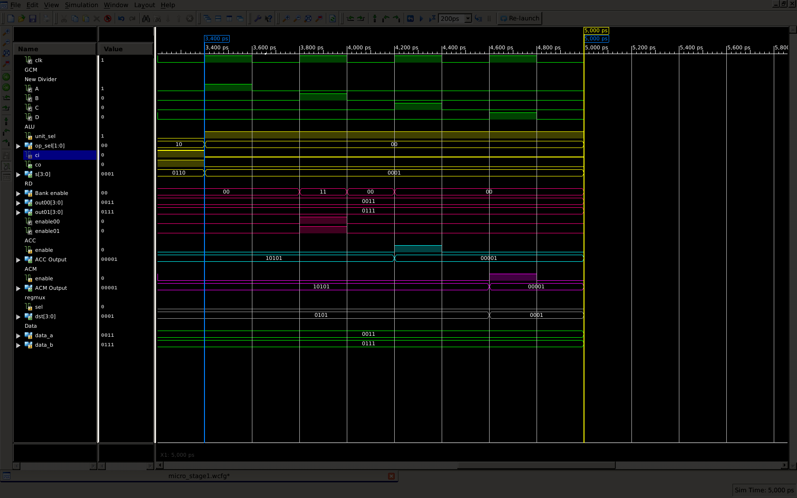

<!-- Versión para adecuar a PDF. Tema Law-->

# Microprocesador - Stage 1

## ALU + Registros ACM, ACC y RD - Descripción general

Esta primer etapa de desarrollo del microprocesador de 4 bits está compuesta por los siguientes elementos: un registro de datos RD, el registro temporal ACC, el registro acumulador ACM y  una ALU de 16 operaciones de 4 bits. El propósito de este módulo del microprocesador es realizar la carga de instrucción en la ALU, la carga de los datos desde memoria en el registro RD y finalmente la carga del resultado de la operación (salida de la ALU) tanto en el registro ACC como en el ACM. Siguiendo el esquema general del microprocesador observamos que las acciones antes mencionadas se realizan en sincronía con las 4 primeras señales del GCM (Generador de ciclo) del microprocesador, lo cual se toma en consideración para el diseño de este primer módulo.

Los registros utilizados consisten en un arreglo de flip flops (4 o 5 dependiendo el tamaño de la palabra a almacenar) tipo D. Dado que el registro RD debe almacenar los datos leídos desde memoria, se utiliza un banco de registros de 2x4 (elementos x tamaño de elementos en bits). Una de las salidas de dicho banco va directamente a la ALU y la otro entra en un multiplexor de 2 a 1, en el cual se hace la selección del segundo dato a operar, entre el almacenado en el registro B del banco RD  y el almacenado en el registro ACM. Una vez en la ALU se realiza la operación entre los datos y el resultado, tanto magnitud (4 bits) como acarreo/signo (1 bit), se cargan en el registro ACC y  en el ACM, ambos, registros de 5 bits.

El despliegue de la información se hace en un arreglo de 5 displays de 7 segmentos los cuales muestran: dato a, dato b, instrucción actual, acarreo/signo y resultado (magnitud). Para ello se implementa un decodificador  de 4 bits para cada de display de 7 segmentos. Las primeras tres señales de los primeros tres displays, se toman directamente del bus de entrada al módulo, y tanto el acarreo como el valor de salida de la operación se toman desde las salidas del módulo.

Se ha denominado a este primer módulo del microprocesador `micro_stage1` y el diagrama a bloques correspondiente se muestra a continuación.


> **Fig.1.** Diagrama micro_stage1: ALU + Registros ACM, ACC y RD

El diagrama es una representación del nivel más alto del módulo, en este se denotan los bloques, señales y buses que lo conforman. Se debe tener en consideración que los elementos externos al micro_stage1 son los necesarios para montar un testbench, es decir, no son parte de la estructura final del módulo, su función es simplemente emular los demás dispositivos que dentro del microprocesador y proveer un medio de visualización del funcionamiento de esta primera etapa.

---


<div style="page-break-after: always; break-after: page;"></div>

### ALU 16 operaciones

La unidad de procesamiento se divide en dos subunidades: la lógica y la aritmética. Estas dos unidades se han considerado como dos bloques independientes `arith_u` y `logic_u`. Cada subunidad es capaz de realizar 8 operaciones cada una, sobre uno o los dos operandos. La selección de la unidad y de la operación se hace en función de los valores de los campos recibidos en la instrucción. Esta instrucción es un conjunto de bits que se reciben desde el codificador de instrucción, elemento de una segunda etapa del microprocesador, por lo cual para pruebas y depuración de este módulo se sustituye dicho conjunto de bits provenientes del decodificador por un vector de 5 bits `instrcn`.


> **Fig. 2.** Diagrama ALU 16 operaciones. 

| logic_u                                                      | arith_u                                                      |
| ------------------------------------------------------------ | ------------------------------------------------------------ |
| La unidad lógica se compone de 4 bloques de operadores lógicos de 1 bit, cada uno de estos operadores realiza la operación bit a bit de las entradas. El acarreo de salida en esta unidad se establece en 0. | La unidad aritmética de la ALU se compone de un bloque de control en el que en función de la operación recibida como instrucción se modifican los datos de entrada para posteriormente enviarse a un sumador completo de 4 bits. |

#### Instrucciones

El formato de las instrucciones de la ALU es una palabra de 5 bits la cual se divide en campos como se muestra a continuación:

```
bit		:	4				3			2-1			0
señal	:	[regmux_sel]	[unit_sel]	[op_sel]	[carry_in]
```

- *regmux_sel*: El selector de registro del segundo operando se conecta al multiplexor y mediante este se elige el segundo operando que entra a la ALU, entre el dato de entrada B (rdb_bus) y el valor almacenado en el acumulador (acm_bus).

- *unit_sel*: El selector de unidad determina si se realiza una operación aritmética (0) o lógica (1) sobre los operandos.

- *op_sel & carry_in*: La instrucción de operación concatenada con el acarreo de entrada ci determina cuál de las 8 operaciones en cada una de las unidades se va a realizar.

#### Tabla de instrucciones

| unit_sel | op_sel & carry_in | hex  |    operación    |
| :------: | :---------------: | ---- | :-------------: |
|    0     |        000        | 0    |      suma       |
|    0     |        001        | 1    |      resta      |
|    0     |        010        | 2    | transferencia A |
|    0     |        011        | 3    |  incremento A   |
|    0     |        100        | 4    | transferencia B |
|    0     |        101        | 5    |  incremento B   |
|    0     |        110        | 6    |  decremento A   |
|    0     |        111        | 7    |  decremento B   |
|    1     |        000        | 8    |       AND       |
|    1     |        001        | 9    |      NAND       |
|    1     |        010        | A    |       OR        |
|    1     |        011        | B    |       NOR       |
|    1     |        100        | C    |       XOR       |
|    1     |        101        | D    |      XNOR       |
|    1     |        110        | E    |    BUFFER A     |
|    1     |        111        | F    |      NOT A      |

### Registros

Cada uno de los registros utilizados en este módulo cuenta con un puerto de activación `enable`, un bus de entrada y otro de salida de 4 ó 5 bits. El banco de registros es un arreglo de n registros, y la activación de estos se hace mediante una señal de $2^n$ bits, donde el bit 0 corresponde a la señal enable del registro 0, el bit 1 corresponde a la señal enable del registro 1 y de manera sucesiva hasta el bit n-1.


> **Fig.3.** Diagrama de registros y banco de registros.


## Implementación del diseño

Para la implementación del proyecto se utilizó el software de análisis y síntesis de HDL `ISE Design Suite` de `Xilinx` y el simulador del lenguaje VHDL  `GHDL`.  

> **GHDL:** Es un simulador de lenguaje VHDL de código abierto. Este permite la "compilación" (*síntesis*)  y ejecución de código VHDL (*simulación*)  en un equipo de cómputo y en conjunto con `GTKWave` la visualización del comportamiento de los modelos de manera gráfica.

### Paquetes

La organización de los archivos `VHD` del proyecto se hizo en forma de paquetes, clasificados en 4 categorías:  **alu**, **basic**, **memory** y **micro**, estos paquetes se integran a la librería por defecto `work`.  A cada archivo de paquete se le agrega el sufijo `_devs` y la extensión de estos es `.vhd`. Los archivos se ubican en el directorio `source`. Dentro del proyecto de **ISE** se agregan los archivos fuente en forma de referencia, es decir, no son copiados al directorio de este.

En el paquete **basic** se organizan dispositivos de lógica combinacional  tales como sumadores, multiplexores, comparadores, decodificadores, etc. El paquete **memory** contiene las descripciones de dispositivos de memoria, flip-flops, registros, memorias, etc. Dentro del paquete **alu** se definen los bloques que componen la ALU: la unidad lógica `logic_u`, la unidad aritmética `arith_u`,  y el control de la unidad aritmética `ctrl_arith_u`.  El paquete **micro** contiene la declaración de componentes de los módulos/etapas que integran la totalidad del microprocesador: `micro_stage1`, `micro_stage2`y el `GMC`.


#### Árbol de paquetes

El siguiente árbol muestra los paquetes y los elementos declarados dentro de estos. Se considera a la librería `work`igual al directorio *source* del proyecto. La distribución de los directorios y carpetas en disco se hace cómo lo representa el árbol.


> **Nota:** Las entidades de todos los dispositivos utilizados en el diseño y pruebas del microprocesador se pueden encontrar en el [Anexo A](Anexo A.md). La descripción de la nomenclatura utilizada para nombrar ciertos dispositivos se encuentra en el [Anexo B](Anexo B.md).

### Formato de archivos

El contenido de los archivos de paquetes es únicamente la declaración de componentes de cada dispositivo tal cual se declara la entidad. Un archivo de paquete tiene el siguiente formato:

```vhdl
library ieee;
use ieee.std_logic_1164.all;

package paquete is
    component dispositivo1 is
        port(
         puerto1: [in|out] std_logic...;
         puerto2: [in|out] std_logic...;
         ...
        );
    end component;
end package;
```

La instanciación de componentes se hace mediante mapeo de puertos por posición, es decir se asignan las señales al componente en el orden en que son declarados  dentro del paquete. El formato de estos archivos se asemeja al siguiente:

```vhdl
library ieee;
use ieee.std_logic_1164.all;
use work.paquete.dispositivo1;

entity bloque1 is
	port(
     puerto1_bloque: [in|out] std_logic...;
     puerto2_bloque: [in|out] std_logic...;
     ...
    );
end entity;

architecture behavioral of bloque1 is
	signal señal1_dispositivo: std_logic...;
	signal señal2_dispositivo: std_logic...;
    ...
begin
    -- Ejemplo de manipulación de señal
    señal2_dispositivo <= not(señal2_dispositivo1) after 2 ns;
    instancia1_dispositivo: dispositivo1 port map (señal1_dispositivo, señal2_dispositivo, ...); 
    -- Ejemplo de proceso
    process(puerto_bloque1)
        if(puerto_bloque1='1') then
        	...
        end if;
    end process;
end architecture;
```

### Niveles de diseño

La descripción de los circuitos que integran el proyecto se hace manera estructural, por ende es posible identificar una jerarquía de niveles de diseño y de manera conveniente establecer un punto de observación del funcionamiento del módulo a diferentes escalas. Es decir, la descripción estructural nos permite situarnos en algún dispositivo en particular y observar tanto su comportamiento como el de los dispositivos en niveles inferiores.  Para efectos de esta etapa, se define el módulo`micro_stage1`como el nivel superior inicial y a partir de este se derivan los niveles subsecuentes haciendo uso de una estructura de árbol.

 #### Árbol de instancias

Representa de forma jerárquica los niveles de diseño y denota las instancias  que se hacen en cada componente que integra el módulo. Cada hoja se compone del nombre de la instancia seguido de su tipo.  Como se observa el dispositivo con el mayor número de instancias y niveles inferiores es la `alu`.




#### Propagación de ALU

Al ser el sumador de 4 bits el componente fundamental de la unidad aritmética, la propagación de la señal de salida y por ende el resultado de operación atraviesa diferentes dispositivos, la siguiente tabla muestra dicha ruta de abajo a arriba.

| Dispositivo | Instancia en | Señal de acarreo   | Señal de salida   |
| ----------- | ------------ | ------------------ | ----------------- |
| full_adder  | adder4bit    | co                 | s                 |
| adder4bit   | arith_u      | co                 | s                 |
| arith_u     | alu_16op     | arith_unit_coutput | arith_unit_output |
| alu_16op    | micro_stage1 | carry_out          | alu_bus           |


# Simulación

#### Niveles de simulación

Para llevar a cabo este proceso el proyecto se carga al software `ISE Design Suite` y se corren las respectivas simulaciones en `ISim`. Para observar a detalle el comportamiento del módulo se realiza la simulación en dos niveles:

1. **Testbench:** Definimos un nivel extra a los niveles mostrados en el árbol de instancias. Este nivel simula un componente de caja cerrada, es decir, un componente sin puertos de entrada ni de salida, en el cual se crea una instancia del siguiente nivel, `micro_stage1`, y las señales provenientes de los dispositivos con los que este interactúa dentro del microprocesador son emuladas en forma de valores constantes. Se implementa un contador de 0 a 3  conectado a un demultiplexor para emular el funcionamiento del GCM. Para el despliegue de los resultados se hacen las instancias de los 5 decodificadores de 4 bits a displays de 7 segmentos que se muestran en el [diagrama del módulo](#diagrama). El testbench se describe en el archivo *vhd* `top_sim.vhd`.

2. **micro_stage1:** Dentro de la simulación a este nivel se presta especial atención a las 4 acciones principales de las que se encarga este módulo: la carga de instrucción en la ALU, la carga de datos en el registro RD, la carga de la salida de la ALU en el registro ACC y el envío de este valor al ACM.

   

#### Convenciones para la simulación

**Frecuencia y periodo**

Se supone una frecuencia de reloj de 2.5 GHz, con lo cual determinamos el período correspondiente y el tiempo total necesario por el módulo para realizar una instrucción:
$$
T_{clk}=\frac1{f_{clk}}=\frac{1}{2.5\times 10^9Hz}=4\times 10^{-10}s=400ps
$$

$$
t_{stage1}=4T_{clk}=4\cdot400ps=1600ps=1.6ns
$$


---

<div style="page-break-after: always; break-after: page;"></div>

**Display de 7 Segmentos**

Como se ha indicado anteriormente, la simulación del testbench obedece al diagrama del módulo mostrado en la fig.1 y por ende el despliegue de la información se da a través de displays de 7 segmentos. Para interpretar de forma más ágil los resultados en la simulación se utiliza la siguiente tabla con la representación en binario, hexadecimal y gráfica de las posibles salidas del decodificador de 4 bits a 7 segmentos.

| binario | hexadecimal | gráfico                                                    | binario | hexadecimal | gráfico                                      |
| ------- | ----------- | ---------------------------------------------------------- | ------- | ----------- | -------------------------------------------- |
| 111111  | 7F          |  | 0000000 | 00          |  |
| 0000001 | 01          |                | 0000100 | 04          |  |
| 1001111 | 4F          |                | 0001000 | 08          |  |
| 0010010 | 12          |                | 1100000 | 60          |  |
| 0000110 | 06          |                | 1110010 | 72          |  |
| 1001100 | 4C          |                | 1000010 | 42          |  |
| 0100100 | 24          |                | 0110000 | 30          |  |
| 0100000 | 20          |                | 0111000 | 38          |  |
| 0001111 | 0F          |                |         |             |                                              |


## Testbench

Las figuras que se presentan a continuación corresponden a la simulación del testbench, en este se realiza la carga de cada una de las 16 operaciones que realiza la ALU con dos operandos constantes $A=1010$ y $B=0101$. Como se definió anteriormente, el tiempo necesario para realizar los 4 procesos habilitados por las señales A-D es de $1.6\ ns=1600\ ps$, periodo que se denota en la simulación mediante marcadores. La señal correspondiente al bus de entrada de instrucción a la ALU y al display 2 se resalta con color anaranjado y las señales correspondientes a los buses que conectan los displays 3 y 4, acarreo y salida respectivamente, se resaltan con color azul. La parte inferior muestra la representación gráfica de los displays 2,3 y 4 en función del valor de las señales antes mencionadas. Por encima de estos displays se indica la operación que se realiza en ese periodo de tiempo.

<div style="page-break-after: always; break-after: page;"></div>

#### Operaciones [0-3]


> Se denota con color rojo el retraso de $200\ ps$ que se obtiene debido a el inicio del reloj en 0. Para el caso de la primera operación el valor de los displays 3 y 4 en los primeros $600\ ps$ es igual a **4F** que representa el display apagado. Esto debido a la secuencia de operaciones que realiza el módulo en sincronía con las señales A-D. Como se observa en el diagrama del módulo, la señal de acarreo y la señal de salida de la ALU toman el valor del resultado de la operación hasta que se cargan los registros en la ALU con la señal B, por ende, valor de los displays se actualiza con cada pulso alto de la señal B.

#### Operaciones [4-7]


<div style="page-break-after: always; break-after: page;"></div>

#### Operaciones [8-11]


#### Operaciones [C-F]


---

<div style="page-break-after: always; break-after: page;"></div>

## micro_stage1

Es este nivel de simulación se fuerzan las constantes $A = 0011$ y $B=0111$  para los valores de los buses *data_a* y *data_b* respectivamente y la siguiente secuencia de instrucciones:

| Operación | Instrucción | Resultado            |
| --------- | ----------- | -------------------- |
| B-A       | 10001       | 0111-0011 = 0100     |
| ACM++     | 00101       | 0100+0001 = 0101     |
| A and ACM | 01000       | 0011 and 0101 = 0001 |
| ACM--     | 00111       | 0001-0001 = 0000     |

La señales de entrada de la **ALU** correspondientes a la instrucción `unit_sel`,`op_sel`,`ci`, el acarreo de salida `co`y el valor de salida 4 bits `s` se identifican con color amarillo. La señal de enable y el bus de salida del banco de registro **RD**, se identifican con color rosa. Las señales del registro **ACC** se identifica con color cyan y el registro **ACM** color fucsia. Las señales del multiplexor **regmux** se identifican con color gris y finalmente los valores de entrada al módulo con color verde.


#### B-A



> En la ejecución de la primer instrucción durante el pulso A se carga la instrucción a la ALU y se hace la selección de B como segundo operando. Pasados $600\ ps$ durante el pulso B se activa el banco de registros RD y se obtiene la salida de la operación de la ALU en el bus correspondiente. Para el pulso C, $1000\ ps$ después, se carga el resultado de la operación en el registro ACC y finalmente pasados $1200\ ps$ se carga el valor de ACC en ACM. Este proceso se repite a partir de cada cambio de instrucción o pulso positivo de la señal A. El tiempo inactivo o de valor indefinido de cada dispositivo se denota con un sombreado rojo en la figura. Estos tiempos inactivos se deben a la secuencia de las señales A-C.


---

<div style="page-break-after: always; break-after: page;"></div>

#### ACM++


> Una vez ejecutada la primer instrucción los valores de los registro se actualizan cada pulso del GCM correspondiente.


#### A and ACM




---

<div style="page-break-after: always; break-after: page;"></div>

#### ACM--


<div style="page-break-after: always; break-after: page;"></div>

# Anexo A: Lista de entidades

### ALU
##### ALU 16 Operaciones

```vhdl
entity alu_16op is
	port(
	 unit_sel : in std_logic;
	 op_sel : in std_logic_vector(1 downto 0);
	 ci : in std_logic;
	 a : in std_logic_vector(3 downto 0);
	 b : in std_logic_vector(3 downto 0);
	 co : out std_logic;
	 s : out std_logic_vector(3 downto 0)
	 );
end entity;
```

##### Unidad aritmética
```vhdl
entity arith_u is
	port (
	 a: in std_logic_vector (3 downto 0);
	 b: in std_logic_vector (3 downto 0);
	 op_sel: in std_logic_vector (1 downto 0);
	 ci: in std_logic;
	 co: out std_logic;
	 s: out std_logic_vector (3 downto 0)
);
end entity;
```

##### Control de unidad aritmética
```vhdl
entity ctrl_arith_u is
	port( 
	 c:in  std_logic_vector (1 downto 0);
	 ci:in  std_logic;
	 a:in  std_logic_vector (3 downto 0);
	 b:in  std_logic_vector (3 downto 0);
	 a_prime:out  std_logic_vector (3 downto 0);
	 b_prime:out  std_logic_vector (3 downto 0);
	 fix:out std_logic 
	);
end entity;
```

##### Unidad lógica
```vhdl
entity logic_u is
	port (
	 a: in std_logic_vector (3 downto 0);
	 b: in std_logic_vector (3 downto 0);
	 op_sel: in std_logic_vector (1 downto 0);
	 ci: in std_logic;
	 s: out std_logic_vector (3 downto 0)
	);
end entity;
```


### Dispositivos básicos

##### Sumador 4 bits
```vhdl
entity adder4bit is
	port (
	 a :in  std_logic_vector (3 downto 0);
	 b :in  std_logic_vector (3 downto 0);
	 ci :in  std_logic;
	 co :out  std_logic;
	 s :out  std_logic_vector (3 downto 0)
);
end entity;
```

##### Sumador completo
```vhdl
entity full_adder
	port(
	 a: in std_logic;
	 b: in std_logic;
	 ci: in std_logic;
	 co: out std_logic;
	 s: out std_logic	
);
end entity;
```

##### Comparador 4 bits
```vhdl
entity comp4bit is
	port(
	 a:in  std_logic_vector (3 downto 0);
	 b:in  std_logic_vector (3 downto 0);
	 is_a:out  std_logic;
	 is_b:out  std_logic;
	 are_equal:out  std_logic
);
end entity;
```

##### Comparador 2 bits
```vhdl
entity comp2bit is
	port(
	 a :in  std_logic_vector (1 downto 0);
	 b :in  std_logic_vector (1 downto 0);
	 is_a :out  std_logic;
	 is_b: out  std_logic;
	 are_equal:out  std_logic
);
end entity;
```

##### Operador lógico 1 bit
```vhdl
entity logic_op_1bit is
	port(
	 a : in std_logic;
	 b : in std_logic;
	 c : in std_logic_vector (1 downto 0);
	 ci : in std_logic;
	 s : out std_logic);
end entity;
```

##### Contador 3 bits 0 a 3
```vhdl
entity conta203 is
	port (
	 clk: in std_logic;
	 count: out std_logic_vector(1 downto 0)
  );
end entity;
```

##### Contador 3 bits 0 a 5
```vhdl
entity conta305 is
	port (
	 clk: in std_logic;
	 count: out std_logic_vector(2 downto 0)
  );
end entity;
```

##### Contador 4 bits 0 a 15
```vhdl
entity conta40F is
	port (
	 clk: in std_logic;
	 count: out std_logic_vector(3 downto 0)
  );
end entity;
```

##### Multiplexor 2 a 1 de 4 bits
```vhdl
entity mux241 is
	port(
	 sel: in std_logic;
	 src00: in std_logic_vector(3 downto 0);
	 src01: in std_logic_vector(3 downto 0);
	 dst: out std_logic_vector(3 downto 0)
	);
end entity;
```

##### Multiplexor 6 a 1 de 4 bits
```vhdl
entity mux643 is
	port(
	 sel: in std_logic_vector(2 downto 0);
	 src00: in std_logic_vector(3 downto 0);
	 src01: in std_logic_vector(3 downto 0);
	 src02: in std_logic_vector(3 downto 0);
	 src03: in std_logic_vector(3 downto 0);
	 src04: in std_logic_vector(3 downto 0);
	 src05: in std_logic_vector(3 downto 0);
	 dst: out std_logic_vector(3 downto 0)
	);
end entity;
```

##### Demultiplexor 1 a 6 de 7 bits 
```vhdl
entity dmux673 is
	port(
	 sel: in std_logic_vector(2 downto 0);
	 src: in std_logic_vector(6 downto 0);
	 dst00: out std_logic_vector(6 downto 0);
	 dst01: out std_logic_vector(6 downto 0);
	 dst02: out std_logic_vector(6 downto 0);
	 dst03: out std_logic_vector(6 downto 0);
	 dst04: out std_logic_vector(6 downto 0);
	 dst05: out std_logic_vector(6 downto 0)
	);
end entity;
```

##### Demultiplexor 1 a 4 de 1 bit

```vhdl
entity dmux412 is
  port (
	sel: in std_logic_vector(1 downto 0);
	src: in std_logic;
	dst00: out std_logic;
	dst01: out std_logic;
	dst02: out std_logic;
	dst03: out std_logic
  );
end entity; 
```

##### Decodificador 4 bits a display 7 segmentos anodo

```vhdl
entity deco47seg is
	port (
	 data_in: in std_logic_vector(3 downto 0);
	 display: out std_logic_vector(6 downto 0)
  );
end entity;
```


### Dispositivos de memoria

##### Banco de registros de 2x4
```vhdl
entity bank241 is
	port(
	 enable: in std_logic_vector(1 downto 0);
	 reg00: in std_logic_vector(3 downto 0);
	 reg01: in std_logic_vector(3 downto 0);
	 out00: out std_logic_vector(3 downto 0);
	 out01: out std_logic_vector(3 downto 0) 
	);
end entity;
```

##### Registro 5 bits

```vhdl
entity reg05 is
    port(
	 enable: in  std_logic;
	 reg: in  std_logic_vector (4 downto 0);
	 out_reg: out  std_logic_vector (4 downto 0)
	);
end entity;
```

##### Registro 4 bits

```vhdl
entity reg04 is
    port(
	 enable: in  std_logic;
	 reg: in  std_logic_vector (3 downto 0);
	 out_reg: out  std_logic_vector (3 downto 0)
	);
end entity;
```

##### Flip-flop D

```vhdl
entity ff0 is
   	port(
     d: in std_logic;
     enable: in  std_logic;
	 q: out  std_logic
);
end entity;
```


### Módulos del microprocesador

##### Stage 1
```vhdl
entity micro_stage1 is
  port(
   ideco_bus: in std_logic_vector(4 downto 0);
   gcm_b: in std_logic;	-- Señal del RD
   gcm_c: in std_logic;	-- Señal del ACC
   gcm_d: in std_logic;	-- Señal del ACM   
   data_a: in std_logic_vector(3 downto 0);
   data_b: in std_logic_vector(3 downto 0);
   cout_stage1: out std_logic;
   out_stage1: out std_logic_vector(3 downto 0)
  );
end entity;
```
<div style="page-break-after: always; break-after: page;"></div>

# Anexo B: Nomenclatura de dispositivos

## Circuitos básicos

#### Multiplexor

	mux[elementos][tamaño][selector]
	
	elementos: 	N número de señales de entrada
	tamaño:		Tamaño en bits de las entradas y sálida
	selector:	Tamaño en bits de selector = ⌈log_2(elementos)⌉

#### Demultiplexor

	dmux[elementos][tamaño][selector]
	
	elementos: 	N número de señales de sálida
	tamaño:		Tamaño en bits de las entradas y sálida
	selector:	Tamaño en bits de selector = ⌈log_2(elementos)⌉

#### Contador

	cont[tipo][tamaño][inicio][fin]
	
	tipo:
		a 		ascendente
		d 		descendente
	tamaño:		N bits
	inicio: 	Posición inicial (incio<2^N)
	fin: 		Posición final (inicio<fin<2^N)

#### Decodificador

	deco[tamaño entrada|código de entrada][tamaño salida|código de salida]
	
	tamaño:	Tamaño en bits
	código: codificación (gray, 7seg, etc)

## Dispositivos de memoria

#### Flip Flops

	ff[tipo]
	
	tipo:
		D 	0
		T 	1
		SR 	2
		JK 	3

#### Registros

	reg[tipo][tamaño]
	
	tipo:
		PP	paralelo-paralelo	0
		PS 	paralelo-serie 		1
		SP 	serie-paralelo 		2
		SS 	serie-serie 		3
	
	tamaño: N bits

#### Banco de registros

	bank[elementos][tamaño][sálida]
	
	elementos:	N registros, N>1
	tamaño: 2^M bits
	sálida:	K registros, N>=1