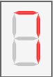

# Simulación

#### Níveles de simulación

Para llevar a cabo este proceso el proyecto se carga al software `ISE Design Suite` y se corren las respectivas simulaciones en `ISim`. Para observar a detalle el comportamiento del módulo se realiza la simulación en dos niveles:

1. **Testbench:** Definimos un nivel extra a los niveles mostrados en el árbol de instancias. Este nivel simula un componente de caja cerrada, es decir, un componente sin puertos de entrada ni de salida, en el cual se crea una instancia del siguiente nivel, `micro_stage1`, y las señales provenientes de los dispositivos con los que este interactúa dentro del microprocesador son emuladas en forma de valores constantes. Se implementa un contador de 0 a 3  conectado a un demultiplexor para emular el funcionamiento del GCM. Para el despliegue de los resultados se hacen las instancias de los 5 decodificadores de 4 bits a displays de 7 segmentos que se muestran en el [diagrama del módulo](#diagrama). El testbench se describe en el archivo *vhd* `top_sim.vhd`.

2. **micro_stage1:** Dentro de la simulación a este nivel se presta especial atención a las 4 acciones principales de las que se encarga este módulo: lar carga de instrucción en la ALU, la carga de datos en el registro RD, la carga de la salida de la ALU en el registro ACC y el envío de este valor al ACM.

   

#### Convenciones para la simulación

**Frecuencia y periodo**

Se supone una frecuencia de reloj de 2.5 GHz, con lo cual determinamos el periodo correspondiente y el tiempo total necesario por el módulo para realizar una instrucción:
$$
T_{clk}=\frac1{f_{clk}}=\frac{1}{2.5\times 10^9Hz}=4\times 10^{-10}s=400ps
$$

$$
t_{stage1}=4T_{clk}=4\cdot400ps=1600ps=1.6ns
$$

**Display de 7 Segmentos**

Como se ha indicado anteriormente, la simulación del testbench obedece al diagrama del modulo mostrado en la fig.1 y por ende el despliegue de la información se da a través de displays de 7 segmentos. Para interpretar de forma mas ágil los resultados en la simulación se utiliza la siguiente tabla con la representación en binario, hexadecimal y gráfica de las posibles salidas del decodificador de 4 bits a 7 segmentos.

| binario | hexadecimal | gráfico                                      | binario | hexadecimal | gráfico                                      |
| ------- | ----------- | -------------------------------------------- | ------- | ----------- | -------------------------------------------- |
|111111         |7F             |  |0000000|00||
|0000001         |01             |  |0000100|04||
|1001111         |4F             |  |0001000|08||
|0010010         |12             |  |1100000|60||
|0000110         |06             |  |1110010|72||
|1001100         |4C             |  |1000010|42||
|0100100         |24             |  |0110000|30||
|0100000         | 20          |  |0111000|38||
| 0001111 | 0F          |    |         |             ||

## Testbench

Las figuras que se presentan a continuación corresponden a la simulación del testbench, en este se realiza la carga de cada una de las 16 operaciones que realiza la ALU con dos operandos constantes $A=1010$ y $B=0101$. Como se definió anteriormente, el tiempo necesario para realizar los 4 procesos habilitados por las señales A-D es de $1.6\ ns=1600\ ps$, periodo que se denota en la simulación mediante marcadores. La señal correspondiente al bus de entrada de instrucción a la ALU y al display 2 se resalta con color anaranjado y las señales correspondientes a los buses que conectan los displays 3 y 4, acarreo y salida respectivamente, se resaltan con color azul. La parte inferior muestra la representación gráfica de los displays 2,3 y 4 en función del valor de las señales antes mencionadas. Por encima de estos displays se indica la operación que se realiza en ese periodo de tiempo.

#### Operaciones [0-3]

> Se denota con color rojo el retraso de $200\ ps$ que se obtiene debido a el inicio del reloj en 0. Para el caso de la primera operación el valor de los displays 3 y 4 en los primeros $600\ ps$ es igual a **4F** que representa el display apagado. Esto debido a la secuencia de operaciones que realiza el módulo en sincronía con las señales A-D. Como se observa en el diagrama del módulo, la señal de acarreo y la señal de salida de la ALU toman el valor del resultado de la operación hasta que se cargan los registros en la ALU con la señal B, por ende, valor de los displays se actualiza con cada pulso alto de la señal B.

#### Operaciones [4-7]

#### Operaciones [8-11]

#### Operaciones [C-F]

## micro_stage1

Es este nivel de simulación se forzan las contantes $A = 0011$ y $B=0111$  para los valores de los buses data_a y *data_b* respectivamente y la siguiente secuencia de instrucciones:

| Operación | Instrucción | Resultado            |
| --------- | ----------- | -------------------- |
| B-A       | 10001       | 0111-0011 = 0100     |
| ACM++     | 00101       | 0100+0001 = 0101     |
| A and ACM | 01000       | 0011 and 0101 = 0001 |
| ACM--     | 00111       | 0001-0001 = 0000     |

La señales de entrada de la **ALU** correspondientes a la instrucción `unit_sel`,`op_sel`,`ci`, el acarreo de salida `co`y el valor de salida 4 bits `s` se identifican con color amarillo. La señal de enable y el bus de salida del banco de registro **RD**, se identifican con color rosa. Las señales del registro **ACC** se identifica con color cyan y el registro **ACM** color fucsia. Las señales del multiplexor **regmux** se identifican con color gris y finalmente los valores de entrada al módulo con color verde.

#### B-A

> En la ejecución de la primer instrucción durante el pulso A se carga la instrucción a la ALU y se hace la selección de B como segundo operando. Pasados $600\ ps$ durante el pulso B se activa el banco de registros RD y se obtiene la salida de la operación de la ALU en el bus correspondiente. Para el pulso C, $1000\ ps$ después, se carga el resultado de la operación en el registro ACC y finalmente pasados $1200\ ps$ se carga el valor de ACC en ACM. Este proceso se repite a partir de cada cambio de instrucción o pulso positivo de la señal A. El tiempo inactivo o de valor indefinido de cada dispositivo se denota con un sombreado rojo en la figura. Estos tiempos inactivos se deben a la secuencia de las señales A-C.

#### ACM++

> Una vez ejecutada la primer instrucción los valores de los registro se actualizan cada pulso del GCM correspondiente.

#### A and ACM

#### ACM--

